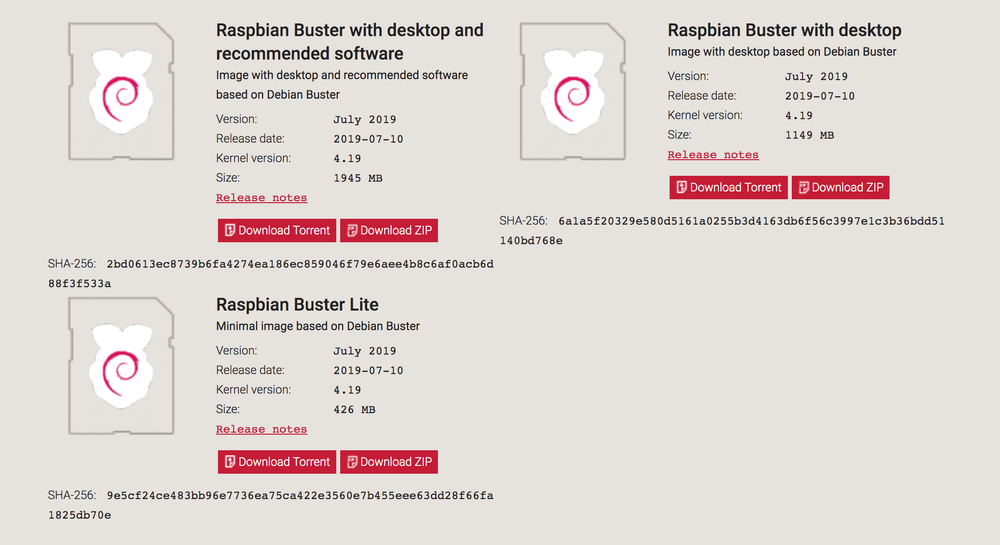
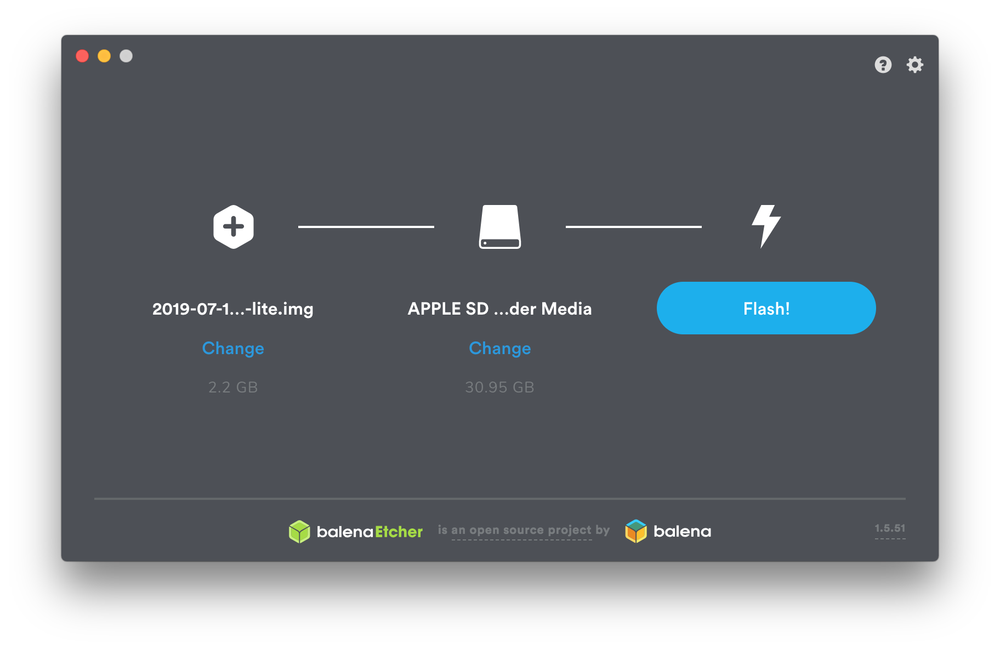

# RaspPi3のインストール

## Raspberry Piのイメージ

[Raspberry Piのイメージ](https://www.raspberrypi.org/downloads)をダウンロードします。  

通信が遅い場合は、ミラーサイトからダウンロードします。

[Mirrorサイト](http://ftp.jaist.ac.jp/pub/raspberrypi/raspbian_lite/images/raspbian_lite-2019-07-12/)

Raspbian Buster Lite(20019-07-12)を使用します。

## 焼き込み

焼き込みには、Etcherを使い焼き込みます。
[https://www.balena.io/etcher/](https://www.balena.io/etcher/)

ダウンロードしたをRaspberry PiのイメージをmicroSDカードに焼き込みます。

!!!warning "注意点"
	必ずデータの入っていないmicroSDカードを使用してください。  

ダウンロードしたイメージとmicroSDカードを選択します。  
`Flash`ボタンを押すことで焼き込むことができ、完了すれば焼き込み終了です。

SDカードにイメージを焼き込み終わったあとに、SDカードを抜いて、再度PCに挿し直すと、PCでSDカードが認識されます。
