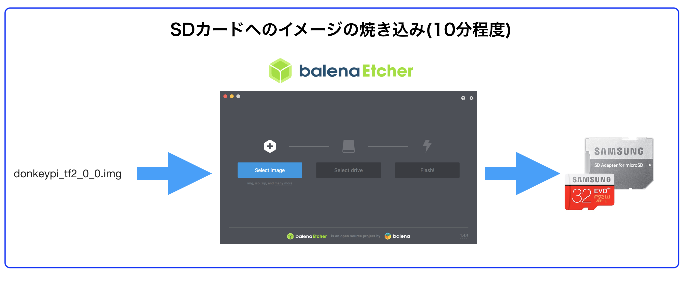

# RaspPi3用のイメージ作成

!!!warning "注意点"
	本ドキュメントはDonkeyCar 3.0.2に対応しています。

## 本イメージ

Google Colaboraotoryと連携するために、DonkeyCar 3.0.2, TernsorFlow 2.0.0 BetaをインストールしたRaspberryPi用イメージになります。

[DonkeyCar 3.0.2 + TensorFlow 2.0 BetaのDownload](https://drive.google.com/open?id=1Hks9ANUUsE9eHQjkSbjmU0SYvlx47RR2)

プロジェクトの作成やWireless Joystick、マルチタブ化も実施済みです。

SDカードイメージには、下記処理を実施済みです。

|項目|処理内容|
|:--|:--|
|[DonkeyCarのインストール](https://faboplatform.github.io/DonkeyDocs/2.DonkeyCar%E5%80%8B%E5%88%A5%E8%A8%AD%E5%AE%9A/03.install3_0_2/)|TensorFlow 2.0.0-Beta1のインストール|
|[Get Your Raspberry Pi Working.](http://docs.donkeycar.com/guide/robot_sbc/setup_raspberry_pi/)|ライブラリ周りの設定|

## 焼き込み

焼き込みには、Etcherを使い焼き込みます。
[https://www.balena.io/etcher/](https://www.balena.io/etcher/)

[DonkeyCar 3.0.2 + TensorFlow 2.0 BetaのDownload](https://drive.google.com/open?id=1Hks9ANUUsE9eHQjkSbjmU0SYvlx47RR2)
からイメージをダウンロードすると、donkey3_tf2b.zipがダウンロードできるので解凍し生成されるdonkey3_tf2bをSDカードに焼き込みます。

