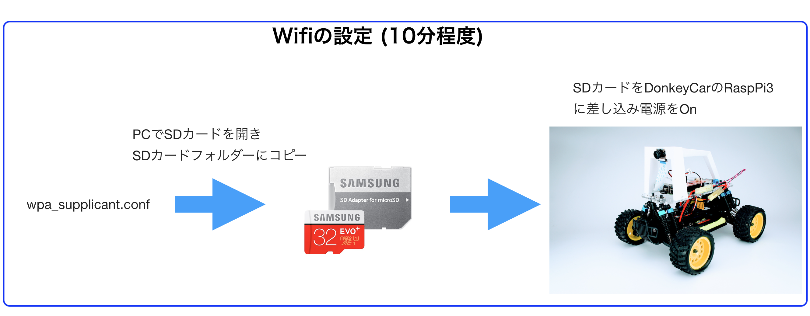
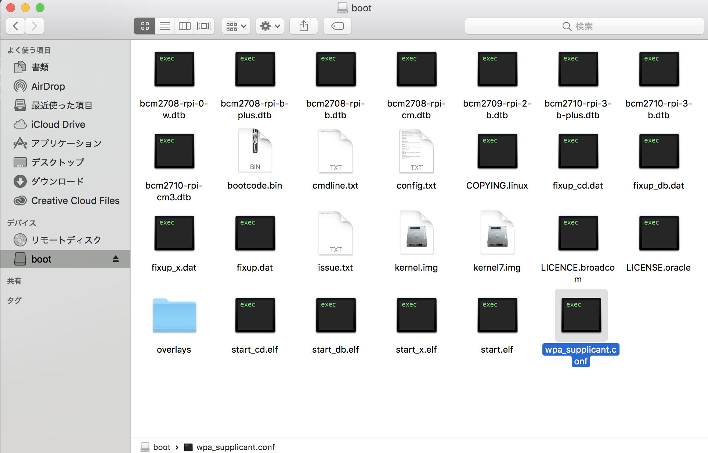

# Wifiの設定



!!!warning "注意点"
	本ドキュメントはDonkeyCar 3.0.2に対応しています。

SDカードにイメージを焼き込みおわるったあとに、SDカードを抜いて、再度PCに挿し直すと、PCでSDカードが認識されます。

Wifiの設定は、前手順で作成したSDカードに、wpa_supplicant.confをコピーし、接続先のSSIDとPasswordを入力してください。

DonkeyCarの初回起動時にSDカードにある`wpa_supplicant.conf`が自動的に`/etc/wpa_supplicant/wpa_supplicant.conf`へコピーされ、指定したWifiネットワークに接続されます。

<hr>

## wpa_supplicant

<hr>

{{ download_link('https://faboplatform.github.io/DonkeyDocs/0.DonkeyCar3の構築/wpa_supplicant.conf', 'wpa_supplicant.conf') }}をdownloadし、SDカードにコピーし、`wpa_supplicant.conf`の値を書き直します。



ssidに接続先のssid, pskにpasswordを記載します。
```
country=US
ctrl_interface=DIR=/var/run/wpa_supplicant GROUP=netdev
update_config=1

network={
    ssid="your network name"
    scan_ssid=1
    psk="your password"
}
```

PasswordのないWifiスポットに接続する場合は、下記例を参考にしてください。

```
country=US
ctrl_interface=DIR=/var/run/wpa_supplicant GROUP=netdev
update_config=1

network={
    ssid="your network name"
    key_mgmt=NONE
}
```

!!!warning "5GHz"
	RaspPi3は、5GHz帯のWifiは非対応です。2.4GHz帯のWifiのアクセスポイントを設定するようにしてください。

<hr>

## SDカードをDonekyCarに挿入

<hr>


SDカードをDonkeyCarのRaspPi3に挿入し、電源をOnにします。

<hr>

## 接続先の確認(OSX)

<hr>

DonkeyCarと同一ネットワークに接続しているOSXより、下記コマンドで接続を試みます。

```
ssh pi@donkeypi.local
```

|項目|値|
|:--|:--|
|id|pi|
|password|raspberry|

!!!info "Host名について"
	上記方法はOSXのみで有効で、複数台使用時は、DonkeyCarのRasPi3のhost名を任意のユニークな名前に書き直す必要があります。

ifconfigでipアドレスを確認します。

```
ifconfigf -a
```

で表示されるWLAN0にIPアドレスが表示されます。

<hr>

## 接続先の確認(Windows)

<hr>


RaspberryPi3をHDMIケーブルでDisplayに接続します。起動画面の最後でIPアドレスが表示されれば、ネットワークに接続成功です。

<hr>

## wpa_supplicantの修正

<hr>


接続に失敗した場合は、RaspPi3内の`/etc/wpa_supplicant/wpa_supplicant.conf` を修正することで、接続先の変更が可能です。

```
cd  /etc/wpa_supplicant/
sudo nano wpa_supplicant.conf
```

!!!info "IPアドレス"
	自分のIPアドレスをメモっておきます。
