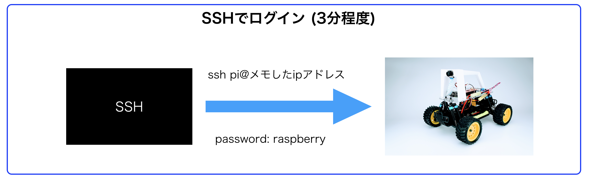
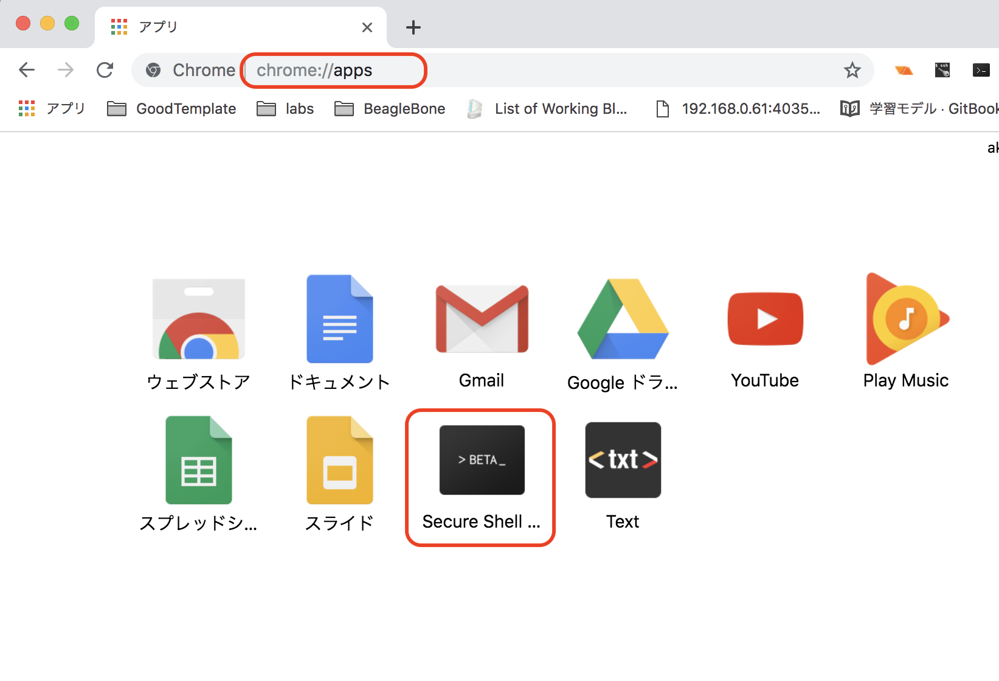
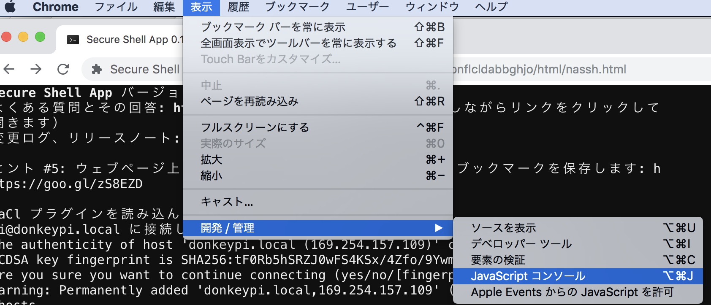

# SSHでRaspberryPiのログイン

!!!warning "注意点"
	本ドキュメントはDonkeyCar 3.0.2に対応しています。

	
## SSHでログイン(Chrome appを使用する場合)

判明したIPアドレスに対して、Chrome AppからSecure Shell Appを起動して、SSHでログインします。

|項目|値|
|:--|:--|
|id|pi|
|password|raspberry|

## SSHでのエラー

が発生する場合の対処方法

`term_.command.removeAllKnownHosts();` を実行し、/.ssh/known_hostsを消します。

