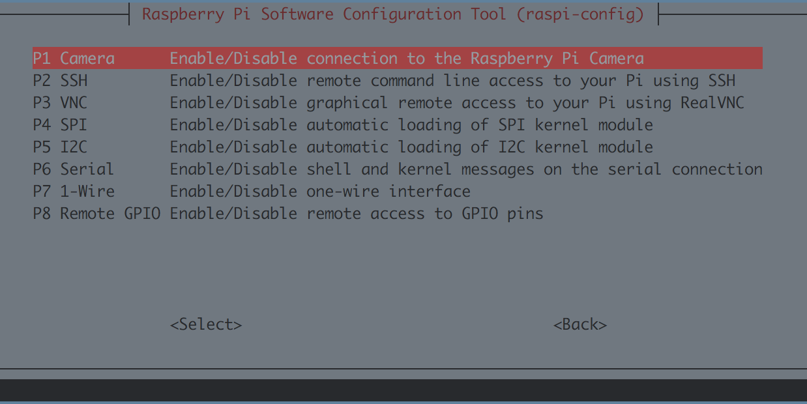
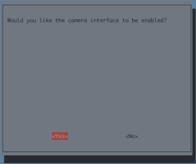

# DonkeyCarのインストール

参考: [DonkeyCar公式ページ](https://docs.donkeycar.com/guide/install_software/)

最新のDonkeyCarをインストールします。
公式サイトに沿ってインストールしていきます。

## Raspberry Piのアップデート
```
sudo apt-get update
sudo apt-get upgrade
```
<hr>

## Rapberry Piの設定
以下のコマンドで、I2Cとカメラを有効化します
`Interfacing Options -> Camera -> yes` , `Interfacing Options -> I2C -> yes` を選択すると有効化できます
```
sudo raspi-config
```






tabキーを押し、finishボタンを押すことで設定出来ます。

設定を変更すると再起動するので、再度SSHでログインします。

## Hostnameの修正

Defaultでは、Macユーザは `ssh pi@raspberrypi.local` でRaspberryPiに接続できます。全員同じ名前になると、区別がつかないので、`hostname`, `hosts` の 2箇所のhost名を書き直し、独自の名前で呼び出せるようにしておきます。今回は、`raspberrypi`から`donkeypi`に書き直します。

### hostnameの修正

```
sudo vi /etc/hostname
```

```
donkeypi
```

### hostsの修正

```
sudo vi /etc/hosts
```

```
(env) pi@raspberrypi:~ $ sudo vi /etc/hosts

127.0.0.1       localhost
::1             localhost ip6-localhost ip6-loopback
ff02::1         ip6-allnodes
ff02::2         ip6-allrouters

127.0.1.1       donkeypi
```

## DonkeyCarのインストール

### 依存関係があるパッケージのインストール

```
sudo apt-get install build-essential python3 python3-dev python3-pip python3-virtualenv python3-numpy python3-picamera python3-pandas python3-rpi.gpio i2c-tools avahi-utils joystick libopenjp2-7-dev libtiff5-dev gfortran libatlas-base-dev libopenblas-dev libhdf5-serial-dev git
```

### OpenCV関連のインストール

```
sudo apt-get install libilmbase-dev libopenexr-dev libgstreamer1.0-dev libjasper-dev libwebp-dev libatlas-base-dev libavcodec-dev libavformat-dev libswscale-dev libqtgui4 libqt4-test
```

### 必要なパッケージのインストール

```
sudo apt-get install zip
```

### 環境の構築

python3、pipが使用できる仮想環境を構築します。

```
python3 -m virtualenv -p python3 env --system-site-packages
echo "source env/bin/activate" >> ~/.bashrc
source ~/.bashrc
```
ログインすると自動的にこの環境を使用する設定にしています。  
`deactivate`を実行すれば元のpythonの環境に戻せます。

### Donkey Carのインストール

```
cd ~/
git clone https://github.com/autorope/donkeycar
cd donkeycar
git checkout master
pip install -e .[pi]
```

## TensorFlow

### TensorFlowの環境構築

Raspian StretchはPython 3.5、Raspian BusterはPython 3.7対応となっています。TensorFlowのパッケージを間違わないようにインストールします。


### TensorFlow 1.13.1の構築

```
wget https://www.piwheels.org/simple/tensorflow/tensorflow-1.13.1-cp37-none-linux_armv7l.whl
pip install ./tensorflow-1.13.1-cp37-none-linux_armv7l.whl
```

### TensorFlow 2.0.0 RC0の構築

Googleの公式版の[TensorFlowレポジトリ](https://github.com/tensorflow/tensorflow)では、2.0.0に対応していないために、[PINTO0309](https://github.com/PINTO0309)さんがBuildをかけて、公開してくれている2.0.0 RC0をインストールして使用します。

|Package|Version|
|:--|:--|
|TensorFlow|2.0.0-RC0|

TensorFlow 2.0.0-RC0をwgetコマンドで取得します。
```
wget https://github.com/PINTO0309/Tensorflow-bin/raw/master/tensorflow-2.0.0rc0-cp37-cp37m-linux_armv7l.whl
pip install ./tensorflow-2.0.0rc0-cp37-cp37m-linux_armv7l.whl
```
