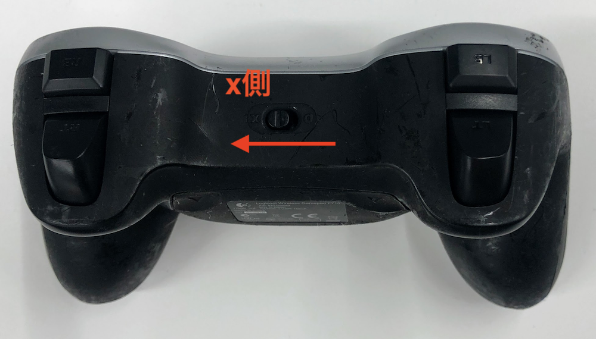
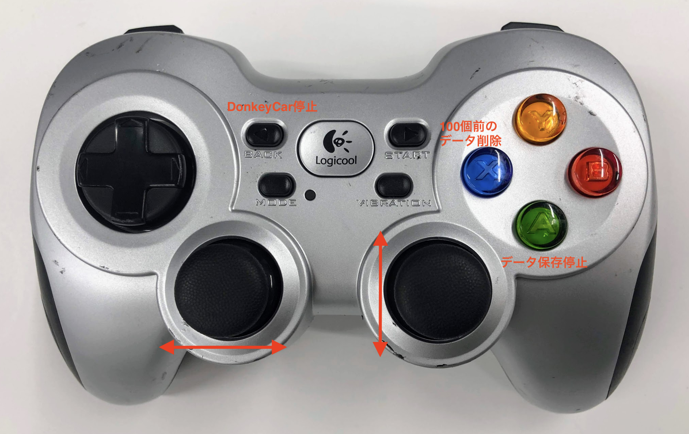
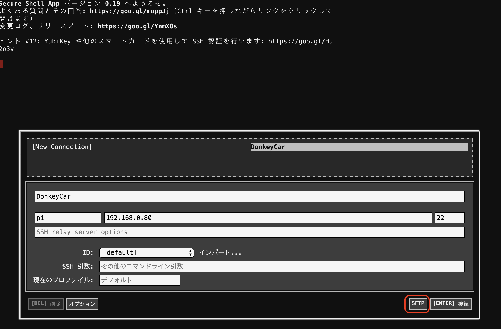
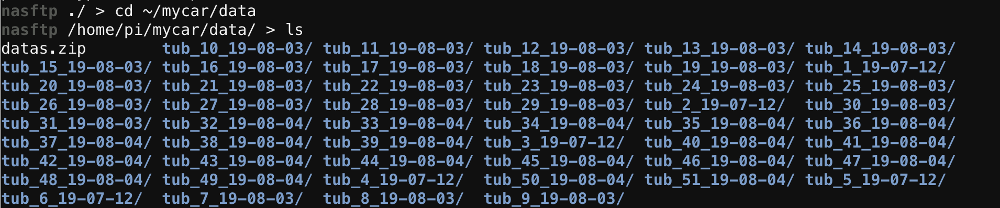
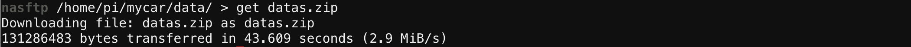

# 教師データの作成


<hr>

## Joystickの接続

<hr>

JoystickをDonkeyCarに接続します。Joystickの裏側の蓋を外すと、USBドングルが入っているので、DonkeyCarのRaspPi3のUSBに差し込みます。






!!!warning "Joystickは省電力モードにすぐ入ります"
	Joystickをいじっていない時間が長いと、Joystickは省電力モードにはいります。復活させるには、`start`を押し、`vibration`ボタンで電源のOn/Offを確認します。他のボタンにはコマンドが割り振られているために押さないようにしてください。

<hr>

## DonkeyCarの起動

<hr>


`~/mycar`フォルダに移動します。


```
cd ~/mycar
```

DonkeyCarを起動します。`--js`をつけると、Joystickが有効になります。

```
python manage.py drive --js
```

早速、DonkeyCarのテスト走行を行いましょう!!
走行の終了は、++"CTRL"+"c"++で、終了します。

<hr>

## データの保存

<hr>

データは、前進・行進している間、自動保存されます。保存先は、`~/mycar/dara`になります。フォルダが生成されるタイミングは、`python manage.py drive --js`を実行したタイミングで、毎回作成されます。

```
cd ~/mycar/data
```

lsコマンドで作成されたフォルダを確認します。

```
ls
```

今作成されたフォルダが下記のように表示されます(例)。このフォルダ以下にデータ・セットが保存されています。

```
tub_01_19-01-26
```

DonkeyCarの終了は、++"CTRL"+"c"++で終了します。

!!!warning "フォルダのできるタイミング"
	tubフォルダができるタイミングは、`python manage.py drive --js`を実行したタイミングです。

<hr>

## 教師データの圧縮

<hr>


データを圧縮し、1つのファイル(ZIP形式)にしてPCに転送します。

RaspberryPi3にZIPをインストールします。

```
sudo apt-get install zip
```

ZIPで学習データとして使いたい走行のフォルダを圧縮します。

```
cd ~/mycar/data
```

ZIPコマンドでフォルダを圧縮します。

```
zip -r datas.zip tub_01_19-01-26
```

!!!info "学習に必要なデータ・セット数"
	学習に必要なデータセット数は、5000〜2万データ・セットぐらいになります。

<hr>

## データの転送

<hr>

Secure Shellを再起動(ChromeのReload)し、ログイン画面に戻ります。今度は、SFTPを選択し、SFTPでDonkeyCarに接続します。



data.zipのあるフォルダに移動します。
```
cd ~/mycar/data
ls
```



datas.zipをgetします。
```
get datas.zip
```




これで、datas.zipがPCに転送されます。
