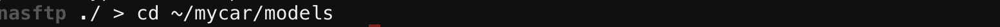

# 自動走行


<hr>

## mypilotをRaspPi3へ移動

<hr>

SFTPでRaspberryPi3側の`/home/pi/mycar/models`フォルダにアップロードします。


学習済みモデルをアップするフォルダに移動します。`~/mycar/models/
```
cd ~/mycar/models
```



学習済みモデル mypilot.h5をアップロードします。
```
put mypilot.h5
```


<hr>

## 学習済みモデルでDonkeyCarを動かす(RasPi3)

<hr>

クラウドで学習したモデルタイプにRaspberryPi側も合せます。myconfig.pyのDEFAULT_MODEL_TYPEを有効にし、値を'categorical'に設定します。`DEFAULT_MODEL_TYPE = 'categorical'`

```
nano ~/mycar/myconfig.py
```

myconfig.py
```
# #TRAINING
# #The DEFAULT_MODEL_TYPE will choose which model will be created at training time. This chooses
# #between different neural network designs. You can override this setting by passing the command
# #line parameter --type to the python manage.py train and drive commands.
DEFAULT_MODEL_TYPE = 'categorical'   #(linear|categorical|rnn|imu|behavior|3d|localizer|
latent)
```


RaspberryPi側にログイン。

```
python manage.py drive --model ~/mycar/models/mypilot.h5
...
...
...
Yusing donkey v3.0.2 ...
loading config file: /home/pi/mycar/config.py
loading personal config over-rides

config loaded
cfg.CAMERA_TYPE PICAM
PiCamera loaded.. .warming camera
Adding part PiCamera.
Starting Donkey Server...
Adding part LocalWebController.
Adding part ThrottleFilter.
Adding part PilotCondition.
Adding part RecordTracker.
"get_model_by_type" model Type is: linear
loading model /home/pi/mycar/models/mypilot.h5
finished loading in 12.664790868759155 sec.
Adding part FileWatcher.
Adding part FileWatcher.
Adding part DelayedTrigger.
Adding part TriggeredCallback.
Adding part KerasLinear.
Adding part DriveMode.
Adding part AiLaunch.
Adding part AiRunCondition.
Init ESC
Adding part PWMSteering.
Adding part PWMThrottle.
Tub does NOT exist. Creating new tub...
New tub created at: /home/pi/mycar/data/tub_2_19-07-16
Adding part TubWriter.
You can now go to <your pi ip address>:8887 to drive your car.
Starting vehicle...
8887
/usr/lib/python3/dist-packages/picamera/encoders.py:544: PiCameraResolutionRounded: frame size rounded up from 160x120 to 160x128
  width, height, fwidth, fheight)))
WARNING: Logging before flag parsing goes to stderr.
W0716 10:51:58.391323 1502708848 web.py:2246] 404 GET /favicon.ico (10.104.77.70) 11.61ms
```

起動ログに、Web Consoleの起動しているサーバのアドレスとポートが出てくるので、Web Browserで接続します。

Web画面のmodel & pilotから、local pilotを選ぶ。


