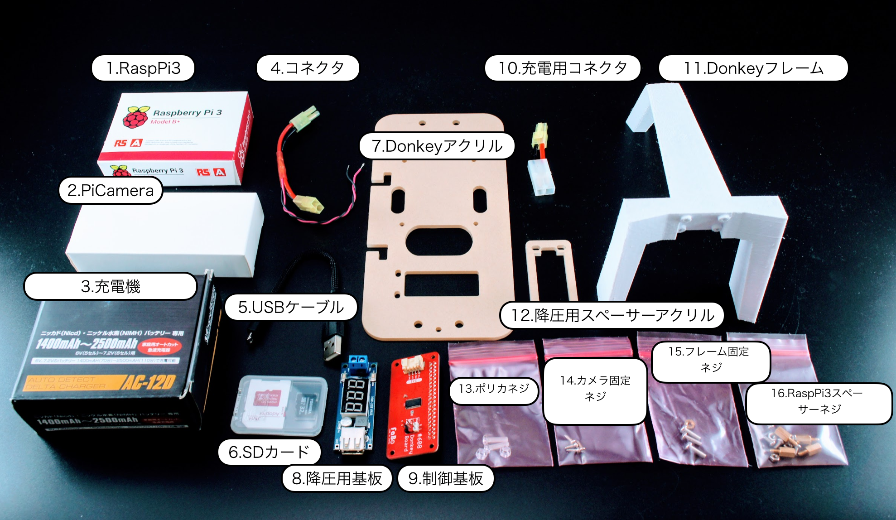
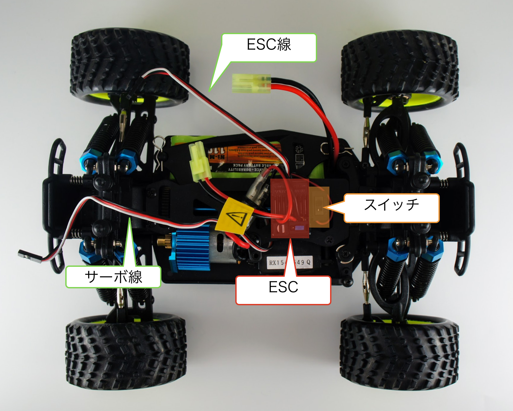
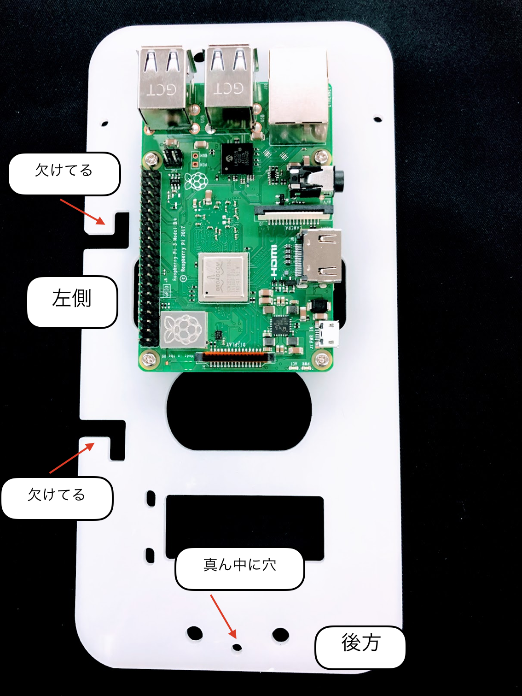
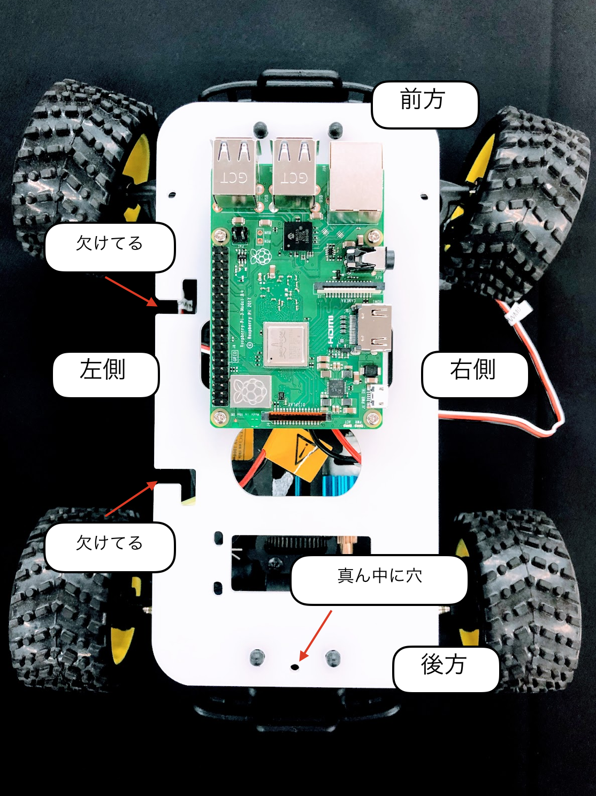
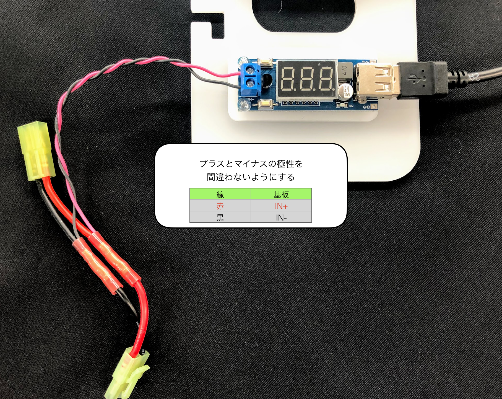
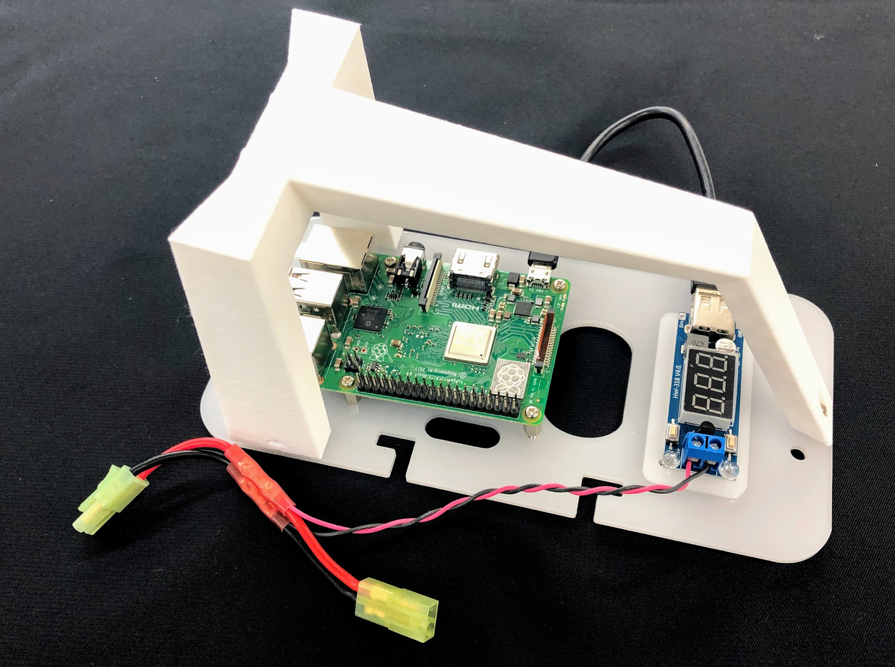
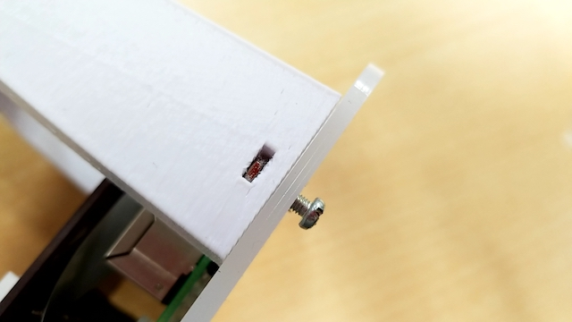
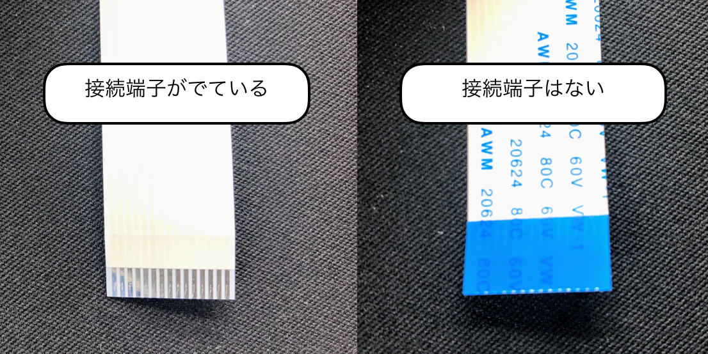
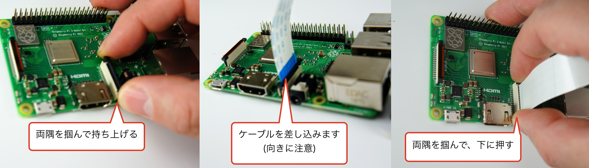
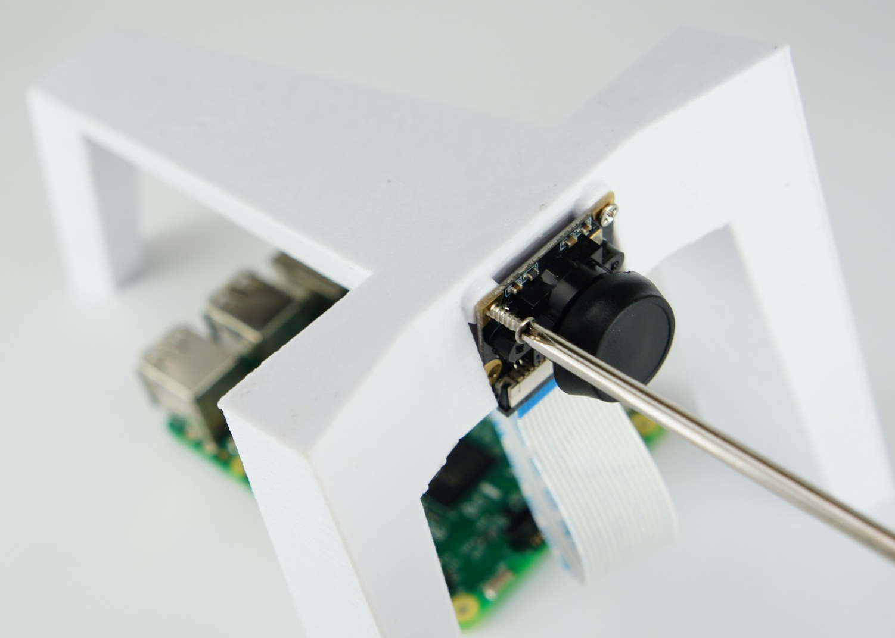

# 組み立て

## Donkey Carのパーツ一覧

|項目|内容|商品|
|:--|:--|:--|
|1|RCカー本体|HSP 94186 Kidking 1/16 4WD|
|2|Donkey Carアーム||
|3|Donkey Carプレート||
|4|Donkey Board|[https://github.com/FaBoPlatform/FaBo/tree/master/0608_donkeycar/PCB](https://github.com/FaBoPlatform/FaBo/tree/master/0608_donkeycar/PCB)|
|5|降圧型変換器内蔵電圧計|[DC 6.5-40V To 5V 2A USBチャージDC-DC降圧型変換器内蔵電圧計](https://www.amazon.co.jp/DC-6-5-40V-5V-2A-USB%E3%83%81%E3%83%A3%E3%83%BC%E3%82%B8DC-DC%E9%99%8D%E5%9C%A7%E5%9E%8B%E5%A4%89%E6%8F%9B%E5%99%A8%E5%86%85%E8%94%B5%E9%9B%BB%E5%9C%A7%E8%A8%88/dp/B00IZ8DRTU/ref=sr_1_5?__mk_ja_JP=%E3%82%AB%E3%82%BF%E3%82%AB%E3%83%8A&keywords=5V+%E9%99%8D%E5%9C%A7&qid=1554109378&s=gateway&sr=8-5)|
|6|RaspberryPi3|
|7|PiCamera|
|8|SDカード|
|9|USBケーブル|
|10|バッテリー3又ケーブル|

## Donkey Car組み立て

## 説明

## ０、下準備

RCカー

RaspberryPi

　SDカードをセットする。

## 1.DonkeyCarプレートにRaspberryPiを固定するネジを取り付ける。

　使用ネジM2.6-10mmネジ＋ナット　x４

　裏からネジを立てるように固定する。
 
## 2. RaspberryPiを取り付ける

ラジコンに乗せて、向きが間違っていないか確認する。

## 3. 降圧型変換器内蔵電圧計を取り付ける。

使用ネジM2.8-10mmネジ＋ナット　x2　

間にスペーサーを入れて固定する（２箇所）。

## 4. USB Cableを接続

## 6. 電源コネクタの取り付け

## 7. Donkeyアームを取り付ける

## 8. PiCameraを取り付ける

PiCameraを取り付ける。

ネジが小さいので無くさないように注意する事。

## 9. プレートをRCカー本体に固定する。

４箇所のボディマウントエクステンションに固定ピンを取り付ける。

## 10. PWMシールドを装着する

## 11. 完成

