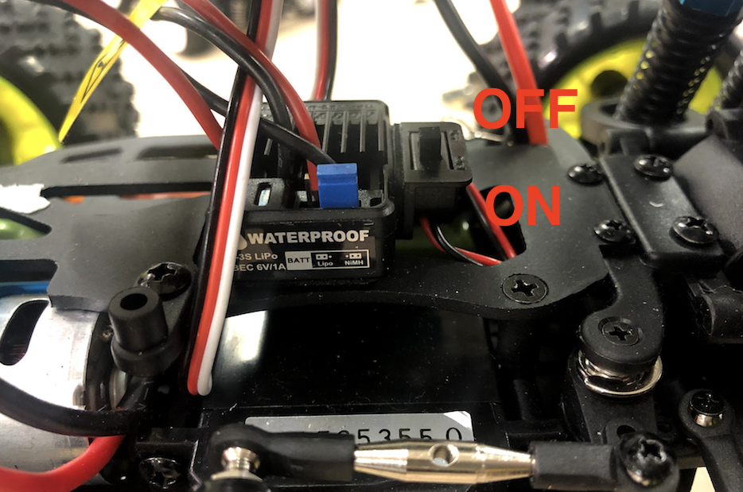

# キャリブレーション


|ch|pwm|操作|
|:--|:--|:--|
|0|pwm0|モーターの制御|
|1|pwm1|サーボの制御|

## キャリブレーション

```
donkey calibrate --channel チャンネル番号
```

## サーボの制御

サーボの制御は、PWM1でおこないます。

例
```
donkey calibrate --channel 1
```

一番右の値と、一番左の値を見つけ出してください。310-410の間ぐらいが可動範囲です。値をconfig.pyに反映します。

```
nano ~/mycar/config.py
```

|操作|コマンド|メモ
|:--|:--|:--|
|保存|++"CTRL"+"o"++|コマンド実行後 ++"Enter"++で保存をします。|
|終了|++"CTRL"+"x"++||


`config.py`
```
#STEERING
STEERING_CHANNEL = 1
STEERING_LEFT_PWM = 410
STEERING_RIGHT_PWM = 310
```

## モーターの制御

モーターの制御は、PWM0でおこないます。

例
```
donkey calibrate --channel 0
```

まず、DonkeyCarの電源をOffにし、ESCの初期化処理をおこないます。



初期化は、360の値でおこないます。
```
donkey calibrate --channel 0
using donkey version: 2.5.8 ...
Enter a PWM setting to test(0-1500)360
```

この状態で、DonkeyCarの電源をOnにします。「ピィ・ピィーー」と音がなります。これで初期化設定です。

```
donkey calibrate --channel 0
using donkey version: 2.5.8 ...
Enter a PWM setting to test(0-1500)360
Enter a PWM setting to test(0-1500)400
```

前後にタイヤが回る範囲を見つけ出し、config.pyに反映します。

```
nano ~/mycar/config.py
```

`config.py`
```
#THROTTLE
THROTTLE_CHANNEL = 0
THROTTLE_FORWARD_PWM = 400
THROTTLE_STOPPED_PWM = 360
THROTTLE_REVERSE_PWM = 310
```

!!!Warning
	PWMで信号を発信中にRCカー本体の電源をONにすると、そのPWM値が初期値として登録される。例えば、donkey calibrate --channel 0 で600を入力中に、電源をOnした場合、600が中央値になる。中央値がずれた場合は、donkey calibrate --channel 0 で、360程度の値で電源をOnにし、360を中央値に設定し直す。[ESCのDatasheet(Hobbywing QuicRun 1040)](http://www.redcatracing.com/manuals/HW-WP-1040-Brushed.pdf)

!!!Warining
	前進は、どのような状況でも操作できます。前進したのちの、後進は、一度 360の初期値をおくったあとに、後進が有効になります。　
