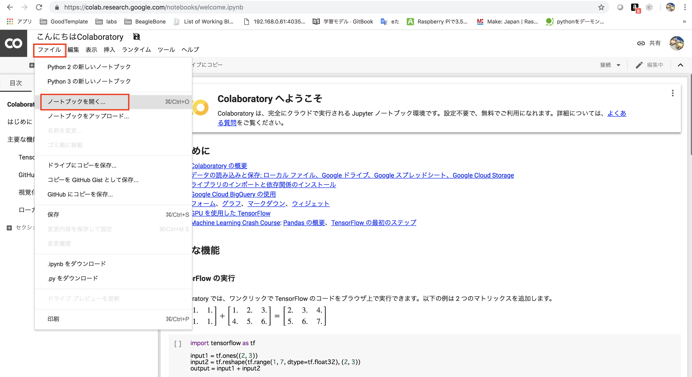
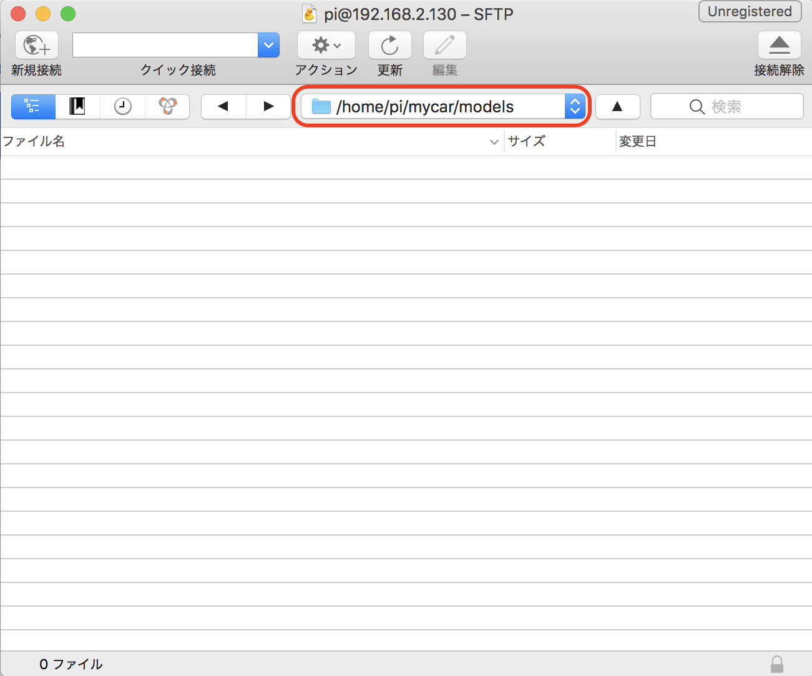

# Colabでの学習(GPU)

!!!warning
	Colabのサンプルは、かならずChormeで実施してください。他のブラウザを用いる場合は、ファイルのアップロードに失敗します。

## 学習にはColabを用います。

[https://colab.research.google.com/](https://colab.research.google.com/)

## ColabへのDonkeyCarの取り込み




|ノートブックのRepo|
|:--|
|[https://github.com/FaBoPlatform/DonkeyColab](https://github.com/FaBoPlatform/DonkeyColab)|

!!!warning
	ColabとRaspberryPi3のTensorFlow, KerasのVersionをあわせる必要があります。TensorFlow 1.12.0, Keras 2.2.4に合わせてください。Versionをあわせないとフォーマットエラーが発生します。

## 学習済みデータをDonwloadしてRaspberryPi3へ

mypilotをダブルクリックするとダウンロードが始まります。


Cyberduckを起動し、SFTPでRaspberryPi3側の`/home/pi/mycar/models`フォルダにアップロードします。




## 学習済みモデルでDonkeyCarを動かす(RasPi3)

RaspberryPi側にログイン。

```
$ python manage.py drive --model ~/mycar/models/mypilot
```

Web画面のmodel & pilotから、local pilotを選ぶ。


