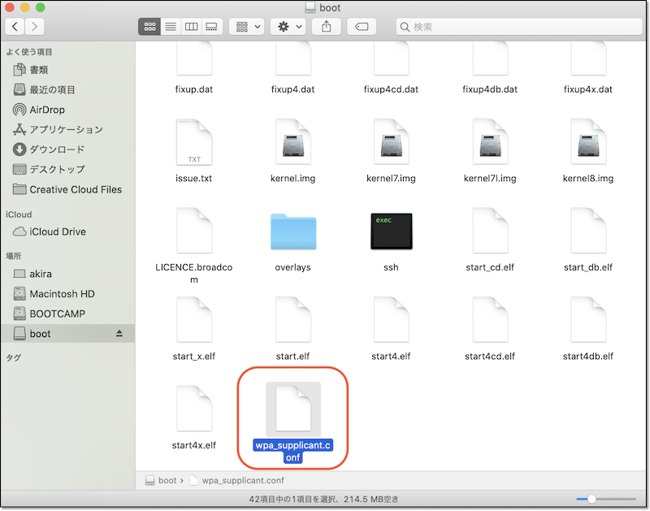
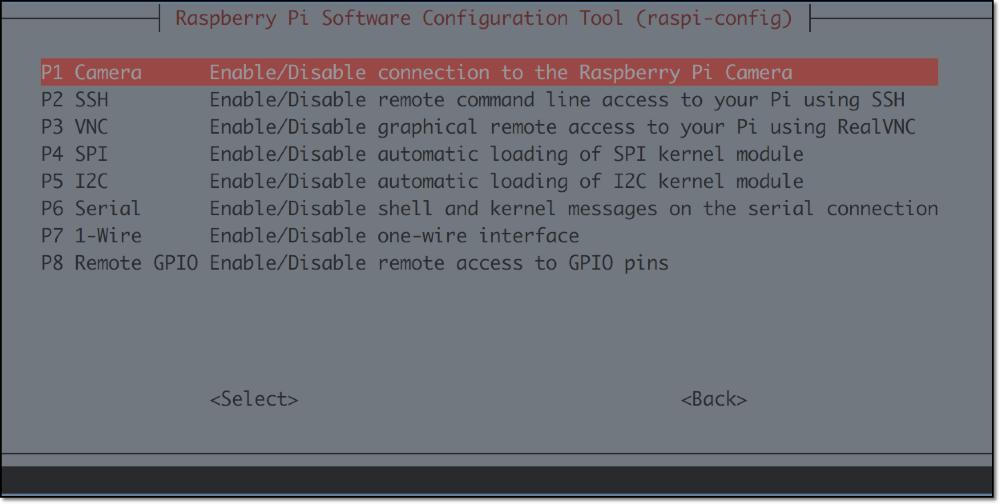

# SDカードイメージを最初から作成する方法

!!! Warning "インストール済みイメージを使う場合は、本作業をスキップ"
	DonkeyCarインストール済みイメージを使う場合は、1.車体作成にお進みください。<br>

|項目|概要|
|:-|
|[DonkeyCarインストール済みイメージ](https://drive.google.com/file/d/1cGmHjMB8FfMK6GlUsT7r5ZjFwyFhxgwu)|下記手順で作成したイメージです。RaspberryPi3B+で3時間ほどかかります。|


本章では、上記のイメージを作成するためのインストール手順を解説しています。<br>

## Raspberry Piのイメージ

Raspberry Pi用のイメージは、[Raspberry Pi Imager](https://www.raspberrypi.org/downloads)を使って直接micro SDカードに焼き込みます。

!!! Info "イメージの焼き込みに使えるツールは"
	[Raspberry Pi Imager](https://www.raspberrypi.org/downloads)の他にも、[balenaEtcher](https://www.balena.io/etcher/)やDDコマンドなどでも焼き込み可能です。<br>

使用中のOS(Windows/maxOS/Ubuntuに対応)の[Raspberry Pi Imager](https://www.raspberrypi.org/downloads)をダウンロードし、インストールします。

Raspberry pi Imagerを使ってmicro SDカードにOSイメージを焼きます。OSは`Raspberry Pi OS Lite (32-bit)`を選択します。

<br>
<br>
<br>

## sshの有効化

RaspberryPi OSの焼き込みが終わったら、sshの設定をおこないます。

<br>


OSイメージをmicro SDカードに焼き込み終わったあとに、SDカードを抜いて、再度PCに挿し直すと、PCでSDカードが認識されます。PCでSDカードを認識したら、`boot`パーティション直下に空ファイルのsshファイルをコピーします。

{{ download_link('https://faboplatform.github.io/DonkeyDocs/0.SDカードイメージを最初から作成する方法/ssh', 'ssh') }}をダウンロードし、SDカードにコピーします。`ssh`ファイルの中身はただの空ファイルですが、`ssh`という名前のファイルがSDカードに存在すると、sshでのアクセスが可能になる設定になります。

この方法での結果、raspi-configでsshを有効化すること同じ結果になります。<br>

!!! Info "RasberryPiにキーボードやマウスが装着されていない時に有効"
	上記方法では、PCでsshの設定ができますので、RaspberryPiにキーボードやマウスが装着されていない時でも、sshでの接続を可能な設定に変更する事が可能です。

## WiFiの設定

Wifiの設定も、SDカードに`wpa_supplicant.conf`という名前のファイルをコピーする事で反映させる事が可能です。

{{ download_link('https://faboplatform.github.io/DonkeyDocs/0.SDカードイメージを最初から作成する方法/wpa_supplicant.conf', 'wpa_supplicant.conf') }}をダウンロードします。ファイルを編集してSSIDとパスワードを接続先のWiFiルータの値に書き直します。

wpa_supplicant.conf
```
country=JP
ctrl_interface=DIR=/var/run/wpa_supplicant GROUP=netdev
update_config=1

network={
    ssid="your network name"
    psk="your password"
    scan_ssid=1
}
```

<br>

SDカードの`boot`パーティション直下にコピーしてください。<br>

sshとwpa_supplicant.confの2ファイルをSDカードの`boot`にコピーする事で、Wifiに接続しsshで接続可能になります。

## Raspberry Piのアップデート

Raspberry Piにログインしてパッケージを更新します。

```
sudo apt-get update
sudo apt-get upgrade
```

## Rapberry Piの設定

`raspi-config`で、I2Cとカメラを有効化します。

`Interfacing Options -> Camera -> yes` , `Interfacing Options -> I2C -> yes` を選択して有効化します。

```
sudo raspi-config
```





tabキーを押し、finishボタンを押すことで設定出来ます。

設定を変更すると再起動するので、再度SSHでログインします。

!!! Info "raspi-configのupdate"
	raspi-config自体もアップデート可能な事があるので、raspi-configを更新しておきたい場合はraspi-configのメニューからアップデートの確認をおこなってください。


## HDMI HotPlug 有効化

HDMIのHotPlugの対応を有効化します。HDMIのHotPlugに対応すると、RaspberryPi起動後にHDMIケーブルを差しても、モニターに画面を表示する事ができるようになります。

config.txtを編集
```
vi /boot/config.txt
```

`/boot/config.txt`
```
hdmi_force_hotplug=1
hdmi_drive=2
```

!!! Warning "HDMI HotPlugを有効にしないと"
	標準のイメージでは、電源を投入する前に、RaspberryPiにHDMIケーブルを接続し、その後、電源をOnにしないと、モニターに画面が表示されません。


## vimでコピー&ペーストを可能にする

標準のイメージでは、vimでのコピー&ペーストが対応していません。ここでは、vimrcを書き直し、コピー&ペーストに対応させます。

.vimrcを編集

```
vi ~/.vimrc
```

`/home/pi/.vimrc/`
```
:set clipboard+=unnamed
```

## Hostnameの修正

標準のイメージでは、Macユーザは `ssh pi@raspberrypi.local` でRaspberry Piに接続できます。全員同じ名前になると、区別がつかないので、`hostname`, `hosts` の 2箇所のhost名を書き直し、独自の名前で呼び出せるようにしておきます。今回は、`raspberrypi`から`donkeypi`に書き直します。

/etc/hostnameを編集
```
sudo vi /etc/hostname
```

`/etc/hostname`
```
donkeypi
```

/etc/hostsを編集
```
sudo vi /etc/hosts
```

`/etc/hosts`
```
(env) pi@raspberrypi:~ $ sudo vi /etc/hosts

127.0.0.1       localhost
::1             localhost ip6-localhost ip6-loopback
ff02::1         ip6-allnodes
ff02::2         ip6-allrouters

127.0.1.1       donkeypi
```

!!! Warning "WindowsではRaspberryPiのHost名検索ができない"
	Widnowsでは、RaspberryPiのHost名検索ができないので、注意してください。

## DonkeyCarのインストール

### 必要なパッケージ群のインストール
```
sudo apt-get install -y vim htop locate arp-scan screen
sudo apt-get install -y build-essential python3 python3-dev python3-pip python3-virtualenv python3-numpy python3-picamera python3-pandas python3-rpi.gpio i2c-tools avahi-utils joystick libopenjp2-7-dev libtiff5-dev gfortran libatlas-base-dev libopenblas-dev libhdf5-serial-dev git ntp
sudo apt-get install -y libilmbase-dev libopenexr-dev libgstreamer1.0-dev libjasper-dev libwebp-dev libatlas-base-dev libavcodec-dev libavformat-dev libswscale-dev libqtgui4 libqt4-test
```

### virtualenv環境の構築

python/pip環境をpython3/pip3で構築します。この仮想環境は~/env/に構築されます。

`source ~/env/bin/activate`コマンドで仮想環境を有効化します。

```
python3 -m virtualenv -p python3 ~/env --system-site-packages
echo "source ~/env/bin/activate" >> ~/.bashrc
source ~/.bashrc
```

`~/.bashrc`ファイルに仮想環境を有効化する記述を追加し、ログインに仮想環境を有効化します。

!!! Info "仮想環境から抜け出す場合は"
	`deactivate`コマンドで仮想環境を抜けます。

!!! Info "仮想環境を削除したい場合は"
	pip仮想環境を削除する場合は`rm -rf ~/env`でディレクトリを削除することで可能です。

### DonkeyCarのインストール
参考: [DonkeyCar公式ページ](https://docs.donkeycar.com/guide/install_software/)

最新のDonkeyCarをインストールします。[DonkeyCar公式ページ](https://docs.donkeycar.com/guide/install_software/)も参考にしてください。<br>

DonkeyCarのインストール
```
mkdir ~/projects
cd ~/projects

git clone https://github.com/autorope/donkeycar
cd donkeycar
git checkout be45ae038cb00d81c5450b9a481dbf5aaa03e688
pip install -e .[pi]
pip install tensorflow==1.13.1
pip install numpy --upgrade
pip install opencv-python
pip install smbus
```

!!! Warning "pip install opencv-pythonは3時間(RaspPi3B+)かかります"
	`pip install opencv-python`のコマンドで、OpenCV最新版をビルドしてインストールしています。この処理に3時間(RaspPi3B+)で3時間くらいかかります。インストールを急ぎたい場合は、`sudo apt-get install python3-opencv`のコマンドでインストールも可能です。

### OpenCV 4.x関連エラー

エラーが発生しない場合は、本項目はスキップしてください。

OpenCV 4.xは以下のエラーが出る場合があります。
```
python -c "import cv2"
Traceback (most recent call last):
  File "<string>", line 1, in <module>
  File "/home/pi/env/lib/python3.7/site-packages/cv2/__init__.py", line 3, in <module>
    from .cv2 import *
ImportError: /home/pi/env/lib/python3.7/site-packages/cv2/cv2.cpython-37m-arm-linux-gnueabihf.so: undefined symbol: __atomic_fetch_add_8
```

これはOpenCVの問題のようなので、問題が解決されるまで以下のように対応しておきます。
```
echo "export LD_PRELOAD=/usr/lib/arm-linux-gnueabihf/libatomic.so.1" >> ~/.bashrc
source ~/.bashrc
```

参考：[https://github.com/piwheels/packages/issues/59](https://github.com/piwheels/packages/issues/59)


## DonkeyCar 設定

~/mycarでプロジェクトを作成して、自分の車両用の設定ファイルをテンプレートを作成します。


createcar
```
donkey createcar --path ~/mycar
cd ~/mycar
```

myconfig.pyの編集
```
vi myconfig.pi
```

ステアリングPWM(`STEERING_LEFT_PWM`,`STEERING_RIGHT_PWM`)とスロットルPWM(`THROTTLE_FORWARD_PWM`,`THROTTLE_STOPPED_PWM`,`THROTTLE_REVERSE_PWM`)はキャリブレーションを実施して適切な値を入れます。

`JOYSTICK_DEADZONE`はスロットルオフの時にレコーディングが止まるようにするための閾値を設定します。(0.0だとJoystck使用時はレコーディングが続く場合があるので0.05ぐらいの閾値にします。）<br>

`~/mycar/myconfig.pi`
```
STEERING_LEFT_PWM = 460 # 左。PWMは1740
STEERING_RIGHT_PWM = 290 # 右。PWMは1100

THROTTLE_FORWARD_PWM = 500 # 前進の値。PWMは2000us
THROTTLE_STOPPED_PWM = 375 # ニュートラルの値。PWMは1500us
THROTTLE_REVERSE_PWM = 250 # 後進の値。PWMは1000us

JOYSTICK_MAX_THROTTLE = 1.0 # 早過ぎる場合は0.3に落とす
CONTROLLER_TYPE='F710'
JOYSTICK_DEADZONE = 0.05

MAX_EPOCHS = 50
EARLY_STOP_PATIENCE = 10
CACHE_IMAGES = False

# GYM_CONF["guid"] = "00000000-0000-4000-0000-000000000000"
```


## OLED設定

新しいFaBo DonkeyBoardにはOLEDが搭載されています。それに伴い、FaBo DonkeyCarでは、Raspberry Pi起動時に、IPアドレスを表示することが可能になりました。
ここでは、その設定方法を説明します。

!!! Warning "Raspberry Pi3A+ではハードウェア構成が違う"
	DonkeyCarの最新パッケージ(3.1.5)は、走行時にOLEDを表示する拡張が入りました。一方で、RaspberryPi 3A+のようにハードウェア構成が違う場合は、エラーが発生します。エラーの原因は、ネットワークインターフェースが存在しない事が原因で発生します。


FaBo DonkeyCar用に、下記パッケージをインストールします。

FaBo DonkeyCarのOLEDの拡張パッケージのダウンロードと設定
```
cd ~/projects
git clone https://github.com/FaBoPlatform/ip_address_display
mkdir -p ~/fabo/bin
cd ip_address_display
cp oled_ip* ~/fabo/bin
cp oled.py ~/projects/donkeycar/donkeycar/parts/
```

/etc/rc.localのexit 0の前にOLEDを表示するスクリプトの実行を追加します。

/etc/rc.localの編集
```
sudo vi /etc/rc.local
```

`/etc/rc.local`
```
before:
exit 0

after:
/home/$(getent passwd 1000 | cut -d: -f1)/fabo/bin/oled_ip.sh
```

rc.local有効化
```
sudo systemctl status rc.local
sudo systemctl daemon-reload
sudo systemctl start rc.local
sudo systemctl status rc.local
```

再起動後
```
sudo reboot
```

うまくパッケージが反映されれば、RaspberryPiのIPアドレスが表示されるようになります。