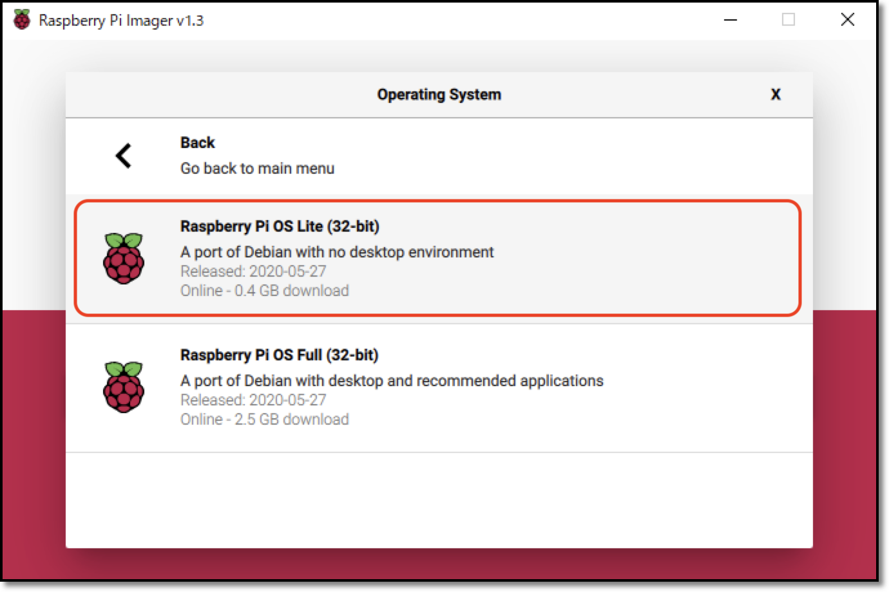
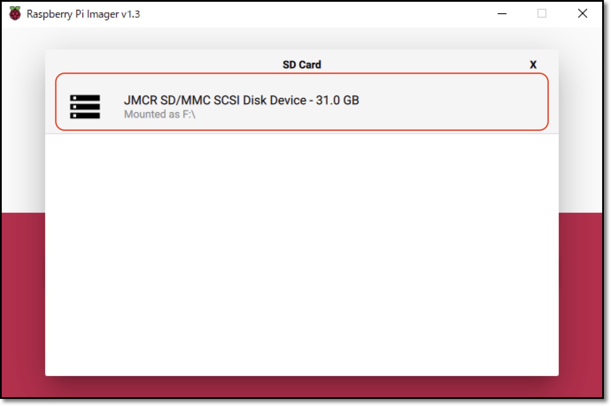
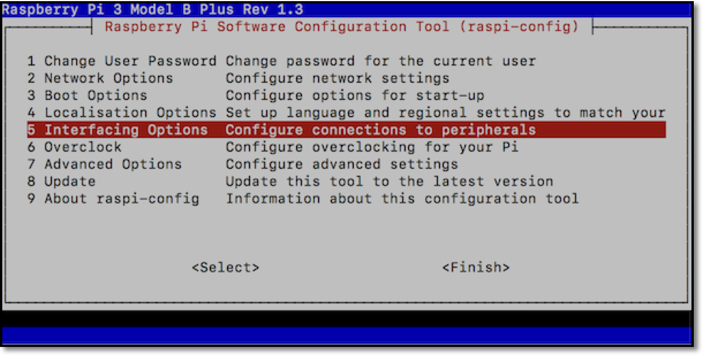
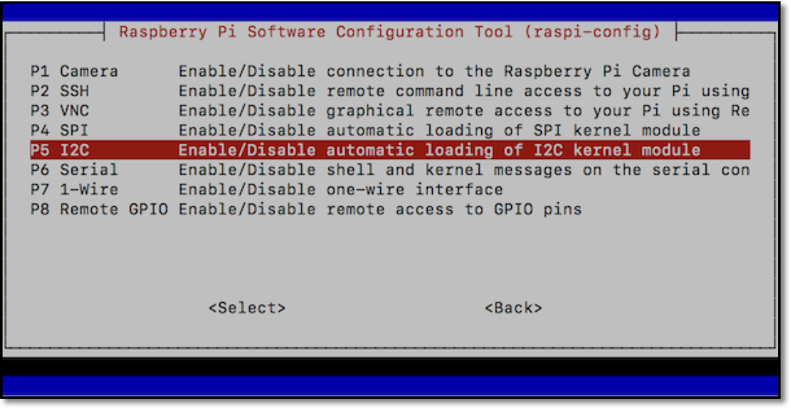

# SDカードイメージを最初から作成する方法

DonkeyCarインストール済みイメージを使う場合はスキップしてください。<br>
ここは最初からSDカードイメージを作る場合の説明になります。<br>


## Raspberry Piのイメージ
Raspberry Pi用のイメージはRaspberry Pi Imagerを使って直接micro SDカードにインストールする方法になりました。

<hr>

[Raspberry Pi Imager](https://www.raspberrypi.org/downloads)をダウンロードします。Windows/maxOS/Ubuntu用があります。

Raspberry pi Imagerを使ってmicro SDカードにOSイメージを焼きます。<br>
OSはRaspberry Pi OS Lite (32-bit)を選択します。<br>

<br>
<br>
<br>

モニターやキーボード無しで設定を続けます。

## sshを有効化する
micro SDカードに、`ssh`ファイルをコピーします。<br>
{{ download_link('https://faboplatform.github.io/DonkeyDocs/0.SDカードイメージを最初から作成する方法/ssh', 'ssh') }}をダウンロードします。中身はただの空ファイルです。

OSイメージをmicro SDカードに焼き込み終わったあとに、SDカードを抜いて、再度PCに挿し直すと、PCでSDカードが認識されます。<br>
PCでSDカードを認識したら、`/boot/`ディレクトリ以下に空ファイルのsshファイルをコピーします。<br>
この方法はraspi-configでsshを有効化することと全く同じですが、モニターやキーボードを別途用意することなく実現できます。<br>

続けてWiFiを設定します。

## WiFiを設定する
micro SDカードに、`wpa_supplicant.conf`ファイルをコピーします。<br>
{{ download_link('https://faboplatform.github.io/DonkeyDocs/0.SDカードイメージを最初から作成する方法/wpa_supplicant.conf', 'wpa_supplicant.conf') }}をダウンロードします。ファイルを編集してSSIDとパスワードをWiFiルータ用に設定してください。<br>

`wpa_supplicant.conf`を編集したら、SDカードの`/boot/`ディレクトリ以下にコピーしてください。<br>

この後、SDカードをraspberry piに入れて、raspberry piの電源を入れます。<br>

## Raspberry Piのアップデート
Raspberry Piにログインしてパッケージを更新します。
```
sudo apt-get update
sudo apt-get upgrade
```
<hr>

## Rapberry Piの設定
以下のコマンドで、I2Cとカメラを有効化します。
`Interfacing Options -> Camera -> yes` , `Interfacing Options -> I2C -> yes` を選択すると有効化できます
```
sudo raspi-config
```





tabキーを押し、finishボタンを押すことで設定出来ます。

raspi-config自体もアップデート可能な事があるので、raspi-configを更新しておきたい場合はraspi-configのメニューからアップデートの確認をおこなってください。

設定を変更すると再起動するので、再度SSHでログインします。


## HDMI HotPlug 有効化
Raspberry Pi起動後にHDMIケーブルを繋いだときに、モニターに画面を表示するための設定。<br>
デフォルトだと電源を入れる前にHDMIケーブルを接続していなければモニターを認識しないので、この設定をしておくと便利になります。<br>
```
vi /boot/config.txt
```

```
hdmi_force_hotplug=1
hdmi_drive=2
```

## vimでコピー&ペーストを可能にする
```
vi ~/.vimrc
```

```
:set clipboard+=unnamed
```

## Hostnameの修正

Defaultでは、Macユーザは `ssh pi@raspberrypi.local` でRaspberry Piに接続できます。全員同じ名前になると、区別がつかないので、`hostname`, `hosts` の 2箇所のhost名を書き直し、独自の名前で呼び出せるようにしておきます。今回は、`raspberrypi`から`donkeypi`に書き直します。

## hostnameの修正

```
sudo vi /etc/hostname
```

```
donkeypi
```

## hostsの修正

```
sudo vi /etc/hosts
```

```
(env) pi@raspberrypi:~ $ sudo vi /etc/hosts

127.0.0.1       localhost
::1             localhost ip6-localhost ip6-loopback
ff02::1         ip6-allnodes
ff02::2         ip6-allrouters

127.0.1.1       donkeypi
```

## DonkeyCarのインストール

### パッケージ群のインストール
```
sudo apt-get install -y vim htop locate arp-scan screen

sudo apt-get install -y build-essential python3 python3-dev python3-pip python3-virtualenv python3-numpy python3-picamera python3-pandas python3-rpi.gpio i2c-tools avahi-utils joystick libopenjp2-7-dev libtiff5-dev gfortran libatlas-base-dev libopenblas-dev libhdf5-serial-dev git ntp

sudo apt-get install -y libilmbase-dev libopenexr-dev libgstreamer1.0-dev libjasper-dev libwebp-dev libatlas-base-dev libavcodec-dev libavformat-dev libswscale-dev libqtgui4 libqt4-test
```

### virtualenv環境の構築

python/pip環境をpython3/pip3で構築します。<br>
この仮想環境は~/env/に作成されます。<br>

`source ~/env/bin/activate`コマンドで仮想環境を有効化して、`deactivate`コマンドで仮想環境を抜けます。<br>
pip仮想環境を削除する場合は`rm -rf ~/env`でディレクトリを削除することで可能です。

```
python3 -m virtualenv -p python3 ~/env --system-site-packages
echo "source ~/env/bin/activate" >> ~/.bashrc
source ~/.bashrc
```
上記コマンドでログインシェルのbash設定ファイルである`~/.bashrc`ファイルに仮想環境を有効化するように追記したため、ログインすると自動的にこの環境を使用する設定にしています。<br>
`deactivate`を実行すれば元のpythonの環境に戻せます。

### DonkeyCarのインストール
参考: [DonkeyCar公式ページ](https://docs.donkeycar.com/guide/install_software/)

最新のDonkeyCarをインストールします。<br>
困ったら公式サイトをみるようにします。

```
mkdir ~/projects
cd ~/projects

git clone https://github.com/autorope/donkeycar
cd donkeycar
git checkout dev
pip install -e .[pi]
pip install tensorflow==1.13.1
pip install numpy --upgrade
pip install opencv-python
pip install smbus
```

OpenCV 4.xは以下のエラーが出る場合があります。<br>
```
python -c "import cv2"
Traceback (most recent call last):
  File "<string>", line 1, in <module>
  File "/home/pi/env/lib/python3.7/site-packages/cv2/__init__.py", line 3, in <module>
    from .cv2 import *
ImportError: /home/pi/env/lib/python3.7/site-packages/cv2/cv2.cpython-37m-arm-linux-gnueabihf.so: undefined symbol: __atomic_fetch_add_8
```
これはOpenCVの問題のようなので、問題が解決されるまで以下のように対応しておきます。<br>
```
echo "export LD_PRELOAD=/usr/lib/arm-linux-gnueabihf/libatomic.so.1" >> ~/.bashrc
source ~/.bashrc
```
参考：[https://github.com/piwheels/packages/issues/59](https://github.com/piwheels/packages/issues/59)


## DonkeyCar 設定
まずは~/mycarを作成して、自分の車両用の設定ファイルをテンプレートから作成します。
```
donkey createcar --path ~/mycar
cd ~/mycar
```

次に、myconfig.pyを編集します。
```
vi myconfig.pi
```
ステアリングPWMとスロットルPWMはキャリブレーションを実施して適切な値を入れます。<br>
JOYSTICK_DEADZONEはスロットルオフの時にレコーディングが止まるように少しあった方がいいようです。<br>
(元々のDonkeyCar設計はスロットルオフの時にレコーディングが止まる設計なのですが、ジョイスチックの値が少しブレてしまうようで、無視する範囲がデフォルトの0.0だとスロットルオフの時もレコーディングが止まらなくなってしまうようです。）<br>

```
STEERING_LEFT_PWM = 460 # 左。PWMは1740
STEERING_RIGHT_PWM = 290 # 右。PWMは1100

THROTTLE_FORWARD_PWM = 500 # 前進の値。PWMは2000us
THROTTLE_STOPPED_PWM = 375 # ニュートラルの値。PWMは1500us
THROTTLE_REVERSE_PWM = 250 # 後進の値。PWMは1000us

JOYSTICK_MAX_THROTTLE = 1.0 # 早過ぎる場合は0.3に落とす
CONTROLLER_TYPE='F710'
JOYSTICK_DEADZONE = 0.05

MAX_EPOCHS = 50
EARLY_STOP_PATIENCE = 10
CACHE_IMAGES = False
```


## OLED設定
新しいDonkeyBoardにはOLEDが搭載されています。<br>
Raspberry Piを起動したときに、IPアドレスを表示することが可能になるため、その設定をおこないます。<br>
また、DonkeyCarもOLEDを利用できますが、ネットワークインターフェースが存在しない場合（Raspberry Pi3A+）にエラーになります。<br>
ネットワークインターフェースの確認を追加したコードをpull requestしてあるので、将来的には解決すると思いますが、今の所は対策済みの`oled.py`をdonkeycarのソースコードにコピーしておくことにします。

参考：[https://github.com/FaBoPlatform/ip_address_display](https://github.com/FaBoPlatform/ip_address_display)

ダウンロードと設定
```
cd ~/projects
git clone https://github.com/FaBoPlatform/ip_address_display
mkdir -p ~/fabo/bin
cd ip_address_display
cp oled_ip* ~/fabo/bin
cp oled.py ~/projects/donkeycar/donkeycar/parts/
```
rc.local有効化
```
sudo systemctl status rc.local
sudo systemctl daemon-reload
sudo systemctl start rc.local
sudo systemctl status rc.local
```
再起動後、ネットワークに接続されていればOLEDにIPアドレスが表示されます。
```
sudo reboot
```

