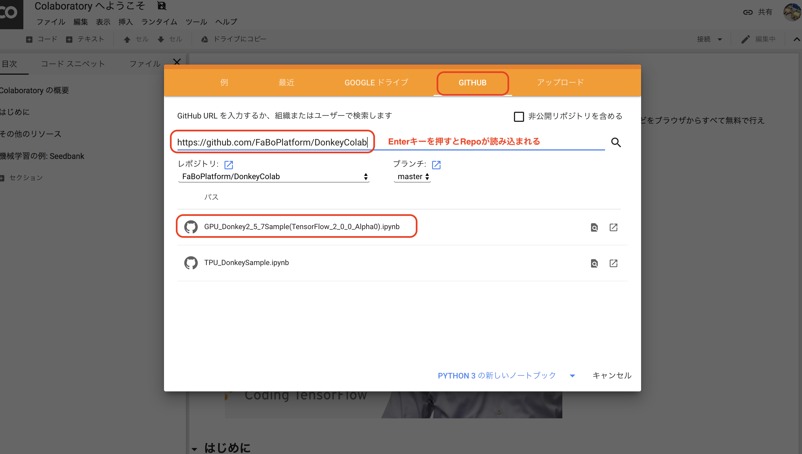

# Colabでの学習(GPU)

!!!warning "注意点"
	本ドキュメントはDonkeyCar 2.5.8に対応しています。

!!!warning
	Google Colaboratoryのサンプルは、かならずChormeで実施してください。他のブラウザを用いる場合は、ファイルのアップロードに失敗します。

## 学習にはGoogle Colaboratoryを用います。

|ノートブックのRepo|
|:--|
|[https://github.com/FaBoPlatform/DonkeyColab](https://github.com/FaBoPlatform/DonkeyColab)|

をコピーしておきます。

下記リンクからColaboratoryを起動します。

## ColabへのDonkeyCarの取り込み

## 学習済みデータをDonwload

mypilotをダブルクリックするとダウンロードが始まります。

