# 組み立て DCK-R2

Donkey Car Carbon Edition

組み立てを行う前に必ずお読みください。

対象モデル

|コード番号|
|:--|
|DCK-R2|

## Donkey Carのパーツ一覧

|写真|部品|個数|
|:--|:--|:--|
||ベース車体 HSP 94186 ※ベース車体付属のプロポは使用しないでください。|１台|
||充電器（PSEマーク付き）イーグル模型 AC デルタピーク・チャージャー 1.2A充電 #2638 ※ベース車体付属の充電器は使用しないでください。|１台|
||モバイルバッテリー INIU BI-B3 10000mAh/37Wh 5V/3A出力 マイクロUSBケーブル付属|１台|
||ゲームパッド ワイヤレスゲームパッド F710またはF710R|１台|
||RaspberryPi3 B+|１枚|
||PiCamera 広角 魚眼レンズ  5 MP Omnivision 5647|１個|
||microSDカード サンディスク SanDisk 64GB SDSQXCY-064G-GN6MA Extreme PRO|１枚|
||SDカードケース|１個|
||USBケーブル 右向きL字　 X001B7THGZ|１本|
||制御基板  #608 FaBo DonkeyBoard ディスプレイ付き|１枚|
||アーム 材質：プラスチック カラー：マッドブラック 部品コード:DCK2-001MBK|１個|
||ベースプレート 材質：カーボン 厚さ:3mm 部品コード:DCK2-002CA|１枚|
||基板取り付けプレート 材質：カーボン 厚さ:2mm 部品コード:DCK2-003RSINCA|１枚|
||充電用変換コネクタ（ラージコネクターミニコネクタ）長さ５cm 部品コード:DCK2-004|１本|
||RaspberryPi取り付けねじ  スペーサー　AS-2609B（予備１個）・・・・・5個 皿ネジ M2.6x5 （予備１個）・・・・・5個 ネジ M2.6x5 （予備１個）・・・・・5個|１袋|
|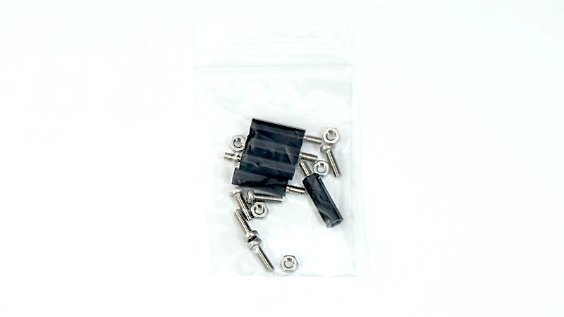|基板プレート取り付けねじ  スペーサー M3 BS-318B（予備１個）・・・・・5個 ナベ頭小ねじ　M3×10（予備１個）・・・・・5個 |１袋|
||アーム取り付けねじ  六角ナット1種 M3（予備１個）・・・・・5個 ナット M3 ３種（薄）・・・・・３個|１袋|
||カメラ固定ネジ  タッピングねじ(予備2個) M2*8・・・・・６個 カメラ　絶縁スペーサー・・・・・２個|１袋|
||固定ピン X000YMXW3|２個|
||両面テープ|２枚|
||ドライバー　+2|１本|
||ナットドライバー 5.5mm|１本|
||精密ドライバー P柄|１本|

※予告なく使用が変更されることがございます。

※開封後すぐに欠品がないか確認してください。欠品の際は、ご連絡ください。

[※FaBoお問い合わせ先](https://www.fabo.io/contact/ )

## Donkey Car組み立て

### 0.車体の説明

ラジコンのボディーを外し、2本のPWMの線を、プロポ受信機から取り外します。

車体のESC[*]()とサーボからでている線とスイッチの位置を確認します。

!!!Note "ESCとは？"
ESCとはエレクトリックスピードコントローラーの略で、スピードコントローラーまたはアンプと呼ばれる。RCカーのモーターを制御する装置のこと。

!!!warning "注意点"
	HSP 94186のプロポとプロポ受信機は、国内の技術基準適合証明(技適)を取得していません。国内では、プロポを使用しないでください。

### 1.ボディマウントの高さを調整します。

|画像|使用するパーツ|個数|
|:--|:--|:--|
||ベース車両|１|

付属のプロポは使用しません。ベース車両を箱から取り出します。

ボディーマウントの高さを調整します。精密ドライバーでねじを外し、高さを一番低い位置へ調整します。

再びねじ止めします。左右どちらも一番低くします。

前後４箇所高さを合わせます。

### 2.Raspberry Piを取り付ける。

|画像|使用するパーツ|個数|
|:--|:--|:--|
||Rapsberry Pi 3B+|１|
||基板取り付けプレート|１|
||皿ねじM2.6＊５|１|
||なべねじM2.6＊5|１|
||樹脂スペーサー（黒）|１|
||制御基板|１|

ラズベリーパイ、基板取り付けプレート、皿ねじM2.6＊５　４個、樹脂スペーサー（黒）　４個を用意します。

皿もみがあるほうが裏になります。

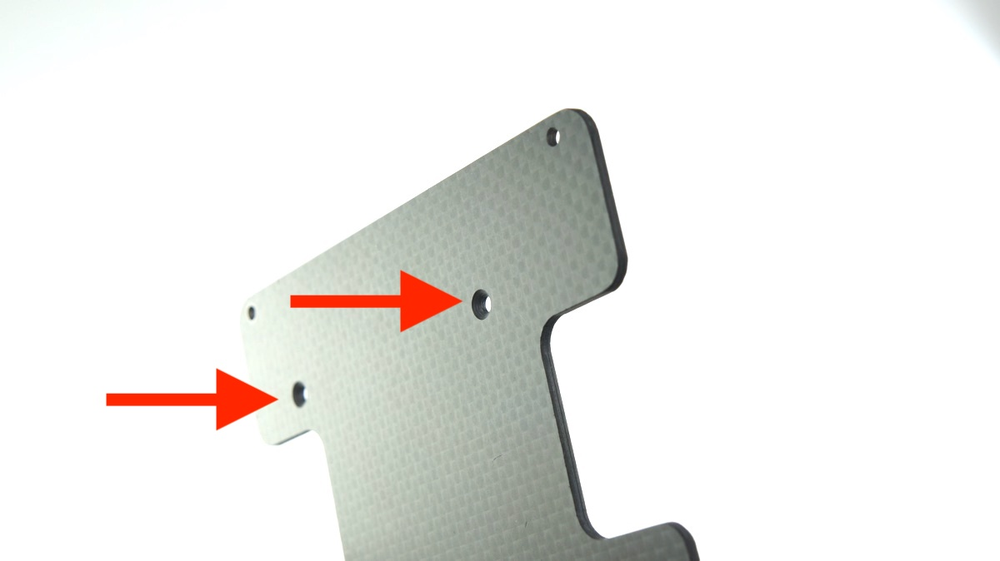

皿ねじM2.6＊５を使用します。

反対は樹脂スペーサーM3を使用します。樹脂スペーサーを手で回し、仕上げは、精密ドライバーで締めます。

同じように樹脂スペーサーを４箇所取り付けます。表の様子になります。

裏側はなべねじ４本を取り付けます。

なべねじ　M2.6*5を用意しラズパイを樹脂スペーサーの上に載せておきます。

※ラズパイの取り付け方向にご注意ください。写真のようにカーボンのプレートがえぐれている方がラズパイのピンヘッダがある方になります。

M2.6*5のなべねじを精密ドライバーで４箇所ねじをしめます。

制御基板を用意します。

制御基板をラズパイのピンにズレがないように差し込みます。

以下のようになります。

### 3.カメラをドンキーカーアームに取り付ける

|画像|使用するパーツ|個数|
|:--|:--|:--|
||アーム|１|
||樹脂スペーサー（白）|１|
||タッピングねじM2*8|１|
||ラズパイカメラ|１|

ドンキーアーム、タッピングねじM2　4個、スペーサー2個、ラズパイカメラを用意します。

ドンキーカーアームにM2＊８のタッピングねじを使用してラズパイカメラを取り付けます。

向かって左側には樹脂スペーサー（白）を上下２箇所取り付けます。

カメラ取り付け完了です。

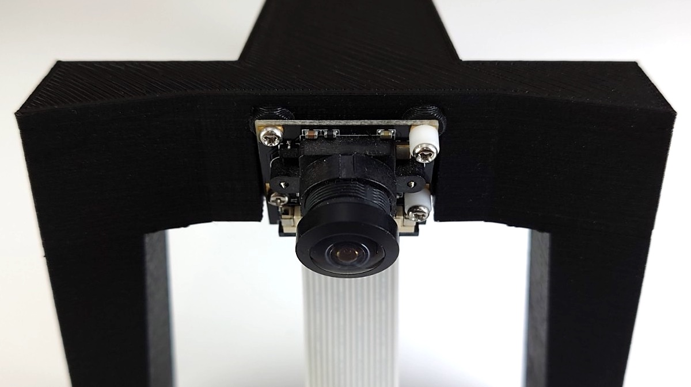

### 4.ベースプレートに基板取り付けプレートを取り付ける

|画像|使用するパーツ|個数|
|:--|:--|:--|
||ベースプレート|１|
||樹脂スペーサーM3*18(黒)）|１|
||タッピングねじM2*8|１|

２章で基板取り付け済みのプレートとベースプレート、スペーサー（黒）M3＊１８、なべねじM３＊１０を用意します・

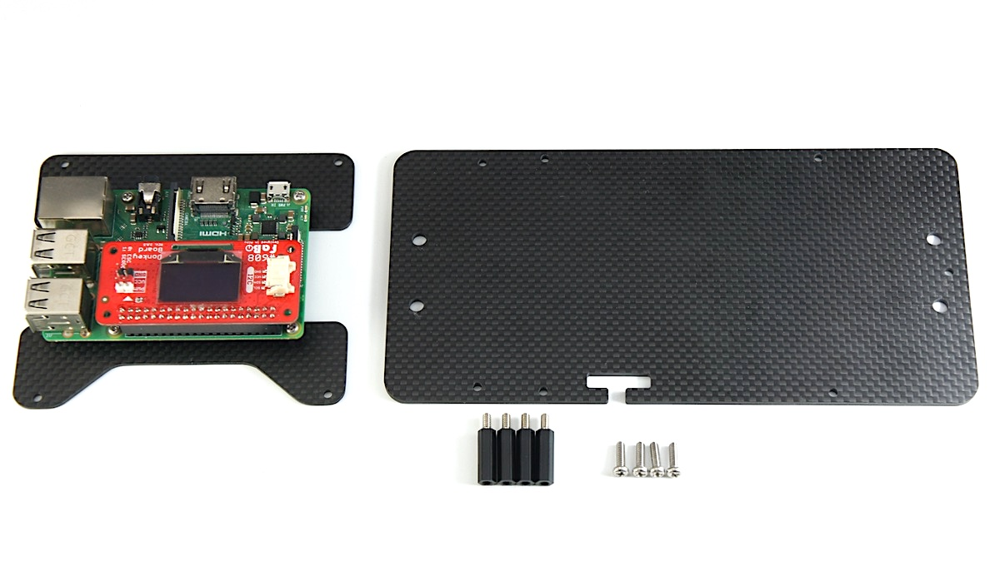

ベースプレートの向きを確認します。ネジ穴位置で前後方向、切り欠きで表裏が決まります。

前から二番目に穴にM３＊10のなべねじと樹脂スペーサーM3＊１８でねじを締めます。

ナットドライバーで締めます。

４箇所写真の場所にスペーサーを設置します。

表

裏

モバイルバッテリー、両面テープ２枚、六角ナットM34個を用意します。

モバイルバッテリーの両側に両面テープを貼ります。

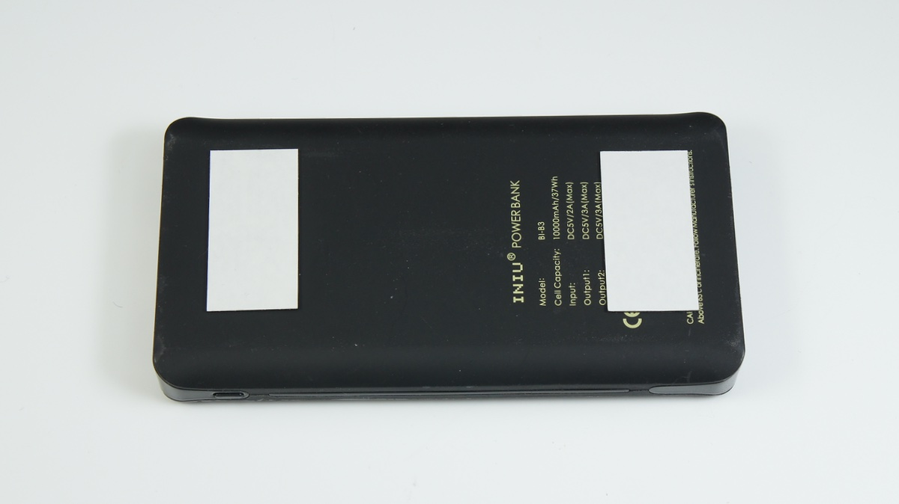

両面テープの片側の剥離紙をとります。

モバイルバッテリーをベースプレートに貼ります。プレートの先端から約２５mmぐらいのところにはります。

モバイルバッテリーの上に基板取り付けプレートを載せ取り付けます。

六角ナットM3で取り付けます。

ナットドライバーで締めます。

### 5.アームを取り付け

第４章で取り付けたベースプレートと第３章でカメラを取り付けたアーム、なべねじM3＊１０　3個、六角ナットM3　３種（厚さが薄いナット）1個を用意します。

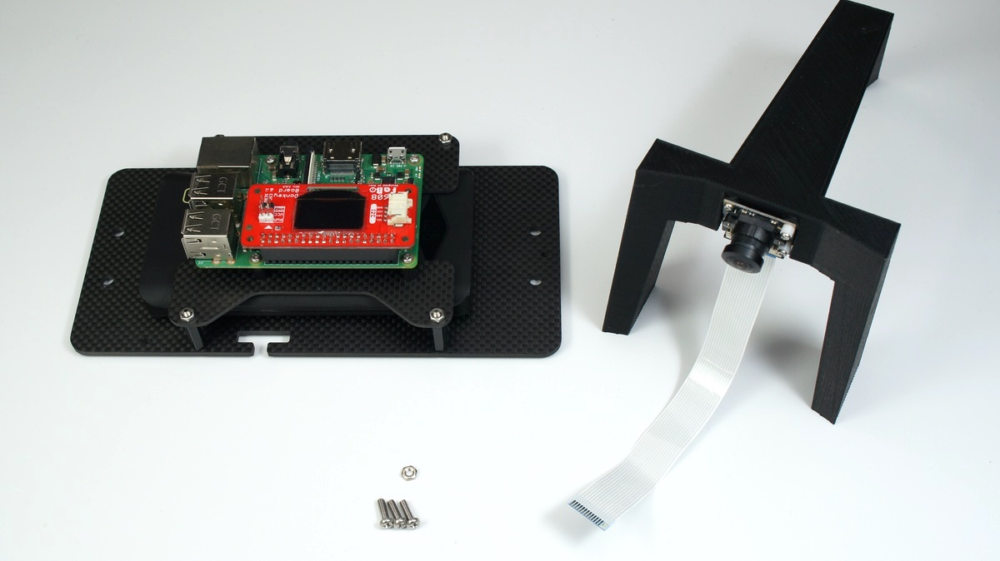

アームをベースプレートの上に起きます。

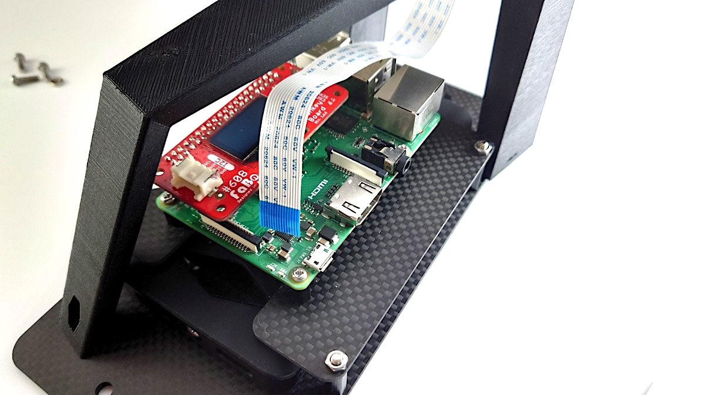

コネクターの黒い部分を引き上げます。

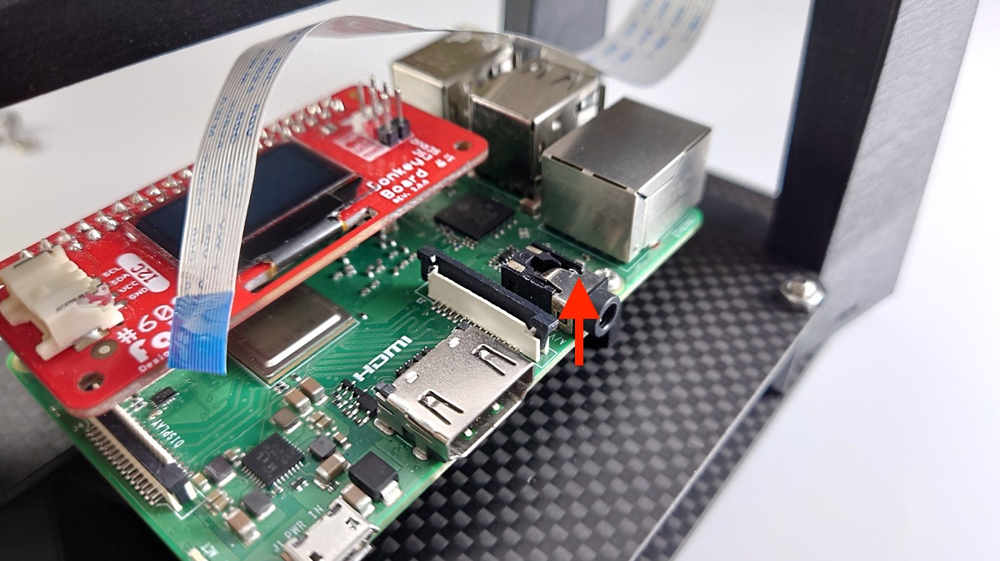

カメラのフラットケーブルをねじって、下の写真のようにコネクタに差し込みます。

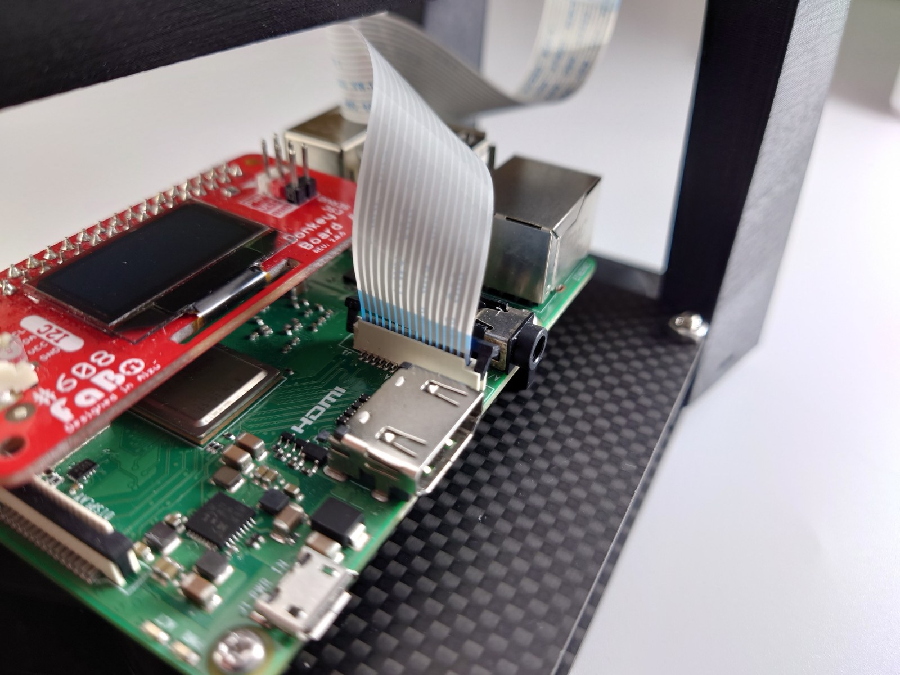

黒い部分を両側下に押します。

ベースプレート前方の２つの穴にネジを差し込んで仮に締めます。

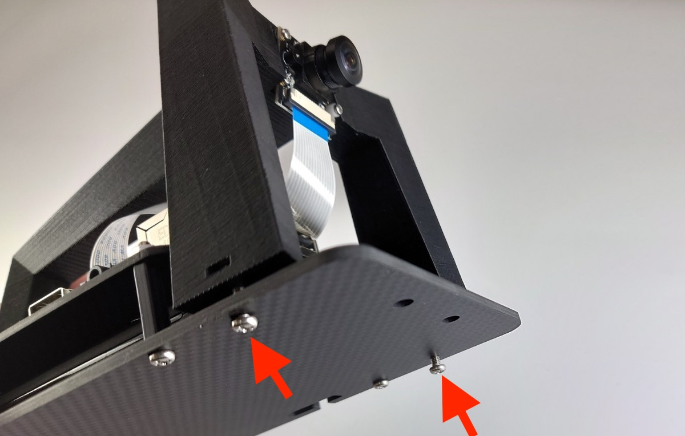

アームにナットM3（３種）を配置します。

なべねじM3*10で締めます。

ドライバーにてアーム部分のねじ３箇所、緩まないように本締めを行います。

アームの取り付けは完了となります。

### 6.ドンキーカーとベースプレートを結合

車体にマウントします。サーボモーターがある方が前となります。

RCピンで固定します。

後

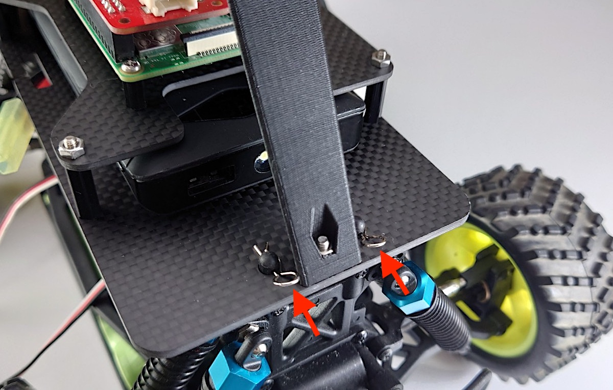

前

### 7.信号ケーブルを接続します。

それぞれ、ベース車体から出ている信号線（ESC,サーボ）を写真のように、赤い基板の制御基板へ接続します。

ESC（スピードコントローラー）の線は０へ、サーボの線は、１へ接続します。

### ８.RCカーの電源ケーブルを接続します。

電源スイッチがOFFになっていることを確認してから電源をつないでください。思いがけない発進より事故の可能性があります。台に置いて車輪を浮かせればより安心です。

バッテリーと接続します。

### ９.Raspberry Piの電源ケーブルを接続します。

モバイルバッテリーにUSBケーブルを刺します。ラズパイ側にはUSBケーブルまだ刺しません。（SDカード設定後）

USBケーブルはラズパイにまだつなぎません。付属のSDカードをパソコンに接続してWifi設定したあとにSDカードをラズパイに刺してから、ラズパイの電源を投入します。くわしくは次の章で解説します。

### １０.ゲームパットUSBドングルを接続します。

ゲームパッドのUSBドングルを任意のUSBポートへ接続します。

### １１.注意事項

走行しない時は、こまめにRCカーの電源を切りましょう。電源を消し忘れると過放電によるバッテリーの故障や寿命を短くなる場合があります。

ドンキーカーのアームを片手掴んだり、アームの下に、指を深くいれると基板の突起物により怪我をする危険性があります。必ず車体の両側を両手で持ちましょう。

完成イメージ（OLEDは、SDカードを入れないと表示されません。）

組み立ては以上になります。

お疲れ様でした。
