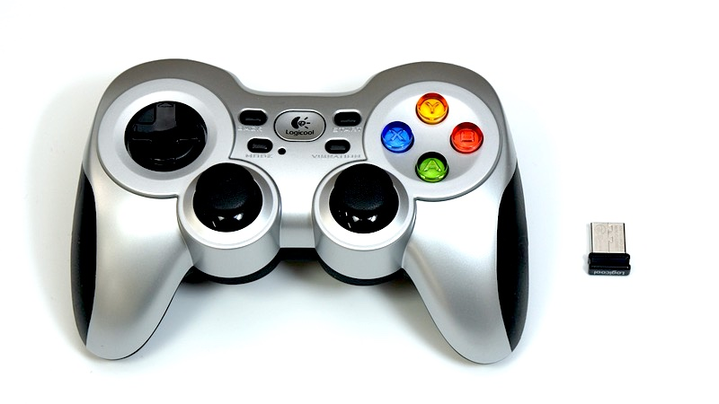
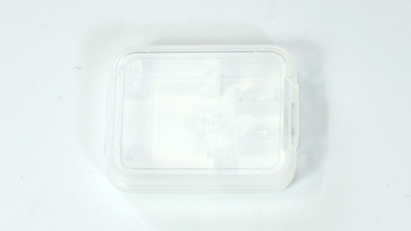
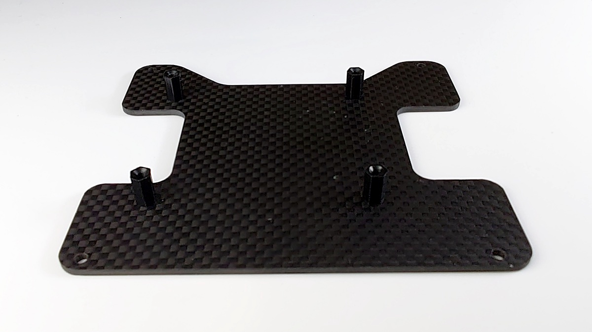
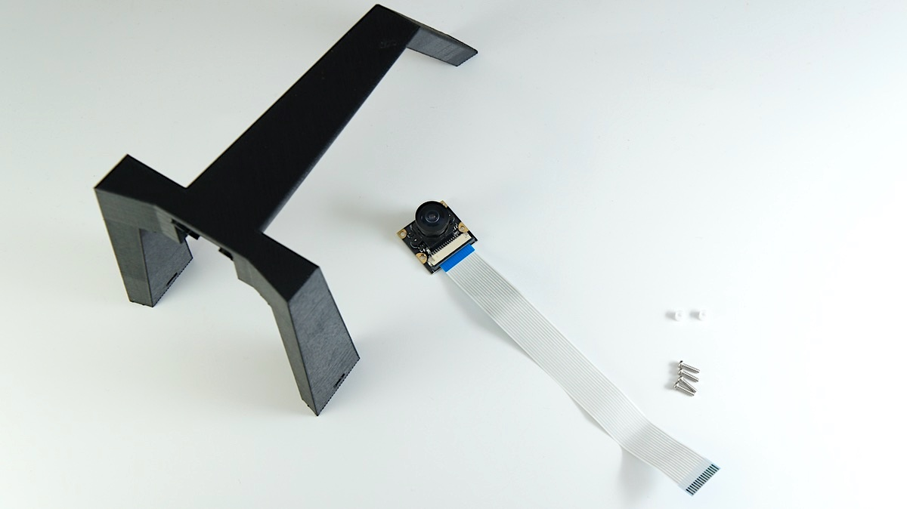
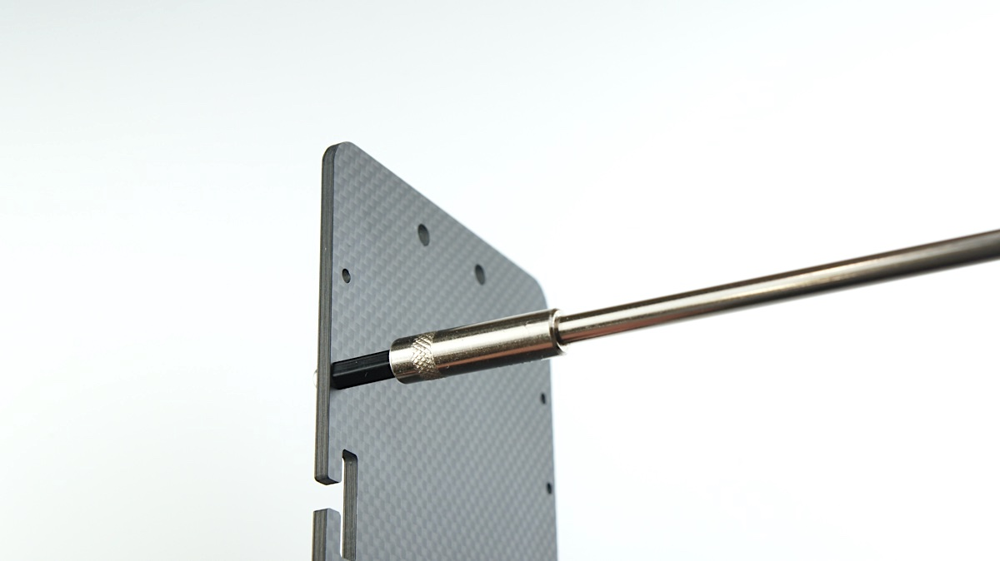

# 組み立て DCK-R2

FaBo Donkey Car Kit Carbon Edition 組み立てマニュアル

組み立てを行う前に必ずお読みください。

対象モデル

|コード番号|
|:--:|
|DCK-R2|

## Donkey Carのパーツ一覧

|写真|部品|個数|
|:--|:--|:--:|
||ベース車体 HSP 94186  ※ベース車体付属のプロポは使用しないでください。|１台|
||充電器（PSEマーク付き）  イーグル模型 AC デルタピーク・チャージャー 1.2A充電 #2638 ※ベース車体付属の充電器は使用しないでください。|１台|
||モバイルバッテリー  INIU BI-B3 10000mAh/37Wh 5V/3A出力 マイクロUSBケーブル付属|１台|
||ゲームパッド  ワイヤレスゲームパッド F710またはF710r 2.4 GHZワイヤレス接続 入力規格：DirectInput,XInput 単三乾電池２本付属 レシーバーはUSB|１台|
||Raspberry Pi 3B＋  Broadcom BCM2837B0 Cortex-A53 (ARMv8) 64-bit 1.4GHz 1GB LPDDR2 SDRAM 2.4GHz and 5GHz IEEE 802.11.b/g/n/ac wireless LAN Bluetooth 4.2, BLE CSI camera port 5V/2.5A DC power input|１枚|
||PiCamera  広角 魚眼レンズ  5 MP Omnivision 5647|１個|
||microSDカード  サンディスク SanDisk 64GB SDSQXCY-064G-GN6MA Extreme PRO SD変換アダプター付属|１枚|
||SDカードケース|１個|
||USBケーブル  マイクロUSBー標準USB L字|１本|
||制御基板   #608 FaBo DonkeyBoard OLEDディスプレイ付き,PCA9685搭載、I2Cポート Rev2.0.5|１枚|
||アーム  材質：プラスチック カラー：マッドブラック 部品コード:DCK2-001MBK|１個|
||ベースプレート  材質：カーボン 厚さ:3mm 部品コード:DCK2-002CA|１枚|
||基板取り付けプレート  材質：カーボン 厚さ:2mm 部品コード:DCK2-003RSINCA|１枚|
||充電用変換コネクタ  ラージコネクターミニコネクタ　 長さ5cm 部品コード:DCK2-004 ※当社ドンキーカー充電には必ずこちらをお使いください。市販のものは、極性が異なる場合がございます。|１本|
||Raspberry Pi取り付けねじ  スペーサー M2.6*9　AS-2609B（予備１個）・・・・・5個 皿ネジ M2.6*5 （予備１個）・・・・・5個 ネジ M2.6x5 （予備１個）・・・・・5個|１袋|
||基板プレート取り付けねじ  スペーサー M3*18 BS-318B（予備１個）・・・・・5個 ナベ頭小ねじ　M3*10（予備１個）・・・・・5個 |１袋|
||アーム取り付けねじ  六角ナット1種 M3（予備１個）・・・・・5個 ナット M3 ３種（スリム）・・・・・３個|１袋|
||カメラ固定ネジ  タッピングねじ(予備2個) M2*8・・・・・６個 カメラ　絶縁スペーサー・・・・・2個|１袋|
||固定ピン  X000YMXW3 本体付属の固定ピンもご使用できます。 予備・・・・・2個|１袋|
||両面テープ|２枚|
||ドライバー　+2|１本|
||ナットドライバー 5.5mm|１本|
||精密ドライバー P柄|１本|

※予告なく仕様が変更されることがございます。

※開封後すぐに欠品がないか確認してください。欠品の際は、ご連絡ください。

[※FaBoお問い合わせ先](https://www.fabo.io/contact/ )

## Donkey Car組み立て

### 0.車体の説明

RCカーのピンとボディを外します。2本のPWMの線を、プロポ受信機から取り外します。

車体のESCとサーボからでている線とスイッチの位置を確認します。

※プロポ受信機は使用しません。

!!!info "ESCとは？"
	ESCとはエレクトロニックスピードコントローラーの略で、スピードコントローラーまたはアンプと呼ばれる。命令によってRCカーのモーターを制御する装置のこと。ドンキーカーでは前進後進するモーターを制御します。

!!!info "サーボとは？"
		サーボとは、命令を受けて回転運動するモーターのこと。ドンキーカーでは車輪を操舵するのに使われる。さまざまな回転速度、トルク選べモーター単体よりも制御しやすく扱いやすい。

###　RCカーの主な名称

!!!warning "注意点"
	HSP 94186のプロポとプロポ受信機は、国内の技術基準適合証明(技適)を取得していません。国内では、プロポを使用しないでください。

### 1.ボディマウントの高さを調整します。

|画像|使用するパーツ|個数|
|:--|:--|:--|
|{: style="height:112px;width:200px;"}|ベース車体 HSP 94186|１|

ベース車体 HSP 94186付属のプロポは使用しません。ベース車体を箱から取り出します。ボディが止まっていた棒がボディマウントです。

初期状態の場合、ボディが高くケーブルが届きません。そこでボディマウントの高さを調整します。精密ドライバーでねじを外し、高さを一番低い位置へ調整します。

初期状態の高さ

ネジを回して外します。

再びねじ止めします。左右どちらも一番低くします。

前後合計４箇所高さを合わせます。

### 2.Raspberry Piを取り付ける。

|画像|使用するパーツ|個数|
|:--|:--|:--:|
|{: style="height:112px;width:200px;"}|Rapsberry Pi 3B+|１|
|{: style="height:112px;width:200px;"}|制御基板|１|
|{: style="height:112px;width:200px;"}|基板取り付けプレート|１|
|{: style="height:112px;width:200px;"}|Raspberry Pi取り付けねじ|１|

Raspberry Piをプレートに取り付けます。

Raspberry Pi、基板取り付けプレート、M2.5\*5皿ねじ　4個、M2.6\*9スペーサー（黒）　4個を用意します。

皿モミがあるほうが裏になります。

M2.6*5皿ねじを使用します。

反対側はM2.6*9スペーサー(黒)を使用します。スペーサーを手で回し、仕上げは、精密ドライバーで締めます。

同じようにスペーサーを4箇所取り付けます。表の様子になります。

裏側はなべねじ4本を取り付けます。

M2.6*5なべねじを用意しRaspberry Piをスペーサーの上に載せておきます。

※Raspberry Piの取り付け方向にご注意ください。写真のようにカーボンのプレートがえぐれている方がRaspberry Piのピンヘッダがある方になります。

M2.6*5なべねじを精密ドライバーで4箇所ねじをしめます。

制御基板を用意します。

制御基板をRaspberry Piのピンにズレがないように差し込みます。

以下のようになります。

### 3.カメラをアームに取り付ける

|画像|使用するパーツ|個数|
|:--|:--|:--:|
|{: style="height:112px;width:200px;"}|アーム|１|
|{: style="height:112px;width:200px;"}|PiCamera|１|
|{: style="height:112px;width:200px;"}|カメラ固定ネジ|１|

アーム、M2タッピングねじ　4個、スペーサー2個、Raspberry Piカメラを用意します。

アームにM2*8タッピングねじを使用してRaspberry Piカメラを取り付けます。

向かって左側にはスペーサー（白）を上下2箇所取り付けます。

カメラ取り付け完了です。

### 4.ベースプレートに基板取り付けプレートを取り付ける

|画像|使用するパーツ|個数|
|:--|:--|:--:|
|{: style="height:112px;width:200px;"}|ベースプレート|１|
|{: style="height:112px;width:200px;"}|基板プレート取り付けねじ|１|

2章で基板取り付け済みのプレートとベースプレート、M3\*18スペーサー（黒）、M3\*10なべねじを用意します・

ベースプレートの向きを確認します。ネジ穴位置で前後方向、切り欠きで表裏が決まります。

前から二番目に穴にM3*10なべねじとM3\*18スペーサーでねじを締めます。

ナットドライバーで締めます。

4箇所写真の場所にスペーサーを設置します。

表

裏

モバイルバッテリー、両面テープ2枚、M3六角ナット 4個を用意します。

モバイルバッテリーの両側に両面テープを貼ります。

両面テープの片側の剥離紙をとります。

モバイルバッテリーをベースプレートに貼ります。下の写真のようにスペーサー右外側とモバイルバッテリーが一直線に並ぶようにして、モバイルバッテリーの向きは、USBポートがある方を後ろ方向へ設置します。

モバイルバッテリーの上に基板取り付けプレートを載せ取り付けます。

M3六角ナットで取り付けます。

ナットドライバー5.5mmで4箇所締めます。

### 5.アームを取り付け

|画像|使用するパーツ|個数|
|:--|:--|:--:|
|{: style="height:112px;width:200px;"}|アーム取り付けねじ|１|

第4章で取り付けたベースプレートと第３章でカメラを取り付けたアーム、M3*10なべねじ 3個、M3六角ナット 3種（厚さが薄いナット）1個を用意します。

カメラの信号ケーブルをを接続します。ベースプレートの穴が3点確認できると思います。アームをベースプレートの上に起きます。

コネクターの黒い部分を引き上げます。

カメラケーブルの端子がHDMI端子方向へ向くようにケーブルをねじります。

下の写真のようにコネクタに差し込みます。

黒い部分を両側下に押します。

ベースプレート前方の2つの穴にM3*10なべねじを差し込んで仮に締めます。

アームにM3(3種)六角ナット1個を配置します。

M3*10なべねじで締めます。

ドライバーにてアーム部分のねじ3箇所、緩まないように本締めを行います。

アームの取り付けは完了となります。

### 6.RCカーとベースプレートを結合

|画像|使用するパーツ|個数|
|:--|:--|:--:|
|{: style="height:112px;width:200px;"} ※本体付属の固定ピンもご使用できます。|固定ピン|２個|

車体にマウントします。

サーボモーターがある方が前となります。

RCピンで固定します。

後

前

### 7.信号ケーブルを接続します。

それぞれ、ベース車体から出ている信号線（ESC,サーボ）を写真のように、ベースプレートの切り欠きを通して、制御基板へ接続します。

ESC（スピードコントローラー）の線は0へ、サーボの線は、1へ接続します。接続方法は、白（PWM）、赤（VCC）、黒（GND）それぞれ合わせます。

### ８.RCカーの電源ケーブルを接続します。

電源スイッチがOFFになっていることを確認してから電源をつないでください。思いがけない発進より事故の可能性があります。台に置いて車輪を浮かせればより安心です。

バッテリーと接続します。

### ９.Raspberry Piの電源ケーブルを接続します。

|画像|使用するパーツ|個数|
|:--|:--|:--:|
|{: style="height:112px;width:200px;"}|USBケーブル|１|

モバイルバッテリーにUSBケーブルを刺します。

Raspberry Pi側にはUSBケーブルまだ刺しません。（SDカード設定後）

USBケーブルはRaspberry Piにまだつなぎません。付属のSDカードをパソコンに接続してWifi設定したあとにSDカードをRaspberry Piに刺してから、Raspberry Piの電源を投入します。くわしくは次の章で解説します。

### １０.ゲームパットUSBレシーバーを接続します。

|画像|使用するパーツ|個数|
|:--|:--|:--:|
|{: style="height:112px;width:200px;"}|ゲームパッド|１|

ゲームパッドのレシーバーを任意のUSBポートへ接続します。

!!!info "ゲームパッド（F710）の入力モード"
	入力規格はXInputとDirectInputがあり、ドンキーカーでXInputの入力モードとなります。

!!!warning "制御不能"
		電波干渉、電池切れや操作距離は最大１０m程度です。制御不能に、ご注意ください。

### １１.注意事項

!!!warning "注意"
	走行しない時は、こまめにRCカーの電源を切りましょう。電源を消し忘れると過放電によるバッテリーの故障や寿命が短くなる場合があります。

!!!warning "注意"
	ドンキーカーのアームを片手掴んだり、アームの下に、指を深くいれると基板の突起物により怪我をする危険性があります。必ず車体の両側を両手で持ちましょう。

!!!warning "注意"
	制御不能（ノーコン）になった場合を考慮し、フェンス等を設け、公道では絶対に走らせないようにしましょう。

完成イメージ（OLEDは、SDカードを入れないと表示されません。SDカードのWifi設定後電源オン）

組み立ては以上になります。

お疲れ様でした。
