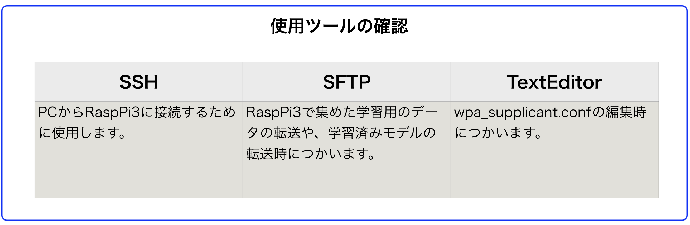
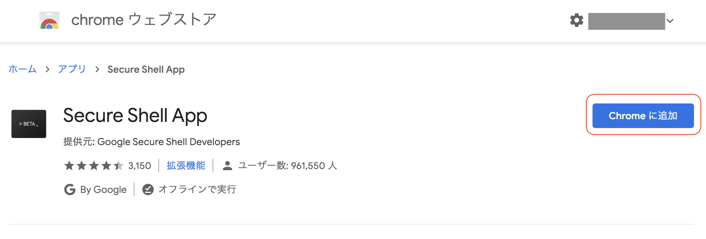
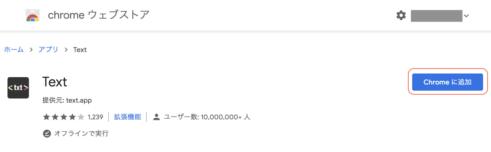

# 使用ツール　

## 使用ツール

|機能|アプリ|プラットフォーム|用途|
|:--|:--|:--|:--|
|SSH|<a href="https://chrome.google.com/webstore/detail/secure-shell-app/pnhechapfaindjhompbnflcldabbghjo?hl=ja" target="ssh_tab">Secure Shell</a>|Chrome App|RaspPi3に接続し、DonkeyCarでコマンドを実装するために使用します。SSH通信が可能なツールならどれでも使用可能です。|
|SFTP|<a href="https://chrome.google.com/webstore/detail/secure-shell-app/pnhechapfaindjhompbnflcldabbghjo?hl=ja" target="sftp_tab">Secure Shell</a>|Chrome App|データ・セット(datas.zip)をRaspPi3からPCに転送する用途で使います。また、学習済みモデル(mypilot)をPCからRaspPi3に転送するために使います。|
|Text Editor|<a href="https://chrome.google.com/webstore/detail/text/mmfbcljfglbokpmkimbfghdkjmjhdgbg" target="text_tab">Text</a>|Chrome App|TextEditorです。こちらも手持ちのTextEditorがあったら、そちらをお使いください。|

!!!info "使用ツール"
	SSH, SFTP, TextEditorは普段使っているツールがある場合は、そちらを使用してください。

## Chromeアプリのインストール

<a href="https://chrome.google.com/webstore/detail/secure-shell-app/pnhechapfaindjhompbnflcldabbghjo?hl=ja" target="ssh_tab">Secure Shell</a> をクリックし、Chrome Storeからインストールします。

<a href="https://chrome.google.com/webstore/detail/text/mmfbcljfglbokpmkimbfghdkjmjhdgbg" target="text_tab">Text</a> をクリックし、Chrome Storeからインストールします。

## Chromeアプリの起動

ChromeのURL欄に`chrome://apps`と入力します。

