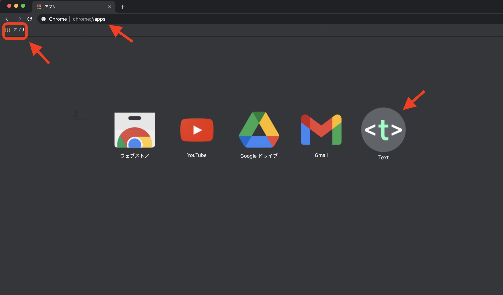
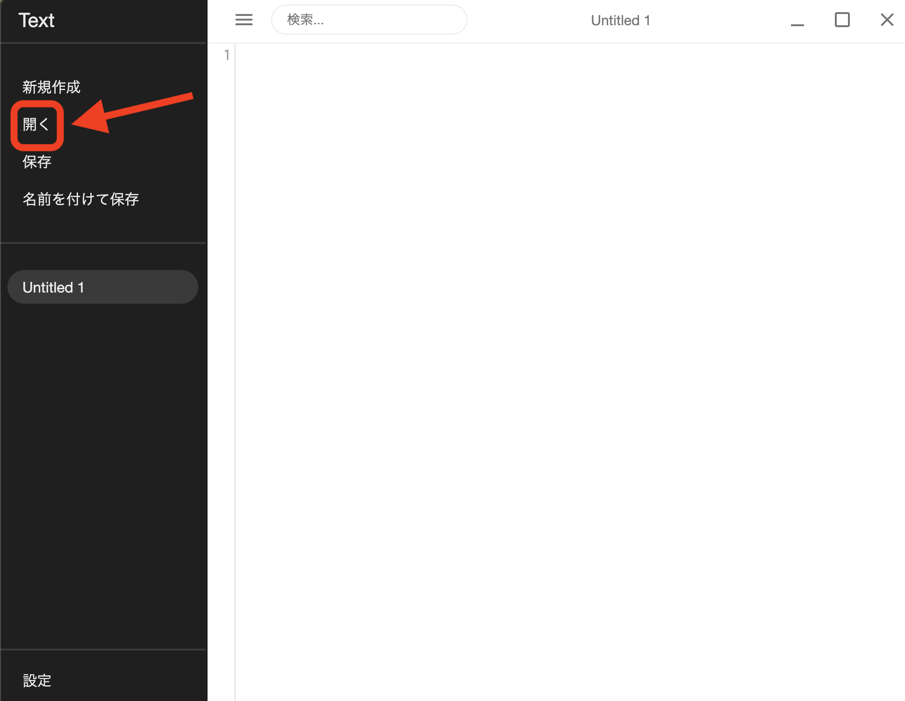
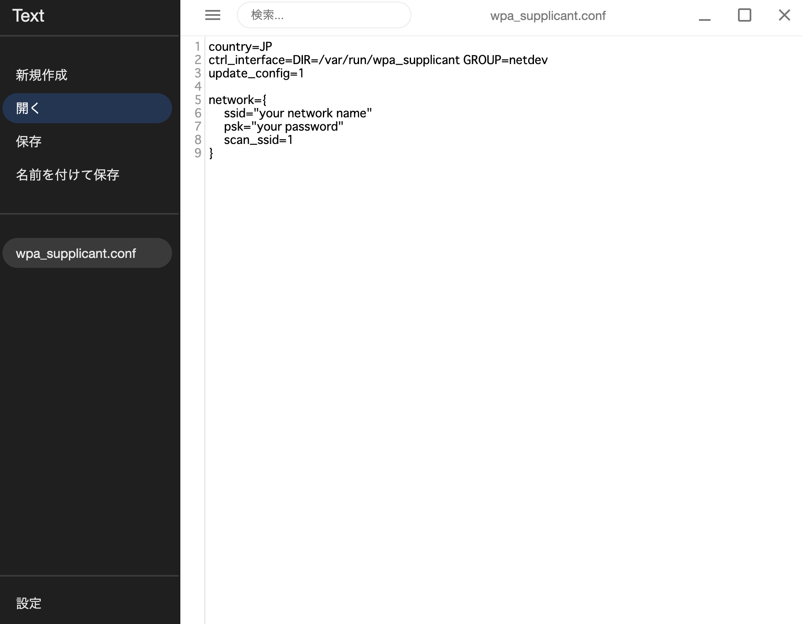
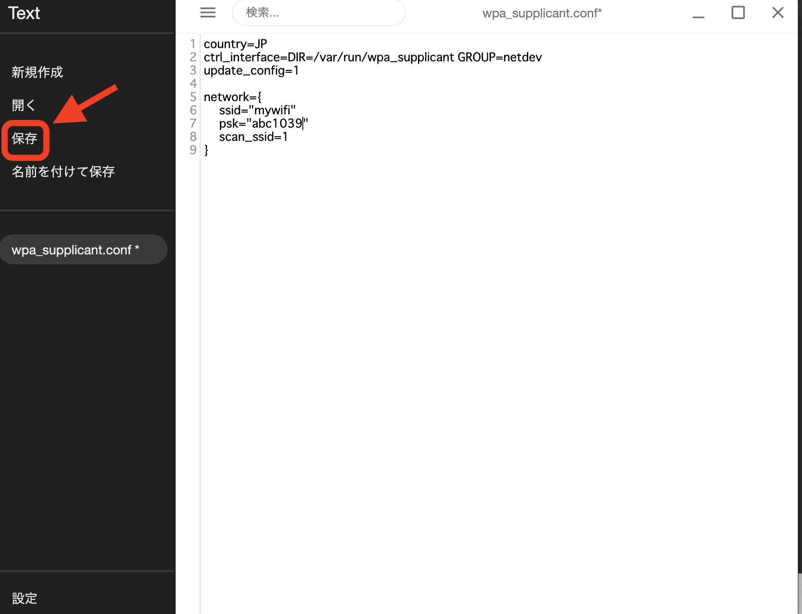
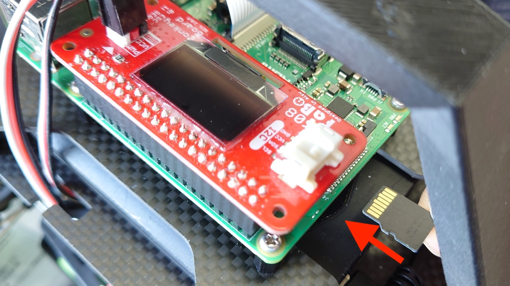
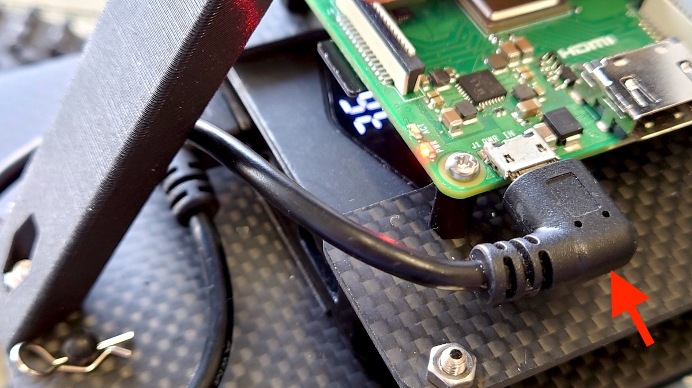
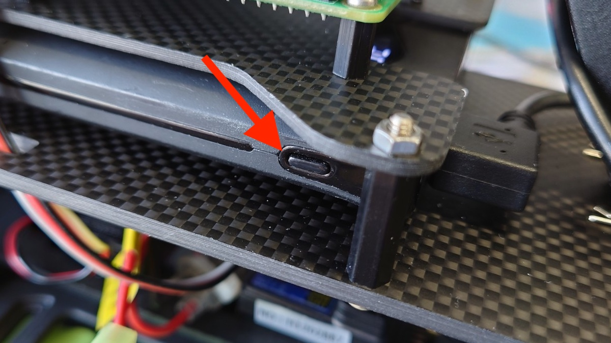
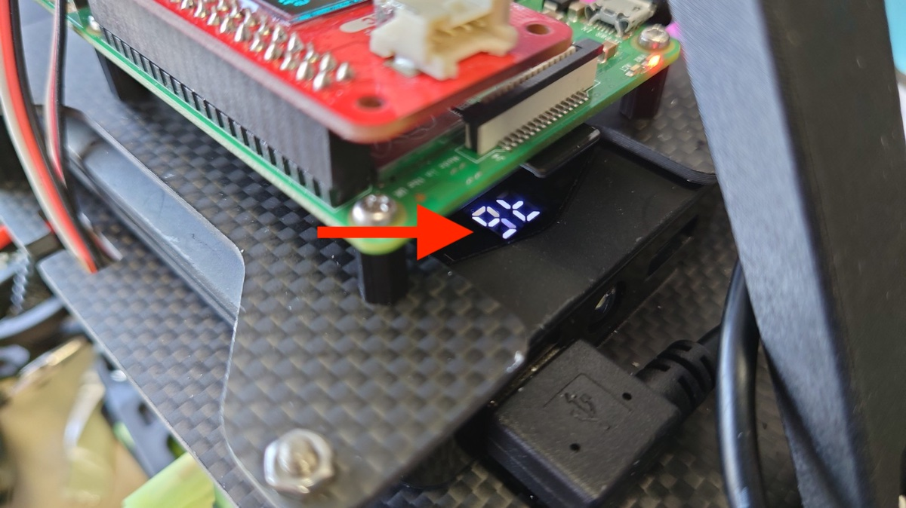
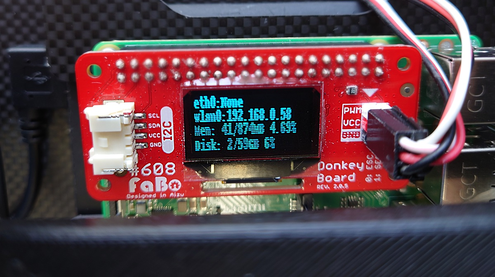

# Wi-Fiの設定

Wi-Fiへの接続、SSHでログインできるようにしていきます。  
焼き込みのみでは初回起動時にWi-Fiへの接続・SSHでのログインが出来ないため、ここで設定を行っています。


## Wi-Fi


### wpa_supplicant.confのダウンロード

microSDカードに、`wpa_supplicant.conf`というファイルをコピーします。{{ download_link('https://faboplatform.github.io/DonkeyDocs/1.DonkeyCar3の構築/wpa_supplicant.conf', 'wpa_supplicant.conf') }}をダウンロードし、SDカードにコピーしてください。


### TEXT Editorの起動と編集

<a href="https://chrome.google.com/webstore/detail/text/mmfbcljfglbokpmkimbfghdkjmjhdgbg" target="text_tab">TEXT(Chorme App)</a> をクリックし、アプリを起動をクリックし、TEXT Editorを開きます。


アプリをクリックするか、アドレスバーにchrome://appsと入力します。Textというアイコンが表示されるので選択します。



開くをクリック。



SDカード(boot)にあるwpa_supplicant.confを選択し、編集します。


ファイルを開くと以下の画面が表示されます。



```
country=JP
ctrl_interface=DIR=/var/run/wpa_supplicant GROUP=netdev
update_config=1

network={
    ssid="your network name"
    psk="your password"
    scan_ssid=1
}
```
ssidに接続先のssid, pskにpasswordを記載します。



Raspberry Piの初回起動時にSDカードにある`wpa_supplicant.conf`が自動的に  
`/etc/wpa_supplicant/wpa_supplicant.conf`へコピーされ、指定したWifiネットワークに  
接続されます。  


!!!warning "5GHz"
	RaspPi3は、5GHz帯のWifiは非対応です。2.4GHz帯のWifiのアクセスポイントを設定するようにしてください。

### Wifiスポットにパスワードなしでログインする場合の設定

PasswordのないWifiスポットに接続する場合は、下記例を参考にしてください。`key_mgmt=NONE`をつける事で、パスワードなしでログインできます。

```
country=JP
ctrl_interface=DIR=/var/run/wpa_supplicant GROUP=netdev
update_config=1

network={
    ssid="your network name"
    key_mgmt=NONE
}
```

ステルスモードのWifiスポットにログインする場合は、scan_ssid=1を入れます。

```
country=JP
ctrl_interface=DIR=/var/run/wpa_supplicant GROUP=netdev
update_config=1

network={
    ssid="your network name"
    psk="your password"
    scan_ssid=1
}
```

<hr>

## SDカードをDonekyCarに挿入

ディスプレイありモデル（DCK-R2）の場合。

SDカードをDonkeyCarのRaspberry 3B+に挿入します。



マイクロUSBプラグをRaspberry Piに刺して電源をオンにします。するとRaspberry Piの赤色LED（PWR）が点灯します。



電源が入らない場合は、モバイルバッテリーのスイッチを１回クリックします。



!!!info "モバイルバッテリースイッチ"
	回クリック 電源オン<br>2回クリック 電源オフ<br>長押し　モバイルバッテリーのライトオンまたはオフ

!!!warning "電源OFFの忘れ"
	モバイルバッテリーをオフにしてもRCカーの電源はオフにはなりません！！！ご注意ください。


<br>


モバイルバッテリーから電源出力されると残量表示が数字（パーセント）で表示されます。



!!!warning "モバイルバッテリーの残量"
	多少のズレがございます。ご了承ください。
<br>
<br>

ディスプレイに情報が表示され、Wlan0:IPアドレスが確認できます。



<hr>

## 接続先の確認(OSX)

ディスプレイなしモデル（DCK-R1）の場合。

DonkeyCarと同一ネットワークに接続しているOSXより、下記コマンドで接続を試みます。

```
ssh pi@donkeypi.local
```

|項目|値|
|:--|:--|
|id|pi|
|password|raspberry|

!!!info "Host名について"
	上記方法はOSXのみで有効で、複数台使用時は、DonkeyCarのRasPi3のhost名を任意のユニークな名前に書き直す必要があります。

ifconfigでipアドレスを確認します。

```
ifconfigf -a
```

で表示されるWLAN0にIPアドレスが表示されます。

<hr>

## 接続先の確認(Windows)

RaspberryPi3をHDMIケーブルでDisplayに接続します。起動画面の最後でIPアドレスが表示されれば、ネットワークに接続成功です。


<hr>

## wpa_supplicantの修正

接続に失敗した場合は、RaspPi3内の`/etc/wpa_supplicant/wpa_supplicant.conf` を修正することで、接続先の変更が可能です。

```
cd  /etc/wpa_supplicant/
sudo nano wpa_supplicant.conf
```

!!!info "IPアドレス"
	自分のIPアドレスをメモっておきます。
