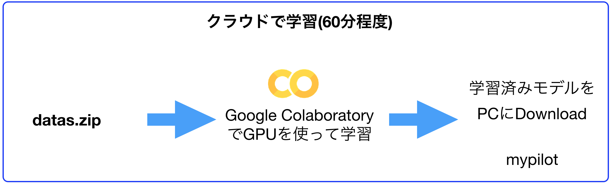
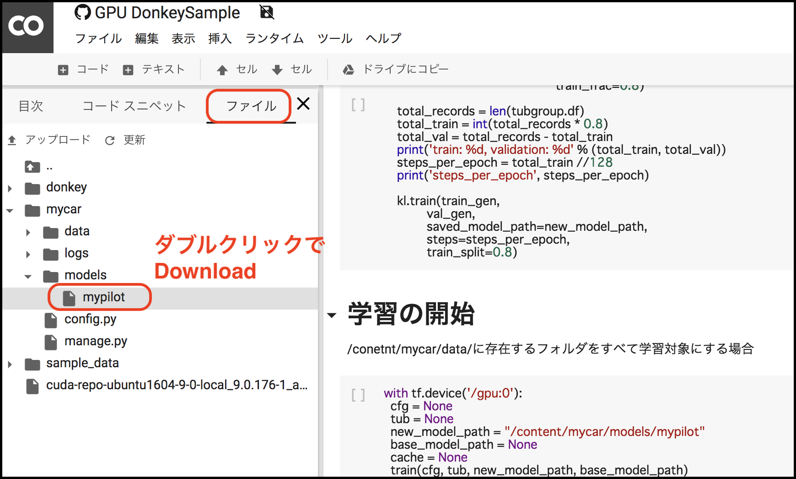

# Colabでの学習(GPU)

!!!warning
	Google Colaboratoryのサンプルは、かならずChormeで実施してください。他のブラウザを用いる場合は、ファイルのアップロードに失敗します。

## 学習にはGoogle Colaboratoryを用います。

下記リンクからColaboratoryを起動します。

このGoogle Colabのノートブックには、学習するためのスクリプトとコマンドが書いてあります。  
手順に従いColab上でスクリプトを実行すると、Donkey Carで集めたデータから学習結果を得られます。

## 学習済みデータをDonwload

Colabから学習結果をダウンロードします。
mypilotをダブルクリックするとダウンロードが始まります。

