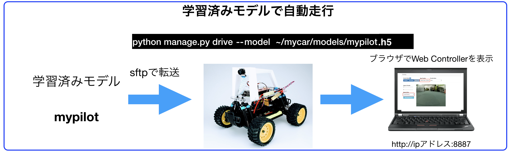
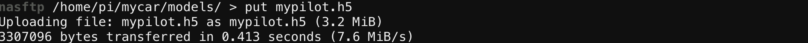

# 自動走行



<hr>

## mypilotをRaspPi3へ移動

<hr>

SFTPでRaspberryPi3側の`/home/pi/mycar/models`フォルダにアップロードします。


SFTPで、学習済みモデルをアップするフォルダに移動します。`~/mycar/models/
```
cd ~/mycar/models
```


SFTPで学習済みモデル mypilot.h5をアップロードします。
```
put mypilot.h5
```




<hr>

## 学習済みモデルでDonkeyCarを動かす(RasPi3)

<hr>

SSHで、RaspberryPi側にログインし、mycarフォルダに移動します。

```
cd ~/mycar
```

アップロードしたモデルを指定してDonkeyCarを指導します。

```
python manage.py drive --model ./models/mypilot.h5
```

DonkeyCarに、Webサーバが立ち上がりWebConsoleが起動します。WebConsoleへのアクセスは、`DonkeyCarのIPアドレス:8887`でChromeで接続します。

DonkeyCarのIPアドレスがわからない場合は、ifconfigでwlan0のIPアドレスを調べます。

```
ifconfig -a
```

## 学習済みモデルの呼び出し自動走行

Web画面のmodel & pilotから、`Local Pilot (d)`を選びます。


学習済みモデルでの走行を停止するには、Web画面のmodel & pilotから、`User (d)`を選びます。

SSHのRaspberryPiのTerminalで、++"CTRL"+"c"++でコマンドを終了し、DonkeyCarを停止します。

