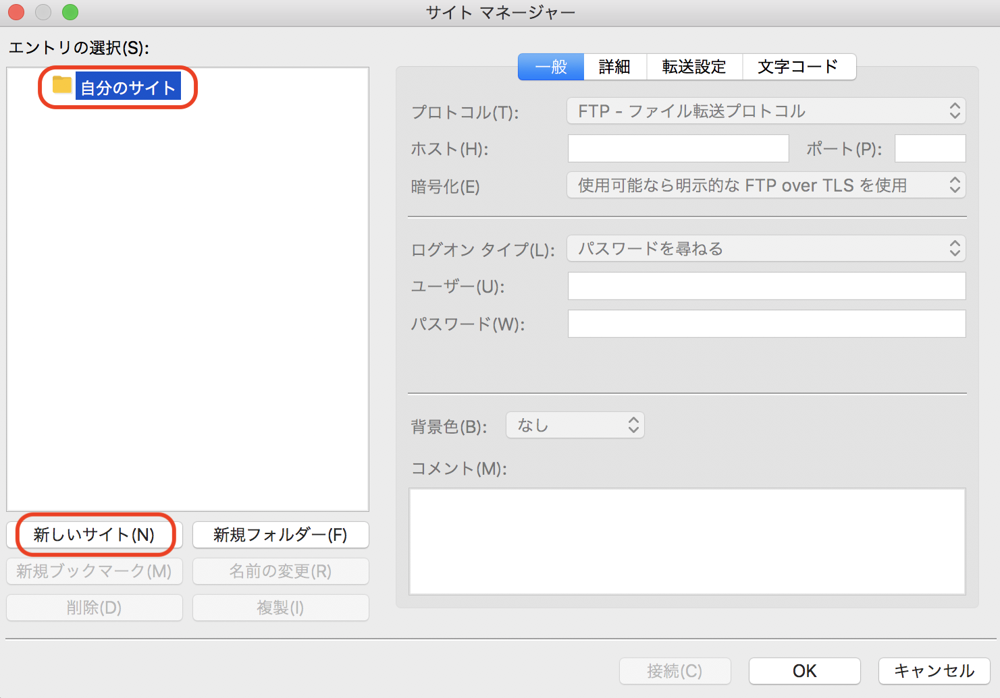
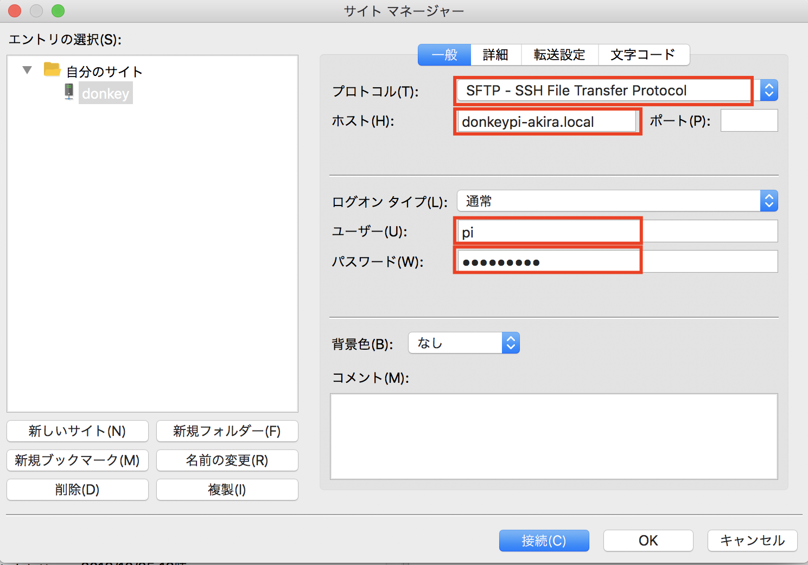
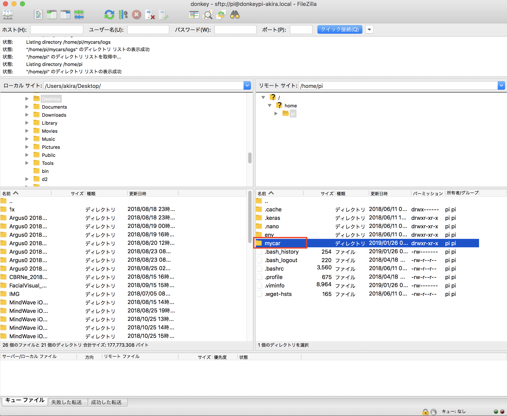
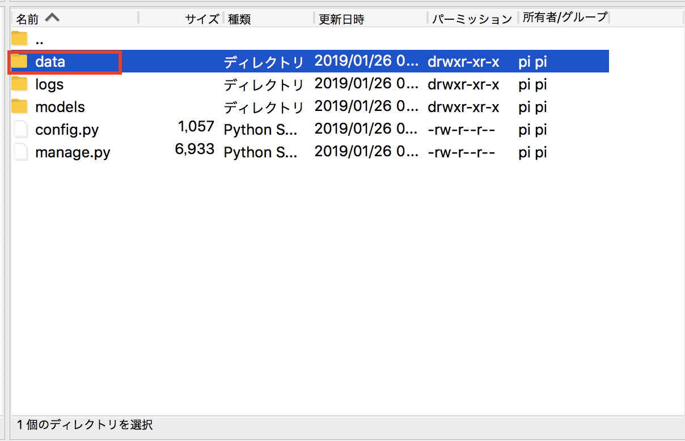
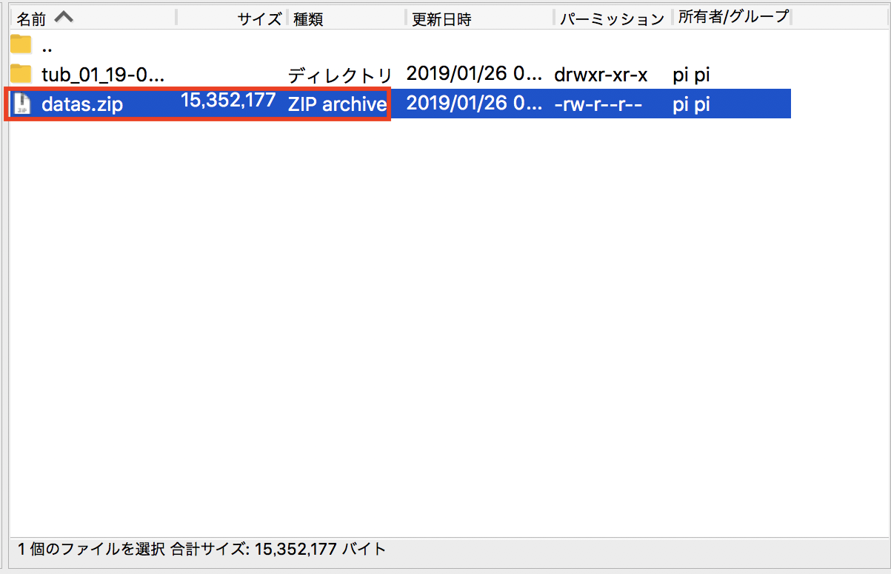

# 教師データの作成

## マルチTub化

MultiTub化することで、保存データをフォルダわけすることが可能です。

RaspberryPi側の`manager.py`を修正します。

multiple tubsの部分のコメントを外し、single tubの部分を無効にします。

~/mycar/manage.py
```python hl_lines="5"
import os
from docopt import docopt

import donkeycar as dk
from donkeycar.parts.datastore import TubGroup, TubWriter, TubHandler
from donkeypart_ps3_controller import F710JoystickController
from donkeycar.parts.camera import PiCamera
from donkeycar.parts.transform import Lambda
from donkeycar.parts.keras import KerasLinear
from donkeycar.parts.actuator import PCA9685, PWMSteering, PWMThrottle
```
...
```python  hl_lines="9 10 13"
    V.add(steering, inputs=['angle'])
    V.add(throttle, inputs=['throttle'])

    # add tub to save data
    inputs = ['cam/image_array', 'user/angle', 'user/throttle', 'user/mode', 't$
    types = ['image_array', 'float', 'float',  'str', 'str']

    # multiple tubs
    th = TubHandler(path=cfg.DATA_PATH)
    tub = th.new_tub_writer(inputs=inputs, types=types)

    # single tub
    #tub = TubWriter(path=cfg.TUB_PATH, inputs=inputs, types=types)
```

## 教師データの作成

DonkeyCarを起動します。

JoyStick
```
$ cd ~/mycar
$ python manage.py drive --js
```

教師データは、`~/mycar/dara`以下に保存されます。
```
cd ~/mycar/data
ls
tub_01_19-01-26
```

++"CTRL"+"x"++で終了します。

## 教師データの圧縮

データを圧縮し、1つのファイル(ZIP形式)にしてPCに転送します。

RaspberryPi3にZIPをインストールします。
```
sudo apt-get install zip
```

ZIPでフォルダを圧縮します。
```
cd ~/mycar/data
zip -r datas.zip tub_01_19-01-26
```

## データの転送

データの転送には、SFTPに対応した[FileZilla](https://filezilla-project.org/)を使用します。

PCに[FileZilla](https://filezilla-project.org/)をインストールし、実行します。











RaspberryPi3からPCに、datas.zipを転送します。


