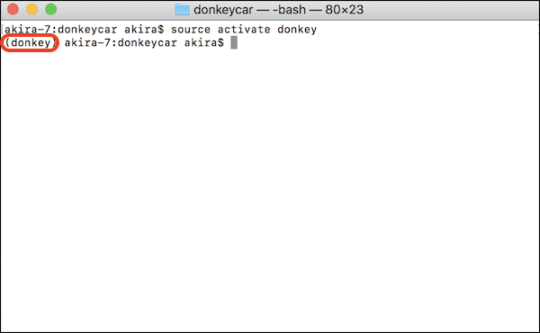
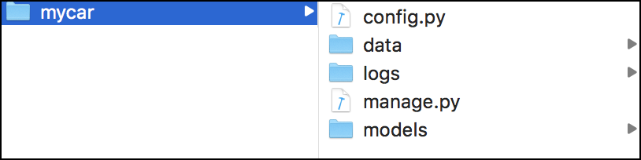

# 学習環境の構築

!!! summary
    Donkey Car Simulatorとの連携は、DonkeyCar v2.5.7では廃止。そのため、Donkey Car Simulatorと連携して動作させるためには、Revisionは、[618b2f7](https://github.com/autorope/donkeycar/commit/618b2f78954b4cc7880365d518a1f24fdfe102ef) まで戻す必要がある。

Donkey Carの学習環境を構築します。Donkey Carの学習は、RapPi3側ではなく、PC側でおこないます。一般的なPCで20-30分程度の学習、GPU搭載のPCで数分の学習がおこなわれます。

## 参考ドキュメント

PC側のインストールは、環境等に大きく依存します。インストール方法は、[Donkey Car 公式ドキュメント](https://docs.donkeycar.com/guide/install_software/)も参考にしてください。

## Git clone


```console
$ mkdir ~/Documents/workspace_donkey
```

!!!Warning
	本ドキュメントでは、作業フォルダ ~/Documents/workspace_donkey にしています。お使いの環境に合わせて、作業フォルダは任意のフォルダ指定で大丈夫です。


```console
cd ~/Documents/workspace_donkey
git clone https://github.com/autorope/donkeycar/
cd donkeycar
git checkout master
```

!!!Warning
	Simulatorと連携したい場合は、上記の作業の後に、`git checkout 344127b`で 344127bのリビジョンに移動します。
!!!Warning
	Proxyを経由する必要がある場合は、`git config --global http.proxy http://proxy.aaa.com:8080`等でProxyを事前に設定しておく。

## Conda環境

```console
conda env create -f install/envs/mac.yml
source activate donkey
```

Consoleに(donkey) の文字列ができていれば成功です。



!!!Warining
	condaが実行できない人は、[miniconda](https://conda.io/miniconda.html)をインストールしてください。

## TensorFlowのインストール

```console
pip install tensorflow==1.8.0
```

## インストール

```console
pip install -e .
```

## プロジェクトの作成

```console
donkey createcar ~/mycar
```

