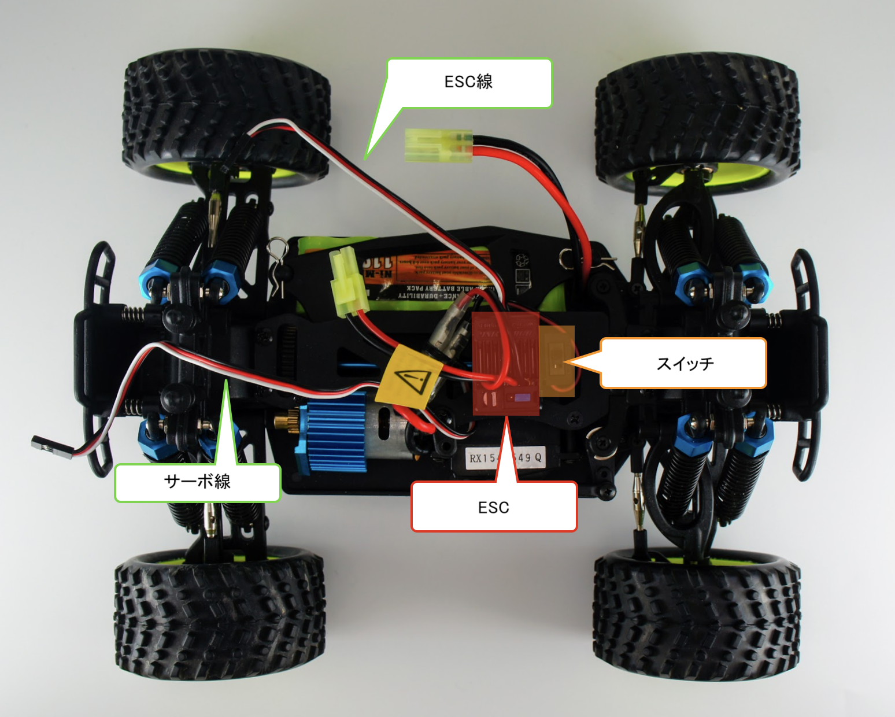
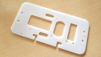
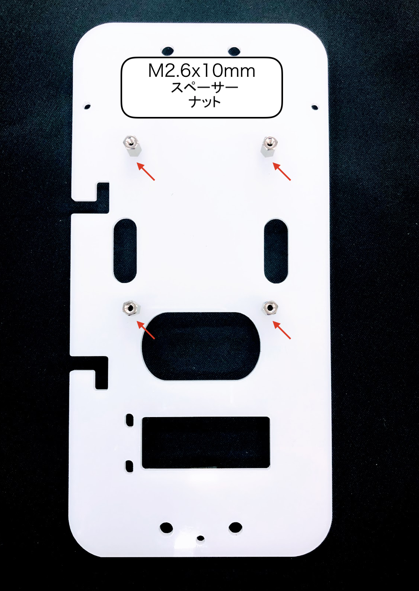
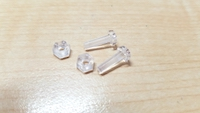
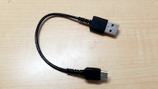
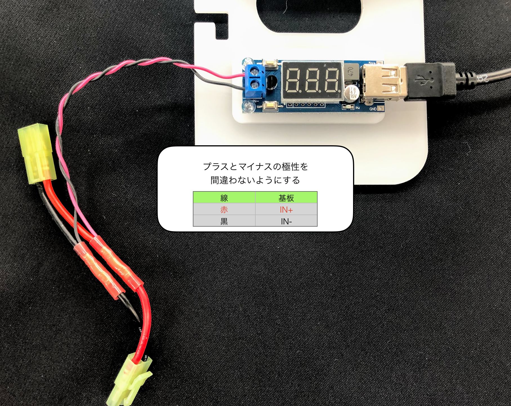
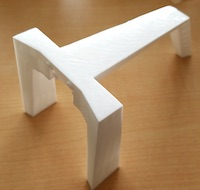
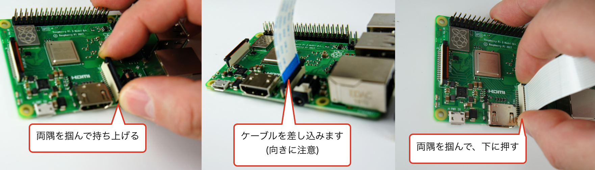
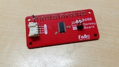

# 組み立て DCK-R1

FaBo Donkey Car Kit 組み立てマニュアル

組み立てを行う前に必ずお読みください。

対象モデル

|コード番号|
|:--:|
|DCK-R1|

## Donkey Carのパーツ一覧

|項目|内容|商品|
|:--|:--|:--|
|0|HSP 94186|[FaBo Store](https://www.fabo.store/collections/donkeycar/products/donkeycar-kit)|
|1|RaspberryPi3 B+|[RS Component](https://jp.rs-online.com/web/generalDisplay.html?id=raspberrypi)|
|2|PiCamera|[FaBo Store](https://www.fabo.store/collections/donkeycar/products/raspberry-pi%E7%94%A8-camera-module)|
|3|充電機(PSEマーク付き)|[FaBo Store](https://www.fabo.store/collections/donkeycar/products/donkeycar-%E5%85%85%E9%9B%BB%E5%99%A8)|
|4|コネクタ|[FaBo Store](https://www.fabo.store/collections/donkeycar/products/donkeycar-%E3%82%B3%E3%83%8D%E3%82%AF%E3%82%BF%E3%82%B1%E3%83%BC%E3%83%96%E3%83%AB)|
|5|USBケーブル|[FaBo Store](https://www.fabo.store/collections/donkeycar/products/usbmicrob%E3%82%B1%E3%83%BC%E3%83%96%E3%83%AB)|
|6|SDカード(32GB)|[FaBo Store](https://www.fabo.store/collections/donkeycar/products/microsdhc-32gb)|
|7|Donkeyアクリル|[FaBo Store](https://www.fabo.store/collections/donkeycar/products/donkeycar-%E5%8F%96%E6%89%8B%E3%83%91%E3%83%BC%E3%83%84%E3%81%AE%E3%82%B3%E3%83%94%E3%83%BC)|
|8|降圧用基板|[FaBo Store](https://www.fabo.store/collections/donkeycar/products/dc-dc%E9%99%8D%E5%9C%A7%E5%9E%8B%E5%A4%89%E6%8F%9B%E5%99%A8%E5%86%85%E8%94%B5%E9%9B%BB%E5%9C%A7%E8%A8%88)|
|9|制御基板|[FaBo Store](https://www.fabo.store/collections/donkeycar/products/donkeycar-shield)|
|10|充電用変換コネクタ|[FaBo Store](https://www.fabo.store/collections/donkeycar/products/donkeycar-%E5%A4%89%E6%8F%9B%E3%82%B3%E3%83%8D%E3%82%AF%E3%82%BF)|
|11|Donkeyアーム|[FaBo Store](https://www.fabo.store/collections/donkeycar/products/donkeycar-%E5%8F%96%E6%89%8B%E3%83%91%E3%83%BC%E3%83%84)|
|12|降圧用スペーサーアクリル|[FaBo Store](https://www.fabo.store/collections/donkeycar/products/donkeycar-%E5%8F%96%E6%89%8B%E3%83%91%E3%83%BC%E3%83%84%E3%81%AE%E3%82%B3%E3%83%94%E3%83%BC)|
|13|ポリカネジ|[FaBo Store](https://www.fabo.store/collections/donkeycar/products/donkeycar-%E3%83%97%E3%83%A9%E3%82%B9%E3%83%81%E3%83%83%E3%82%AF-m3-%E3%82%BB%E3%83%83%E3%83%88)|
|14|カメラ固定ネジ|[FaBo Store](https://www.fabo.store/collections/donkeycar/products/donkeycar-%E3%82%AB%E3%83%A1%E3%83%A9%E5%9B%BA%E5%AE%9A%E3%83%93%E3%82%B9-%E3%82%BB%E3%83%83%E3%83%88)|
|15|アーム固定ネジ|[FaBo Store](https://www.fabo.store/collections/donkeycar/products/donkeycar-%E3%82%B9%E3%83%86%E3%83%B3%E3%83%AC%E3%82%B9-m3-%E3%82%BB%E3%83%83%E3%83%88)|
|16|RaspPi3B+スペーサーネジ|[FaBo Store](https://www.fabo.store/collections/donkeycar/products/donkeycar-%E3%82%B9%E3%83%9A%E3%83%BC%E3%82%B5%E3%83%BC-m2-5x13mm)|

## Donkey Car組み立て

### 0.車体の説明

RCカーのボディーを外し、2本のPWMの線を、プロポ受信機から取り外します。

車体のESCとサーボからでている線とスイッチの位置を確認します。

!!!warning "注意点"
	HSP 94186のプロポとプロポ受信機は、国内の技術基準適合証明(技適)を取得していません。国内では、プロポを使用しないでください。

### 1.DonkeyアクリルにRaspPi3B+を固定するネジを取り付ける

|画像|仕様するパーツ|個数|
|:--|:--|:--|
||RaspPi3B+スペーサーネジ スペーサー ナット|  4 4|
||Donkeyアクリル|1|

スペーサーを挿し込み、裏からナットで固定します。

!!!info "ナットの締め方"
	走行中にナットが緩んでくる可能性がありますので、強めに締めます。

### 2. RaspPi3B+を取り付ける

|画像|項目|個数|
|:--|:--|:--|
||RaspPi3B+|1|
||RaspPi3B+スペーサーネジ ネジ|  4|

RCカーに乗せて、前後左右の方向が間違っていないか確認し、RaspPi3B+を固定します。

!!!info "DonkeyアクリルとRaspPi3B+の向き"
	左側の2つの欠けている部分は、バッテリーの線を引っ掛ける部分になるので、バッテリーサイドに来る必要があります。

### 3. 降圧型変換器内蔵電圧計を取り付ける

|画像|項目|個数|
|:--|:--|:--|
||M3ポリカネジ ナット|2 2|
||降圧用スペーサーアクリル|1|

間にスペーサーを入れて固定します（２箇所）。

### 4. USBケーブルを取り付ける

|画像|項目|個数|
|:--|:--|:--|
||USBケーブル|1|

USBケーブルをRaspPi3B+と降圧基板の間で接続します。

### 5. 電源コネクタを取り付ける

|画像|項目|個数|
|:--|:--|:--|
||電源コネクタ|1|

電源用のコネクタを昇圧基板に取り付けます。極性を間違えないようにしてください。

!!!warning "注意点"
	電源ケーブルのプラス（＋）とマイナス（ー）を絶対に間違わないようにしてください。また、バッテリー装着時に被膜がついていない部分を接触させるとショートしますので、取り扱いには細心の注意をはらってください。

### 6. Donkeyアームを取り付ける

|画像|項目|個数|
|:--|:--|:--|
||Donkeyアーム|1|
||アーム固定ネジ M3ネジ M3ナット|  3 1|

 
※アームの前（アーチ部分）にはナット装着済みです。

### 7. PiCameraを取り付ける

|画像|項目|個数|
|:--|:--|:--|
||PiCamera|1|
||カメラ固定ネジ 絶縁スペーサー|4 2|

PiCameraを取り付けます。

ケーブルには、向きがあるので、向きを間違わないようにします。ケーブルはクロスする感じで問題ありません。

右側には、部品との接触を防ぐために、絶縁スペーサーを装着します。

!!!info "カメラのケーブル"
	ケーブルの挿入する向きを間違えるとRaspPi3B+でPiCameraが認識できません。また、差し込みが甘い場合も同様に認識に失敗するので、再度差し込みなおします。

### 8. アクリルをRCカー本体に固定する

|画像|項目|個数|
|:--|:--|:--|
||固定ピン ※RCカー付属|4|

４箇所のボディマウントエクステンションに固定ピンを取り付ける。

### 9. 制御基板を装着する

|画像|項目|個数|
|:--|:--|:--|
||制御基板|1|

### 10. バッテリーを取り付ける

