# 組み立て DCK-R3

FaBo Donkey Car Kit Carbon Edition 組み立てマニュアル

組み立てを行う前に必ずお読みください。

対象モデル

|コード番号|タミヤ　1/10RC XB(完成モデル) TT-02シャーシ|
|:--:|:--:|
|DCK-R3F|有り|
|DCK-R3B|無し|

## Donkey Car(DCK-R3)のパーツ一覧

|写真|部品|個数|
|:--|:--|:--|
||制御基板   #608 FaBo DonkeyBoard OLEDディスプレイ付き,PCA9685搭載、I2Cポート,超音波センサーHS-SR04接続８ポート Rev3.1.1|１枚|
|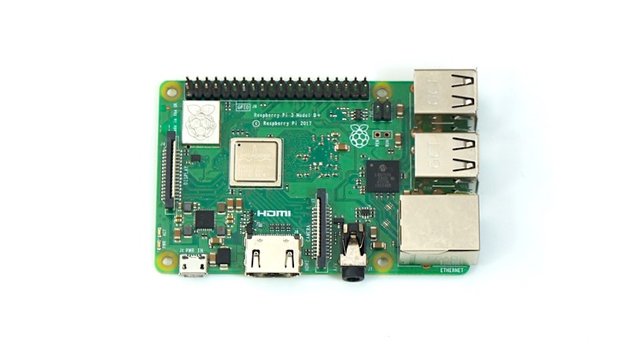|Raspberry Pi 3B＋  Broadcom BCM2837B0 Cortex-A53 (ARMv8) 64-bit 1.4GHz 1GB LPDDR2 SDRAM 2.4GHz and 5GHz IEEE 802.11.b/g/n/ac wireless LAN Bluetooth 4.2, BLE CSI camera port 5V/2.5A DC power input|１枚|
|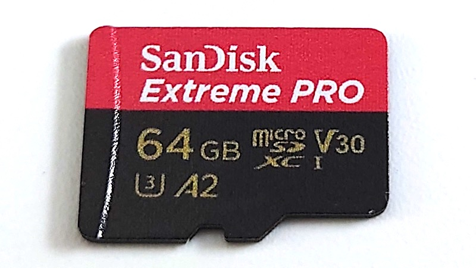|microSDカード  サンディスク SanDisk 64GB SDSQXCY-064G-GN6MA Extreme PRO SD変換アダプター付属|１枚|
|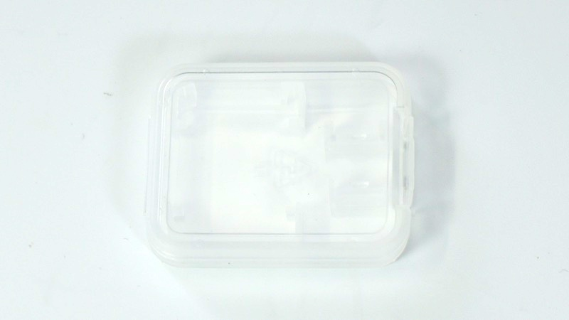|SDカードケース|１個|
|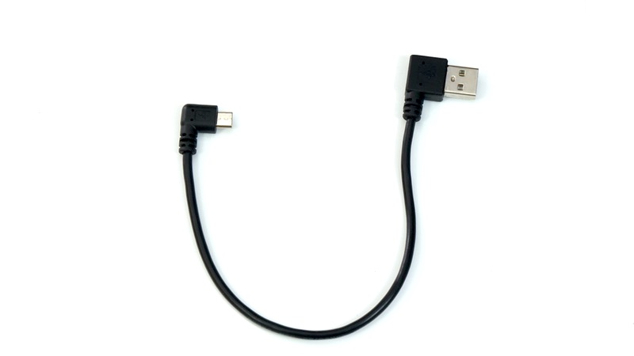|USBケーブル  マイクロUSBー標準USB L字|１本|
|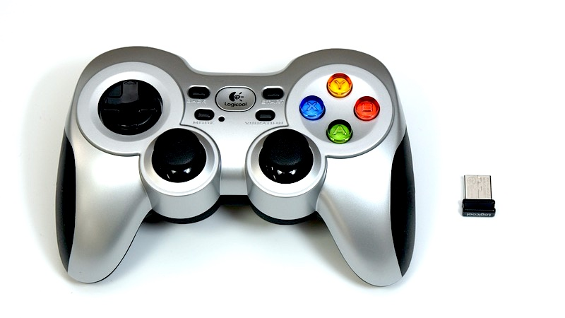|ゲームパッド  ワイヤレスゲームパッド F710またはF710r 2.4 GHZワイヤレス接続 入力規格：DirectInput,XInput 単三乾電池２本付属 レシーバーはUSB|１台|
|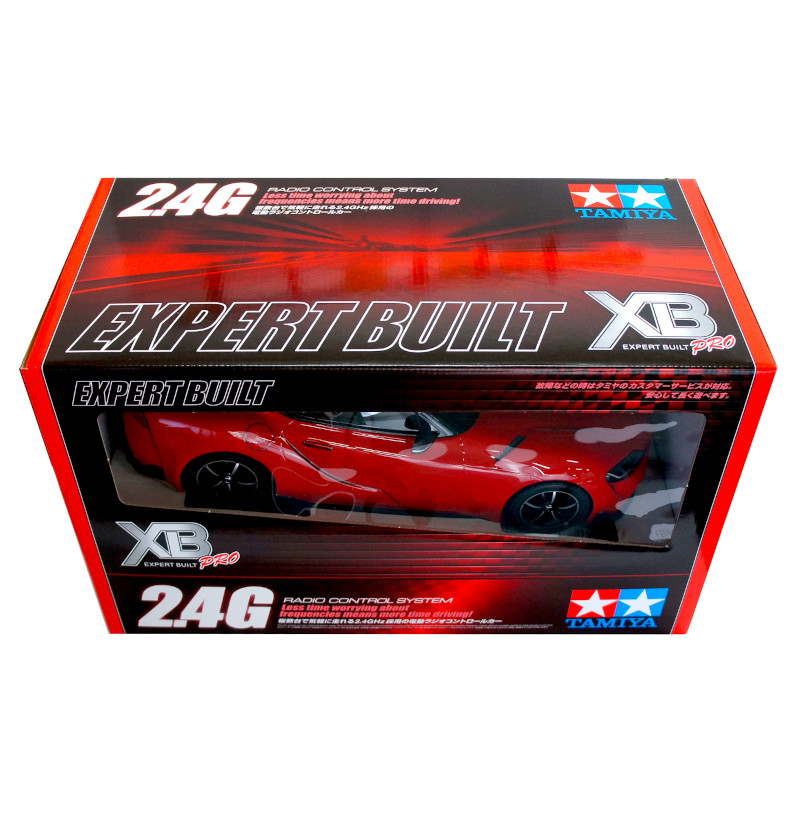{: .bom_listsiJetracerTypeD_OLED_REV020001.JPGze}|RCカー本体　タミヤ　TT-02 XBプロ エキスパートビルド ※完成品  ※タミヤ　1/10RC XB トヨタ　GRスープラ (TT-02シャーシ)  レッド タミヤ　1/10RC XB トヨタ GR 86 (TT-02シャーシ) ホワイト タミヤ　1/10RC XB トヨタ GR 86 (TT-02シャーシ) レッド タミヤ　1/10RC XB SUBARU BRZ(ZD8) (TT-02シャーシ) タミヤ　1/10RC XB トヨタガズーレーシングWRT/ヤリス　WRC（TT-02シャーシ） タミヤ　1/10RC XB NSX（TT-02シャーシ） タミヤ　1/10RC XB マツダ MAZDA3 (TT-02シャーシ) タミヤ　1/10RC XB フォード マスタング GT4 （TT-02シャーシ） のいずれかになります。  ※車種は選べません。 ※写真はGRスープラの場合|１セット|
|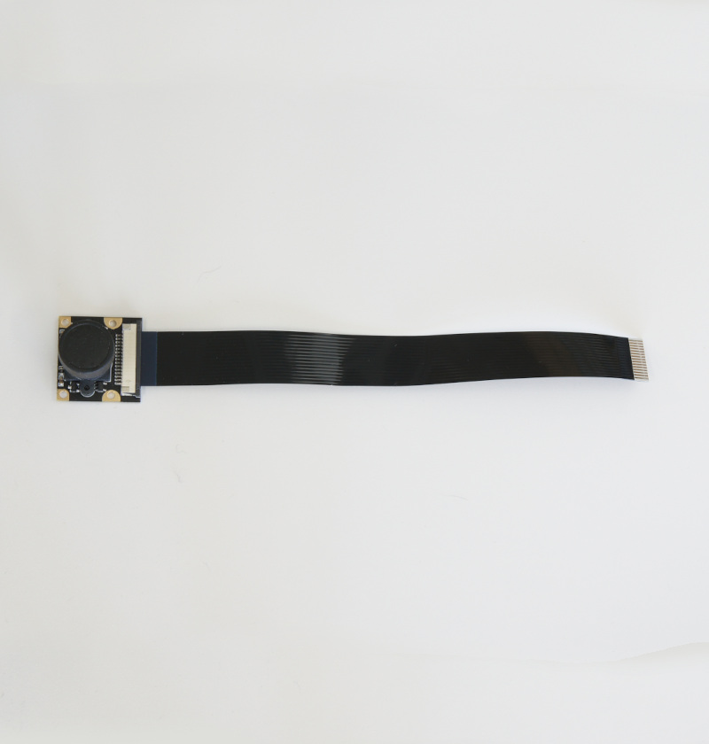{: .bom_listsize}|CAM026 IMX219-160° ケーブル 200mm |１個|
|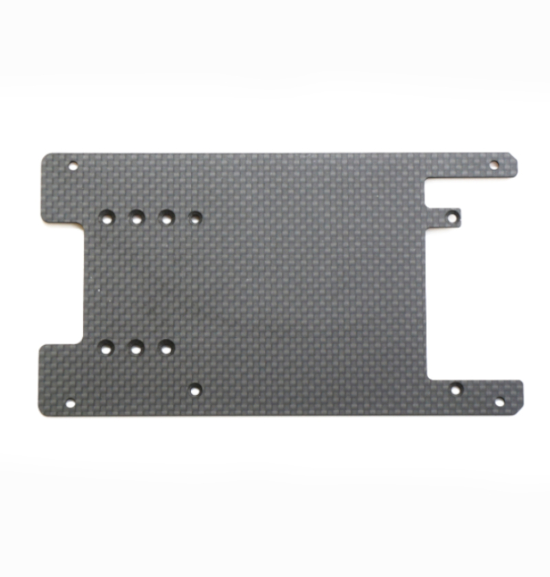{: .bom_listsize}|拡張ボディ カーボンアッパーパネル|１枚|
|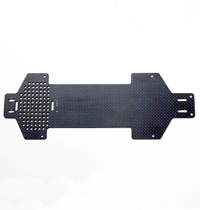{: .bom_listsize}|拡張ボディ カーボンロワーパネル|１枚|
|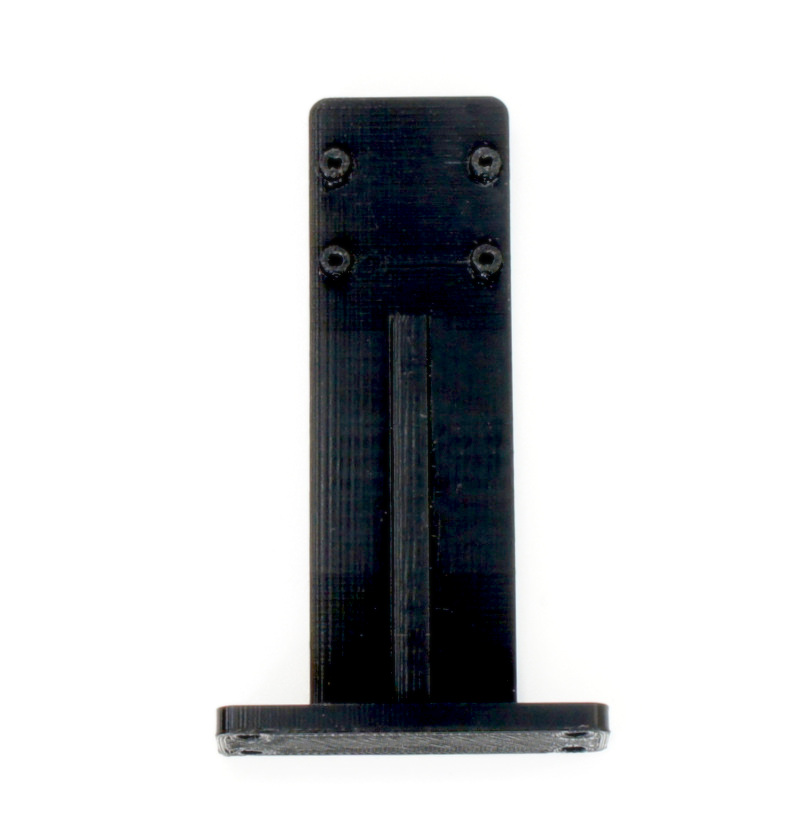{: .bom_listsize}|拡張ボディ カーボンエディション用カメラマウント|１個|
|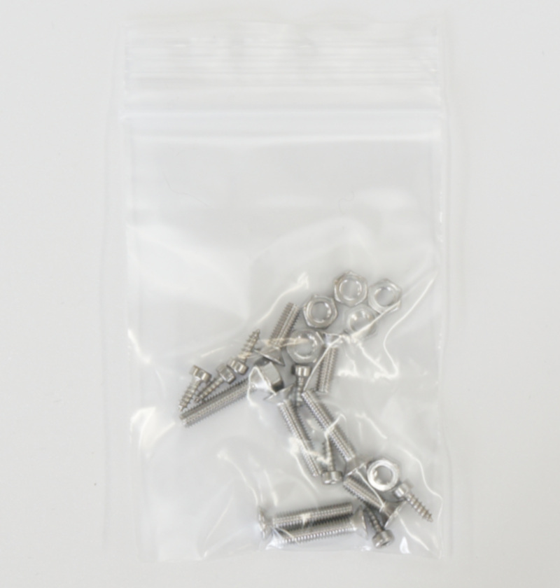{: .bom_listsize}|皿ネジM3×15・・・・4 皿ネジM3×10・・・・2 ナット M3・・・・6 六角穴付きボルトセルフタッピングネジM2×5・・・・6  |１袋|
|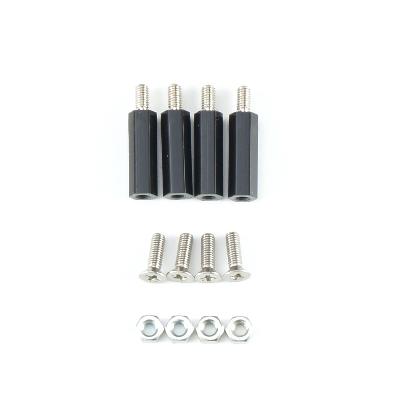{: .bom_listsize}|樹脂六角スペーサー（黒色）M3×18・・・・4 皿ネジM3×10・・・・4 ナット M3・・・・4|１袋|
|{: .bom_listsize}|電源用USBケーブル 標準A(左)-マイクロUSB（右）、0.2m|１本|
|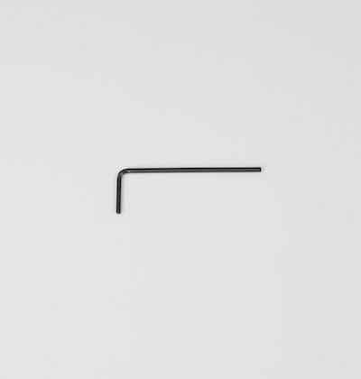{: .bom_listsize}|六角棒レンチ 1.5|１本|
|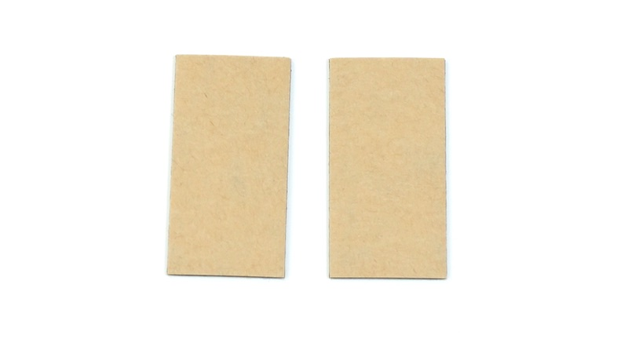{: .bom_listsize}|両面テープ|２枚|
|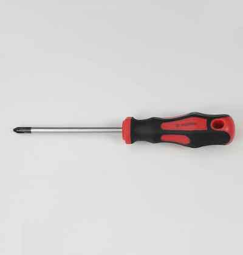{: .bom_listsize}|プラスドライバー +2×100|１本|
|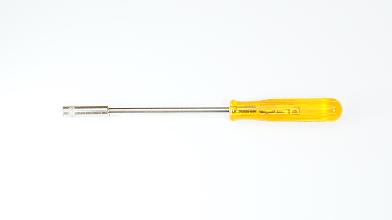{: .bom_listsize}|ナットドライバー 5.5|１本|
|{: .bom_listsize}|ナットドライバー 5.0|１本|
|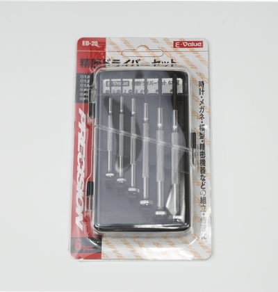{: .bom_listsize}|精密ドライバーセット　ED−20|１セット|
|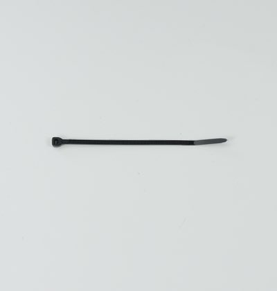{: .bom_listsize}|結束バンド|1本|
|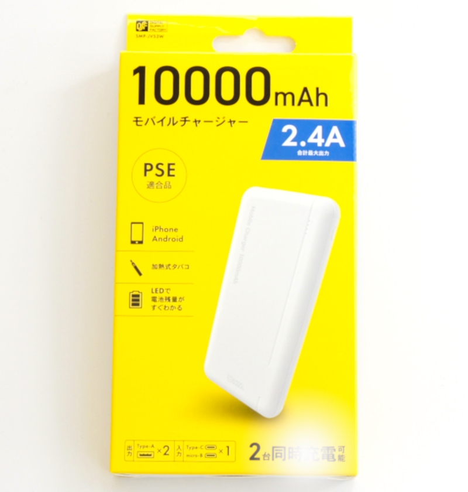{: .bom_listsize}|モバイルバッテリー  モバイルチャージャー10000 オーム電機 SMP-JV53W/05-1196　 定格入力 DC5V/2.0A(Type-C/miro-B) 定格出力 DC5V/2.4V(Type-A*2ポート） 定格容量 DC5V/6300mAh 繰り返し充電回数 約500回 充電ケーブル micro-B 約15cm ※充電にはType-Cのケーブルを使用します。本キットには付属しませんのでお客様でご準備願います。 ※くわしい取り扱いに関しては取扱説明書をご覧ください。|１個|
|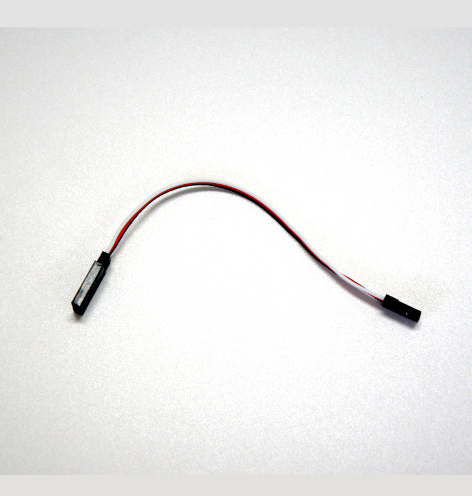{: .bom_listsize}|延長ケーブル１３０mm  |１本|
|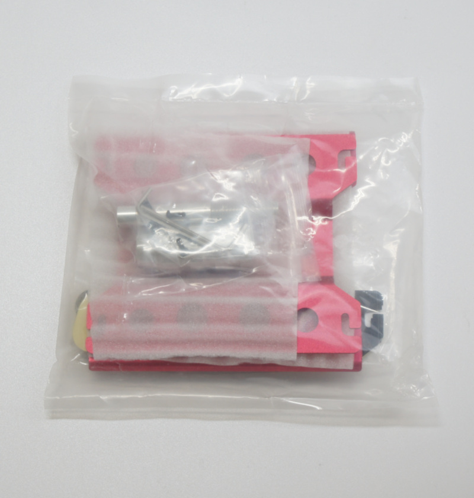{: .bom_listsize}|作業台  ※出荷時期によって外観が異なる場合がございます。|１台|

※予告なく仕様が変更されることがございます。
※カッターナイフ、ニッパー等が必要となります。お客様でご準備お願いいたします。 ※モバイルバッテリーの充電にはUSBタイプＣのケーブルと充電器が必要でございます。お客様でご準備ください。 ※開封後はすぐ欠品がないかご確認お願いいたします。もし欠品がございましたら、<a 
href="https://www.fabo.io/p/blog-page.html">こちら</a>までご連絡ください。
<a href="https://www.fabo.io/p/blog-page.html">https://www.fabo.io/p/blog-page.html</a>

[def]: ./img/DCKR3/BOM/JetRacerCommon/cameramountRev3.JPG