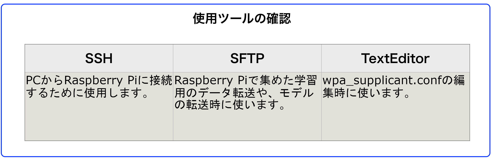
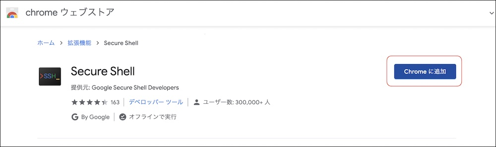
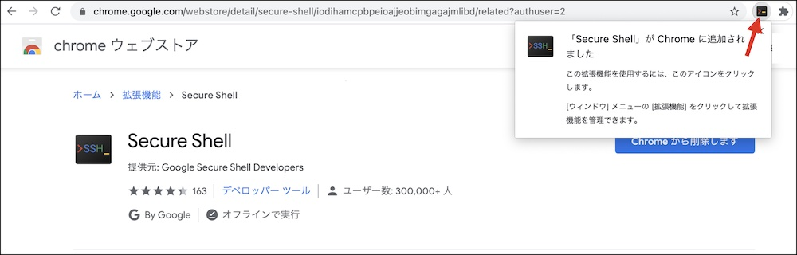
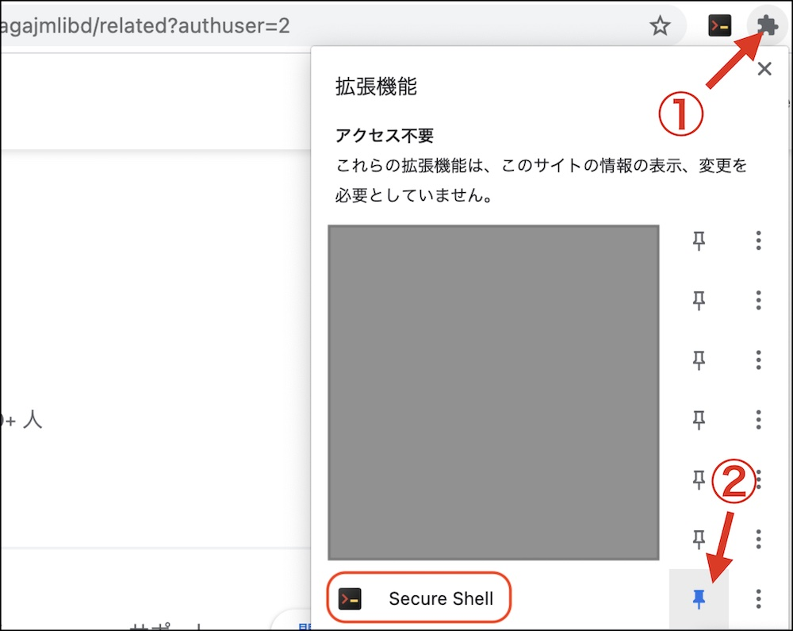

# 使用ツール　

## 使用ツール

|作業デバイス|
|:--|
||

|機能|アプリ|プラットフォーム|用途|
|:--|:--|:--|:--|
|SSH|<a href="https://chrome.google.com/webstore/detail/secure-shell/iodihamcpbpeioajjeobimgagajmlibd" target="ssh_tab">Secure Shell</a>|Chrome拡張|Raspberry Pi3に接続し、DonkeyCarでコマンドを実装するために使用します。SSH通信が可能なツールならどれでも使用可能です。|
|SFTP|<a href="https://chrome.google.com/webstore/detail/secure-shell-app/pnhechapfaindjhompbnflcldabbghjo?hl=ja" target="sftp_tab">Secure Shell</a>|Chrome拡張|データ・セット(datas.zip)をRaspberry Pi3からPCに転送する用途で使います。また、学習済みモデル(mypilot)をPCからRaspberry Pi3に転送するために使います。|
|Text Editor|任意のTextエディタ|任意のアプリ|wpa_supplicant.confを編集するために使用|

!!!info "使用ツール"
	SSH, SFTP, TextEditorは普段使っているツールがある場合は、そちらを使用してください。

## Chromeアプリのインストール

|作業デバイス|
|:--|
||

<a href="https://chrome.google.com/webstore/detail/secure-shell/iodihamcpbpeioajjeobimgagajmlibd" target="ssh_tab">Secure Shell</a> をクリックし、Chrome Storeからインストールします。

Secure Shellのアイコンが常に表示されるように、PINで固定します。

