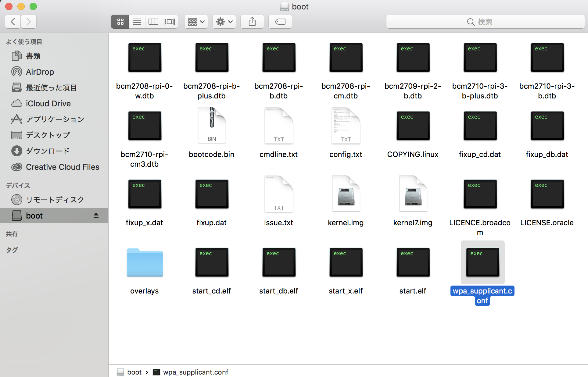

# WiFi設定

WiFiへの接続、SSHでログインできるようにしていきます。  
焼き込みのみでは初回起動時にWiFiへの接続・SSHでのログインが出来ないため、ここで設定を行っています。


## wpa_supplicant.confのダウンロード
{{ download_link('https://faboplatform.github.io/DonkeyDocs/2.DonkeyCarインストール/wpa_supplicant.conf', 'wpa_supplicant.conf') }}をダウンロードします。



## TEXT Editorの起動と編集

<a href="https://chrome.google.com/webstore/detail/text/mmfbcljfglbokpmkimbfghdkjmjhdgbg" target="text_tab">TEXT(Chorme App)</a> をクリックし、アプリを起動をクリックし、TEXT Editorを開きます。


ssidに接続先のssid, pskにpasswordを記載します。


ステルスモードのWiFiスポットにログインする場合は、scan_ssid=1も追加します。
```
country=JP
ctrl_interface=DIR=/var/run/wpa_supplicant GROUP=netdev
update_config=1

network={
    ssid="your network name"
    psk="your password"
    scan_ssid=1
}
```


!!!warning "5GHz"
	Raspberry Pi3は、5GHz帯のWiFiは非対応です。2.4GHz帯のWiFiのアクセスポイントを設定するようにしてください。

<hr>

## WiFiスポットにパスワードなしでログインする場合の設定

PasswordのないWiFiスポットに接続する場合は、下記例を参考にしてください。`key_mgmt=NONE`をつける事で、パスワードなしでログインできます。
```
country=JP
ctrl_interface=DIR=/var/run/wpa_supplicant GROUP=netdev
update_config=1

network={
    ssid="your network name"
    key_mgmt=NONE
}
```

<hr>

## SDカードにコピー
DonkeyCarイメージmicro SDカードに焼き込み終わったあとに、SDカードを抜いて、再度PCに挿し直すと、PCでSDカードが認識されます。<br>
`wpa_supplicant.conf`を編集したら、SDカードの`boot`パーティション直下にコピーしてください。<br>
この後、SDカードをraspberry piに入れて、raspberry piの電源を入れます。<br>

Raspberry Piの起動時にSDカードにある`wpa_supplicant.conf`が自動的に<br>
`/etc/wpa_supplicant/wpa_supplicant.conf`へコピーされ、指定したWiFiネットワークに接続されます。  

<hr>

## 接続先の確認(OSX)

DonkeyCarと同一ネットワークに接続しているOSXより、下記コマンドで接続を試みます。

```
ssh pi@donkeypi.local
```

|ログインID|パスワード|
|:--|:--|
|pi|raspberry|

!!!info "Host名について"
	上記方法はOSXのみで有効で、複数台使用時は、DonkeyCarのRaspberry Pi3のhost名を任意のユニークな名前に書き直す必要があります。

ifconfigでipアドレスを確認します。

```
ifconfigf -a
```

で表示されるWLAN0にIPアドレスが表示されます。

!!!info "IPアドレス"
	自分のIPアドレスをメモっておきます。

<hr>

## 接続先の確認(Windows)

Raspberry Pi3をHDMIケーブルでDisplayに接続します。起動画面の最後でIPアドレスが表示されれば、ネットワークに接続成功です。


<hr>

## wpa_supplicantの修正

接続に失敗した場合は、Raspberry Pi3内の`/etc/wpa_supplicant/wpa_supplicant.conf` を修正することで、接続先の変更が可能です。

```
sudo nano /etc/wpa_supplicant/wpa_supplicant.conf
```

