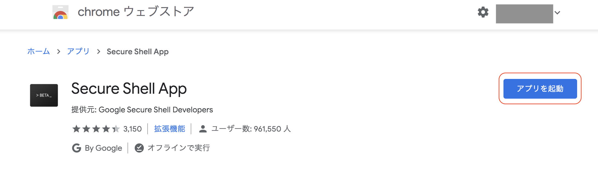
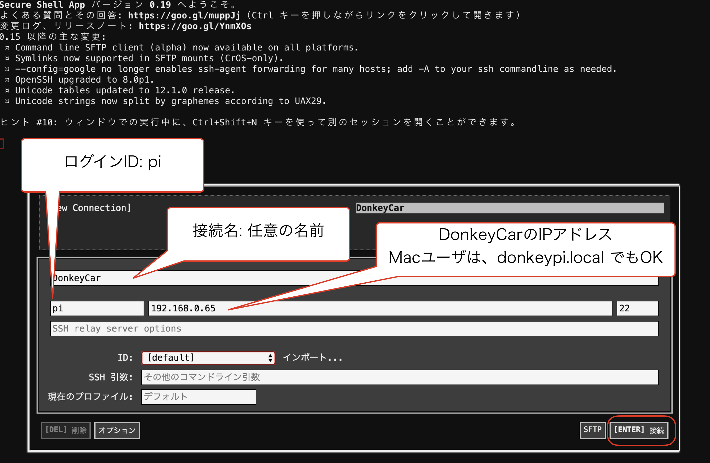
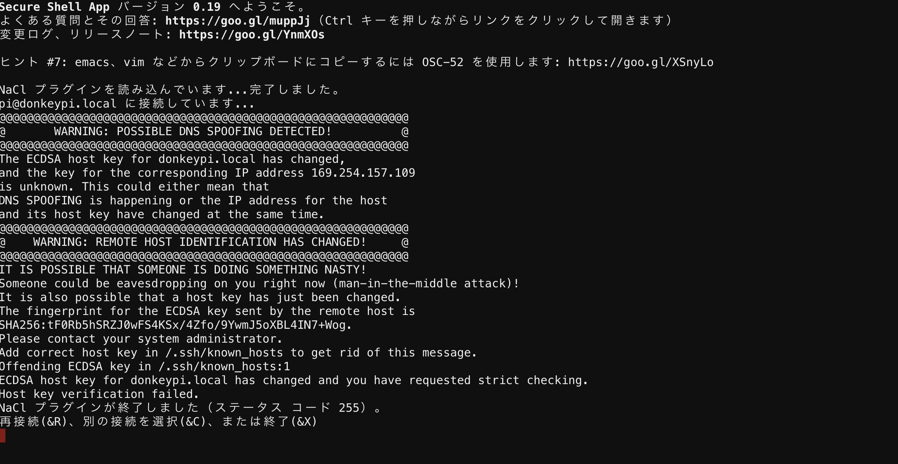
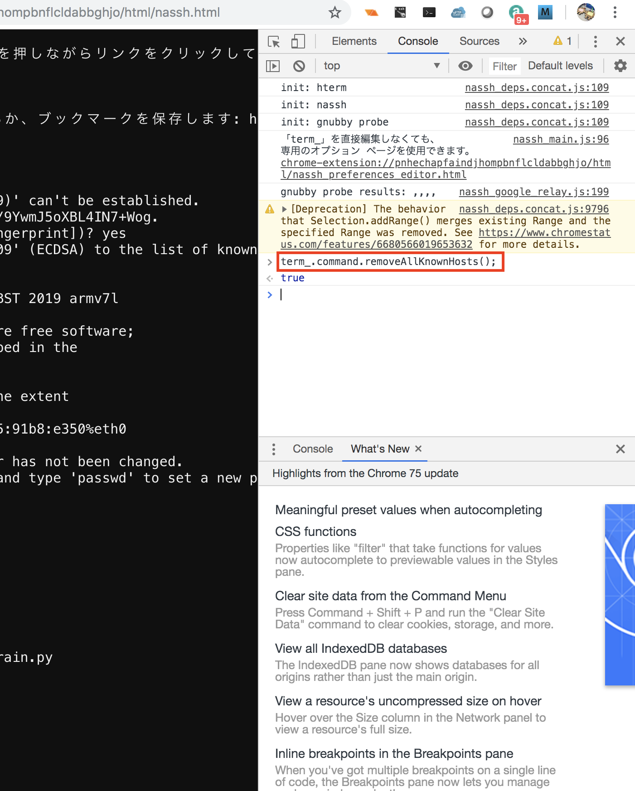

# SSHでRaspberry Piにログイン

	
## SSHでログイン(Chrome appを使用する場合)

判明したIPアドレスに対して、<a href="https://chrome.google.com/webstore/detail/secure-shell-app/pnhechapfaindjhompbnflcldabbghjo/related?hl=ja" target="ssh_tab">Secure Shell</a>をクリックし、`アプリを起動`を選択し、Secure shellでログインします。

|ログインID|パスワード|
|:--|:--|
|pi|raspberry|

## Secure shellでのエラーへの対処

が発生する場合の対処方法

`term_.command.removeAllKnownHosts();` を実行し、/.ssh/known_hostsを消します。

