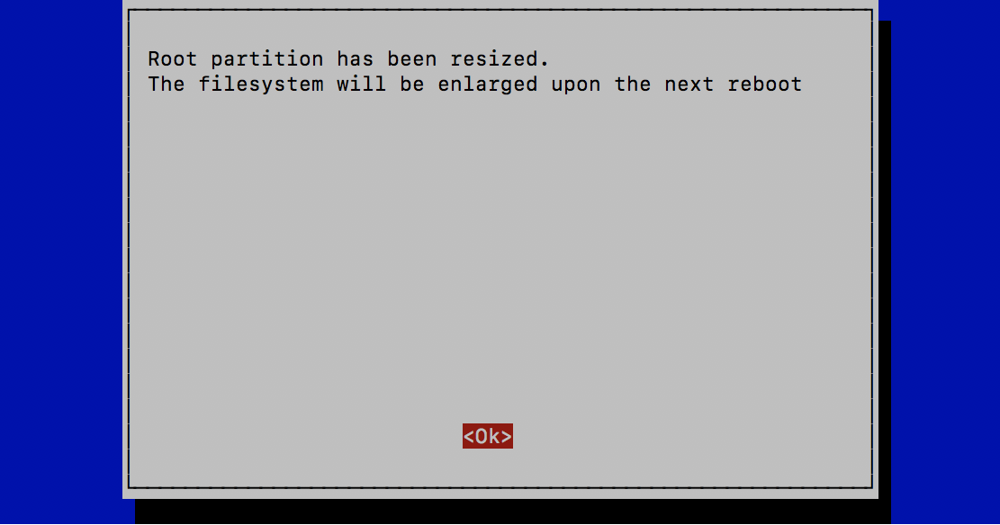

# DonkeyCarのインストール

## RaspberryPi3へのログイン

Windowsユーザは、`ssh pi@IPアドレス`で、OSXユーザは、`ssh pi@donkeypi-命名した名前.local`で、ログインしてください。

## SDカード容量を増やす

RaspberryPi3のConfigを起動します。
```
sudo raspi-config
```





dfコマンドでファイルの空き容量を確認します。
```
df
```

結果
```
Filesystem     1K-blocks    Used Available Use% Mounted on
/dev/root       29712700 1968580  26519276   7% /
devtmpfs          443728       0    443728   0% /dev
tmpfs             448336       0    448336   0% /dev/shm
tmpfs             448336   11596    436740   3% /run
tmpfs               5120       4      5116   1% /run/lock
tmpfs             448336       0    448336   0% /sys/fs/cgroup
/dev/mmcblk0p1     43436   22141     21295  51% /boot
tmpfs              89664       0     89664   0% /run/user/1000
```

## DonkeyCarのUpdate

DonkeyCarをUpdadeします。
```
pip install donkeycar[pi]
python -c "import donkeycar as dk; print(dk.__version__)"
using donkey v2.5.8 ...
2.5.8
```

## TensorFlowのUpdate

Google ColabでのCUDAのVersionに合わせるために、RaspberryPi側も、TensorFlow 2.0.0-Beta1にUpdateします。

Googleの公式版のTensorFlowレポジトリのRaspberryPi3対応版は、最新版に対応していないために、[PINTO0309](https://github.com/PINTO0309)さんによりBuildをかけて公開されている2.0.0 Beta1をインストールして使用します。

|Package|Version|
|:--|:--|
|TensorFlow|2.0.0-Beta1|

TensorFlow 2.0.0-Beta1をwgetコマンドで取得します。
```
wget https://github.com/PINTO0309/Tensorflow-bin/raw/master/tensorflow-2.0.0b1-cp35-cp35m-linux_armv7l.whl
```

TensorFlow 2.0.0-Beta1をインストールします。
```
pip install tensorflow-2.0.0b1-cp35-cp35m-linux_armv7l.whl
```

pip listでインストールしたVersionを確認します。
```
pip list | grep -i -e keras -e tensorflow     
tensorflow          2.0.0-Beta1
```