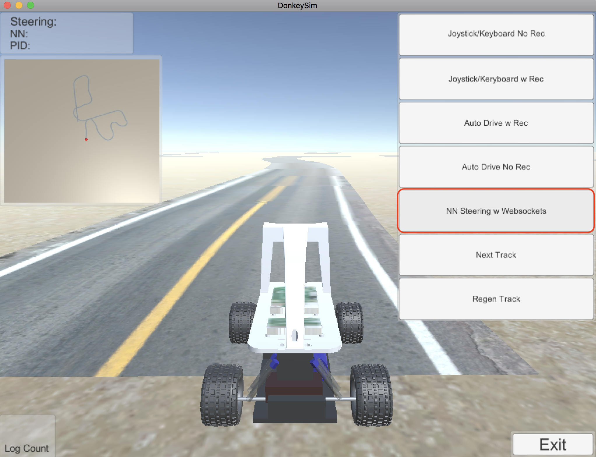

# 走行

!!! summary
    Donkey Car Simulatorとの連携は、DonkeyCar v2.5.7では廃止。そのため、Donkey Car Simulatorと連携して動作させるためには、Revisionは、[618b2f7](https://github.com/autorope/donkeycar/commit/618b2f78954b4cc7880365d518a1f24fdfe102ef) まで戻す必要がある。

## Simulatorでの実行

```console
donkey sim --model=models/mypilot
```

## Simulator側の連携



## Simulatorとの連携

通信はWebsocketでおこなわれる。Simulatorから30msに1回、160x120ピクセルの画像データが送られてくるので、`~/workspace_donkey/donkeycar/parts/keras.py`に渡され、model.predictで、画像データを入力に、SteeringとThrottleの2値を取得し、その値でSimulatorを制御している。

`~/workspace_donkey/donkeycar/donkeycar/parts/simulation.py`

```python
def telemetry(self, sid, data):
        """
        Callback when we get new data from Unity simulator.
        We use it to process the image, do a forward inference,
        then send controls back to client.
        Takes sid (?) and data, a dictionary of json elements.
        """
        if data:
            # The current steering angle of the car
            last_steering = float(data["steering_angle"])

            # The current throttle of the car
            last_throttle = float(data["throttle"])

            # The current speed of the car
            speed = float(data["speed"])

            # The current image from the center camera of the car
            imgString = data["image"]

            # decode string based data into bytes, then to Image
            image = Image.open(BytesIO(base64.b64decode(imgString)))

            # then as numpy array
            image_array = np.asarray(image)

            # optional change to pre-preocess image before NN sees it
            if self.image_part is not None:
                image_array = self.image_part.run(image_array)

            # forward pass - inference
            steering, throttle = self.kpart.run(image_array)

            # filter throttle here, as our NN doesn't always do a greate job
            throttle = self.throttle_control(last_steering, last_throttle, speed, throttle)

            # simulator will scale our steering based on it's angle based input.
            # but we have an opportunity for more adjustment here.
            steering *= self.steering_scale
            #steering *= 1
            # send command back to Unity simulator
            self.send_control(steering, throttle)
```