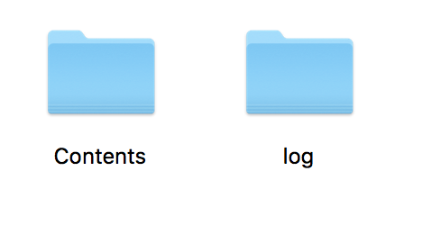

# Simulator

!!! summary
    DonkeyCar v2.5.7では、Simulatore連携が廃止されました。動作するRevisionは、[618b2f7](https://github.com/autorope/donkeycar/commit/618b2f78954b4cc7880365d518a1f24fdfe102ef) まで戻す必要がある。

Donkey Car Simulatorで実機がなくても、自動運転のスキームを試す事が可能。


## Donkey Car Simulator

Donket Car Simulatorは、SDSandboxをベースにDonkey Car仕様にカスタマイズしたものとなる。

|項目|値|
|:--|:--|
|SdSandbox|[https://github.com/tawnkramer/sdsandbox](https://github.com/tawnkramer/sdsandbox)|
|SdSandbox Donkey Branch|[https://github.com/tawnkramer/sdsandbox/tree/donkey](https://github.com/tawnkramer/sdsandbox/tree/donkey)|

## Donkey Car Simulatorのダウンロード

Donkey Carは、Donkey Car Official Docsのページからダウンロードしてくる。

[https://docs.donkeycar.com/guide/simulator/](https://docs.donkeycar.com/guide/simulator)

## Donkey Car Simulatorで学習用データの作成

データは、logフォルダに保存される。OSXユーザは、donkey_simulatorを/Applicationフォルダに移動し、donkey_simulatorのパッケージ内にlogフォルダを作成し、meta.jsonを作成する。

[](./img/sim005.png)

データはパッケージの中にlogフォルダを作成する。



logフォルダに、`meta.json`を作成する。

```
{"inputs":["cam/image_array","user/angle","user/throttle","user/mode"],"types":["image_array","float","float","str"]}
```

MenuからJoystick/Keyboard w Recを選ぶ。


実際のコースを走らせて教師データを作成。


10000ログを目安に、データを保存する。


## データの保存場所

アプリの場所のlogフォルダに保存される。

!!! Warning
	OSXの場合、データはパッケージの中身のlogフォルダに保存される。

!

下記のような画像とJSONデータが保存される。


## 必要なファイル


`0_cam-image_array_.jpg`


`record_0.json`

```xml
{"cam/image_array":"0_cam-image_array_.jpg","user/throttle":0.0,"user/angle":0.0,"user/mode":"user"}
```

画像とJSONは、上記の組み合わせ x 作成枚数の数になる。目安で10,000データ・セットの作成を目標とする。
