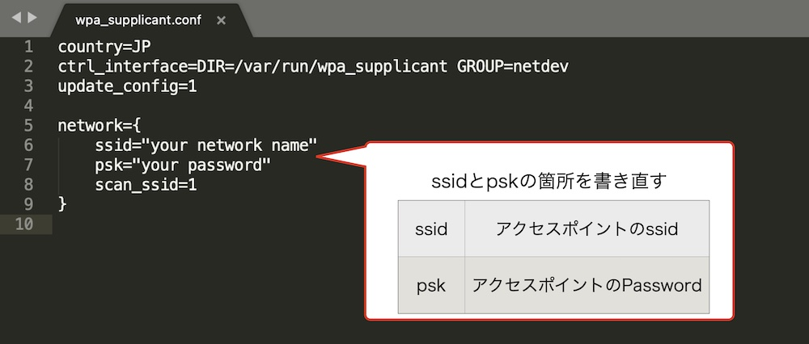

# WiFi設定


WiFiへの接続、SSHでログインできるようにしていきます。  
焼き込みのみでは初回起動時にWiFiへの接続・SSHでのログインが出来ないため、ここで設定を行っています。

## wpa_supplicant.confのダウンロード

|作業デバイス||
|:--|:--|
|||

{{ download_link('https://faboplatform.github.io/DonkeyDocs/2.Donkey Carインストール/wpa_supplicant.conf', 'wpa_supplicant.conf') }}をダウンロードします。


SDカードをPCで開き、wpa_supplicant.confファイルをSDカード内にコピーします。


## wpa_supplicant.confの編集

|作業デバイス||
|:--|:--|
|||

wpa_supplicant.confを任意のテキストエディタで開き、ssidに接続先のssid, pskにpasswordを記載します。




例) アクセスポイントのSSIDが`abcde0000001`, passwordが`123456789`の場合

```console
country=JP
ctrl_interface=DIR=/var/run/wpa_supplicant GROUP=netdev
update_config=1

network={
    ssid="abcde0000001"
    psk="123456789"
    scan_ssid=1
}
```

!!!warning "5GHz"
	Raspberry Pi3は、5GHz帯のWiFiは非対応です。2.4GHz帯のWiFiのアクセスポイントを設定するようにしてください。

<hr>

## WiFiスポットにパスワードなしでログインする場合の設定

|作業デバイス||
|:--|:--|
|||

PasswordのないWiFiスポットに接続する場合は、下記例を参考にしてください。`key_mgmt=NONE`をつける事で、パスワードなしでログインできます。

```console
country=JP
ctrl_interface=DIR=/var/run/wpa_supplicant GROUP=netdev
update_config=1

network={
    ssid="your network name"
    key_mgmt=NONE
}
```

## SDカードの挿入とRaspberryPiに電源を投入

|作業デバイス||
|:--|:--|
|||

wpa_suplicant.confを追加したSDカードをRaspberryPiに差し込み、電源を投入します。RaspberryPiは、wpa_supplicantで指定されたアクセスポイントへ接続を開始します。接続に成功するとDonkeyCarに搭載している赤い基板の液晶にIPアドレスが表示されます。


## wpa_supplicantの修正

接続に失敗した場合は、Raspberry Pi3内の`/etc/wpa_supplicant/wpa_supplicant.conf` を修正することで、接続先の変更が可能です。

```console
sudo nano /etc/wpa_supplicant/wpa_supplicant.conf
```

