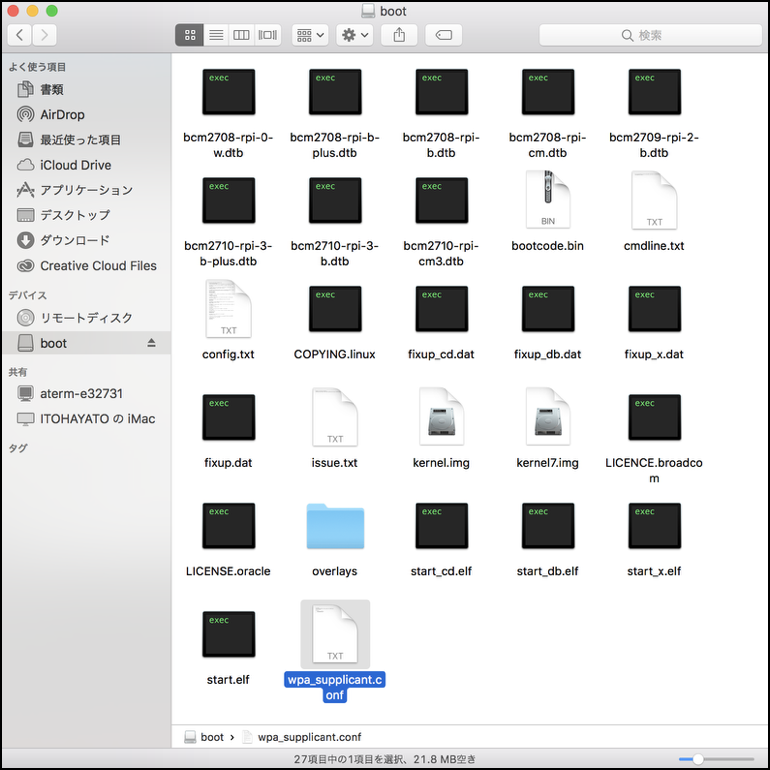

# RaspPi3用のイメージ作成

## Imageの作成
RaspPi3B,B+用SDカードのイメージ
[https://drive.google.com/open?id=1vr4nEXLEh4xByKAXik8KhK3o-XWgo2fQ](https://drive.google.com/open?id=1vr4nEXLEh4xByKAXik8KhK3o-XWgo2fQ)
よりRaspberryPi 3用のイメージをダウンロードしてくる。

donkey_2.5.0_pi3.zipを解凍してできた、donkey_2.5.0_pi3.img をSDカードに焼き込む。

焼き込む方法はこれを参照(OSXの場合)
[http://docs.fabo.io/fabo/rasppi/dev/pi/install_pixel.html](http://docs.fabo.io/fabo/rasppi/dev/pi/install_pixel.html)

Windowsの場合は、Ethcerを使う
[https://www.balena.io/etcher/](https://www.balena.io/etcher/)

## Wifiの設定

作成したSDカードをPCで開き、wpa_supplicant.confを作成します。



wpa_supplicant.confに、接続先のssid, password(psk)を記載します。

```
country=US
ctrl_interface=DIR=/var/run/wpa_supplicant GROUP=netdev
update_config=1

network={
    ssid="<your network name>"
    psk="<your password>"
}
```

RaspberryPi起動時に、wpa_supplicant.confが、/etc/wpa_supplicant/wpa_supplicant.confにコピーされ、Wifiに接続されます。

## Donkey関連アプリのインストール

RaspPi3にHDMIケーブルでDisplayを接続し、RaspberryPiにログインする。

| 項目|内容 |
|:--|:--|
| ID | pi | 
| PASS| raspberry | 


同じ名前のHostnameにあらないように、Hostnameを変更する。

```
$ sudo vim /etc/hostname
```

/etc/hostname

```
donkeypi-akira
```

```
$ sudo vim /etc/hosts
```

/etc/hosts

```
donkeypi-akira
```

ここまででいったん、Rebootする

```
$ sudo reboot
```

これで、先程つけたHostnameであるdonkeypi-akiraで発見できるようになる。

```
$ ssh pi@donkeypi-akira.local
```

Host名は、名前をかぶらないように気をつける。

## DonkeyCarのインストール

RaspberryPiにログインする。

```
$ pip install donkeycar[pi]
$ python -c "import donkeycar as dk; print(dk.__version__)"
using donkey v2.5.8 ...
2.5.8
```

## Projectフォルダの作成

```
$ donkey createcar ~/mycar
```

## 起動

```
$ cd ~/mycar
$ python manage.py drive
```

```
using donkey v2.5.8 ...
/usr/lib/python3/dist-packages/h5py/__init__.py:34: FutureWarning: Conversion of the second argument of issubdtype from `float` to `np.floating` is deprecated. In future, it will be treated as `np.float64 == np.dtype(float).type`.
  from ._conv import register_converters as _register_converters
loading config file: /home/pi/mycar/config.py
config loaded
PiCamera loaded.. .warming camera
Starting Donkey Server...
You can now go to http://192.168.86.41:8887 to drive your car.
/home/pi/env/lib/python3.5/site-packages/picamera/encoders.py:544: PiCameraResolutionRounded: frame size rounded up from 160x120 to 160x128
  width, height, fwidth, fheight)))
```

## PCから接続

```
http://RaspberryPiのIPアドレス:8887
```

で接続。