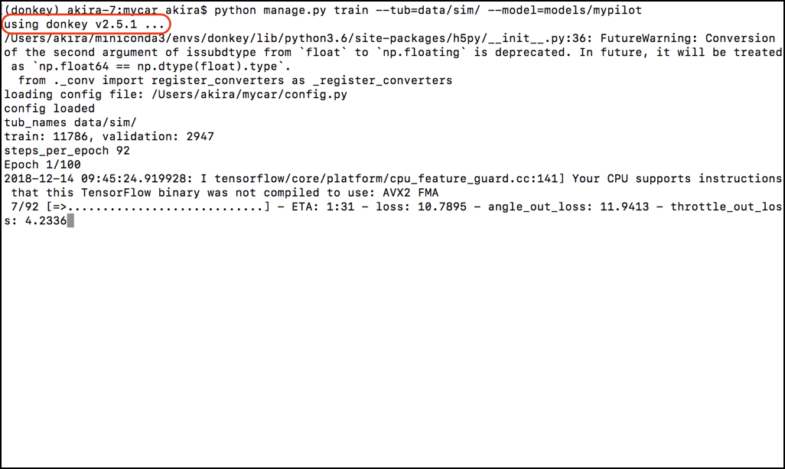

# 学習(Simulator)

!!! summary
    Donkey Car Simulatorとの連携は、DonkeyCar v2.5.7では廃止。そのため、Donkey Car Simulatorと連携して動作させるためには、Revisionは、[618b2f7](https://github.com/autorope/donkeycar/commit/618b2f78954b4cc7880365d518a1f24fdfe102ef) まで戻す必要がある。

Donkey Carの学習環境を構築します。Donkey Carの学習は、RapPi3側ではなく、PC側でおこないます。一般的なPCで20-30分程度の学習、GPU搭載のPCで数分の学習がおこなわれます。

## 学習用データの準備

Donkey SimulatorもしくはDonkey Carで作成した教師データのデータ・セットを、プロジェクトにコピーします。


```console
mkdir ~/mycar/data/sim
cp -r /Application/donkey_sim.app/log/ ~/mycar/data/sim/
```

!!!Warining
	`cp`実行時に-rオプションをつける。ファイル毎にコピーするとargument list too long でエラーが発生。

## 学習

```console
cd ~/mycar
python manage.py train --tub=data/sim/ --model=models/mypilot
```



学習済みデータはmypilotに保存されます。

追加で学習される場合は、--base_modelオプションで学習済みモデルを指定して、続きから学習させる。

```console
python manage.py train --tub=data/sim/ --model=models/newpilot --base_model=models/mypilot
```

## ソースコード

`~/workspace_donkey/donkeycar/donkeycar/parts/keras.py`

Defaultの設定では、下記コードで学習を実施している。

```python
def default_categorical():
    img_in = Input(shape=(120, 160, 3),
                   name='img_in')  # First layer, input layer, Shape comes from camera.py resolution, RGB
    x = img_in
    x = Convolution2D(24, (5, 5), strides=(2, 2), activation='relu')(
        x)  # 24 features, 5 pixel x 5 pixel kernel (convolution, feauture) window, 2wx2h stride, relu activation
    x = Convolution2D(32, (5, 5), strides=(2, 2), activation='relu')(
        x)  # 32 features, 5px5p kernel window, 2wx2h stride, relu activatiion
    x = Convolution2D(64, (5, 5), strides=(2, 2), activation='relu')(
        x)  # 64 features, 5px5p kernal window, 2wx2h stride, relu
    x = Convolution2D(64, (3, 3), strides=(2, 2), activation='relu')(
        x)  # 64 features, 3px3p kernal window, 2wx2h stride, relu
    x = Convolution2D(64, (3, 3), strides=(1, 1), activation='relu')(
        x)  # 64 features, 3px3p kernal window, 1wx1h stride, relu

    # Possibly add MaxPooling (will make it less sensitive to position in image).  Camera angle fixed, so may not to be needed

    x = Flatten(name='flattened')(x)  # Flatten to 1D (Fully connected)
    x = Dense(100, activation='relu')(x)  # Classify the data into 100 features, make all negatives 0
    x = Dropout(.1)(x)  # Randomly drop out (turn off) 10% of the neurons (Prevent overfitting)
    x = Dense(50, activation='relu')(x)  # Classify the data into 50 features, make all negatives 0
    x = Dropout(.1)(x)  # Randomly drop out 10% of the neurons (Prevent overfitting)
    # categorical output of the angle
    angle_out = Dense(15, activation='softmax', name='angle_out')(
        x)  # Connect every input with every output and output 15 hidden units. Use Softmax to give percentage. 15 categories and find best one based off percentage 0.0-1.0

    # continous output of throttle
    throttle_out = Dense(1, activation='relu', name='throttle_out')(x)  # Reduce to 1 number, Positive number only

    model = Model(inputs=[img_in], outputs=[angle_out, throttle_out])
    model.compile(optimizer='adam',
                  loss={'angle_out': 'categorical_crossentropy',
                        'throttle_out': 'mean_absolute_error'},
                  loss_weights={'angle_out': 0.9, 'throttle_out': .01})

    return model
```

