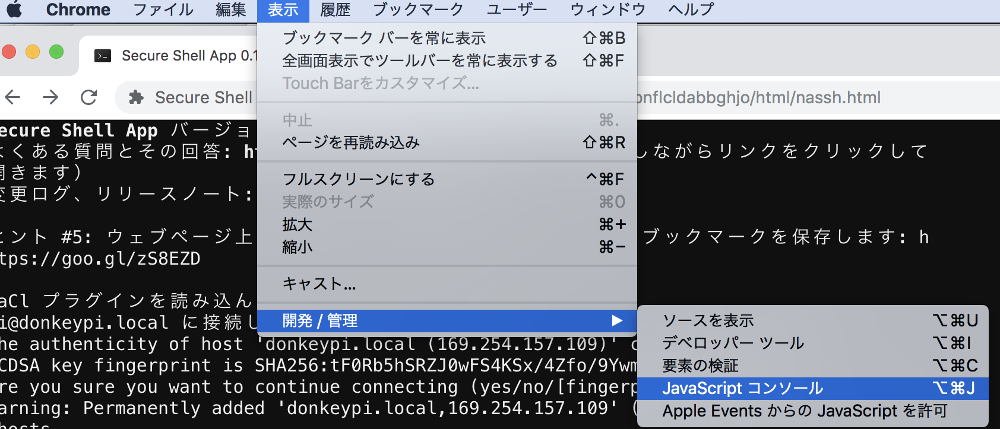
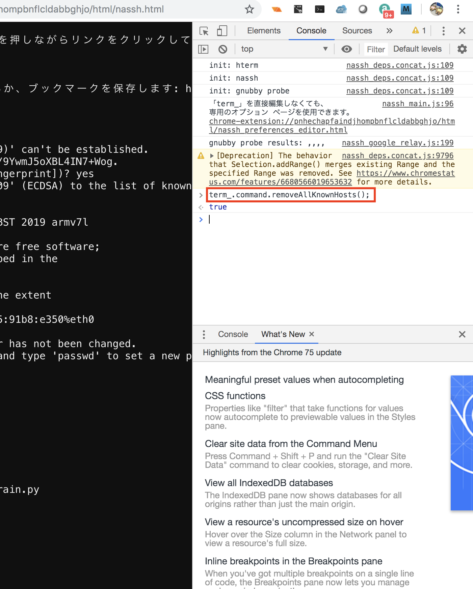

# SSHでRaspberry Piにログイン

	
## SSHでログイン(Chrome拡張 Secure Shellを使用する場合)

|作業デバイス||
|:--|:--|
|||

Secure shell拡張のアイコンをクリックし、`接続ダイアログ`を選択します。

DonkeyCarに接続するための設定をおこないます。

[Enter]接続をクリックし、DonkeyCarにSSHで接続します。

接続した際のpasswordは`raspberry`を入力してください。

|ログインID|パスワード|
|:--|:--|
|pi|raspberry|

## Secure shellでのエラーへの対処

!!!Info "Secure shellを用いた再にエラーがでる場合"
	下記にエラーへの対処方法をまとめています。

が発生する場合の対処方法

`term_.command.removeAllKnownHosts();` を実行し、/.ssh/known_hostsを消します。

