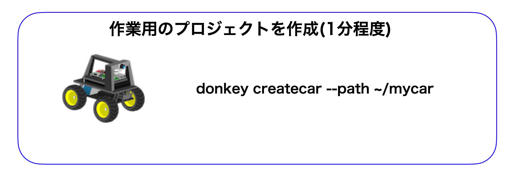

# mycarの作成




## mycarプロジェクトの作成

|作業デバイス||
|:--|:--|
|||

!!!Info "作業のすすめる前提"
	PCからDonkeyCarにSSHでログインした状態で下記作業をおこないます。

下記コマンドを入力し、DonkeyCarの作業フォルダを作成します。この作業で、走行に使用するファイルやスクリプトが置かれるディレクトリを作成します。

```console
cd ~/
donkey createcar --path ~/mycar
```

