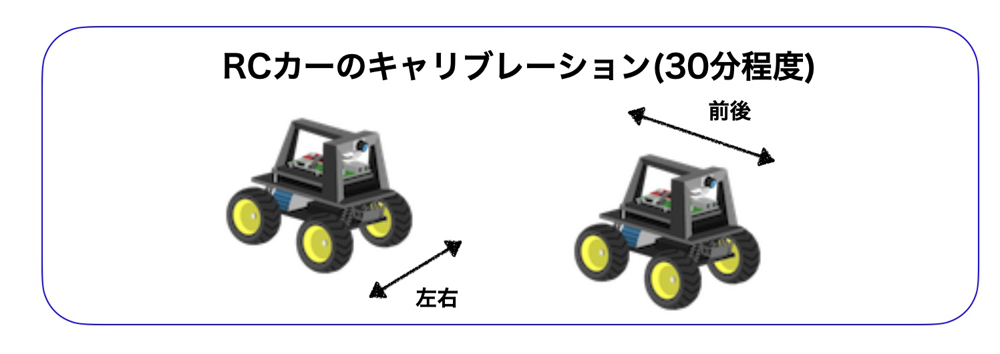
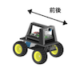
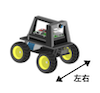
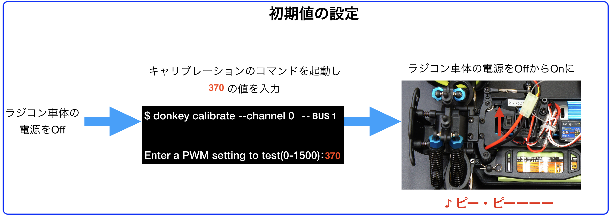

# キャリブレーション

DonkeyCarのスロットルとステアリング動作量の確認をします。<br>
車両毎に若干異なるため、myconfig.pyに適切な値を設定するための項目になります。



## 説明

|作業デバイス||
|:--|:--|
|||

ESC、サーボの接続は、下記表の通りにおこなっています。

|ch|pwm|操作|
|:--|:--|:--|
|0|pwm0|ESC, モーターの制御|
|1|pwm1|サーボの制御|

キャリブレーションのコマンドは下記のコマンドになります。





```console
donkey calibrate --channel 0 --bus 1
```




```console
donkey calibrate --channel 1 --bus 1
```


!!!Warning "注意"
	ここから先は車輪が動き始めます。車輪が空転するようにタイヤを浮かせた状態でコマンドを実行してください。

<hr>

## ESCの調整(channel 0)

|作業デバイス||
|:--|:--|
|||



まず、DonkeyCar本体(ラジコンの電源をOffにしてください。最初に、ESCの初期化処理をおこないます。初期化の値は、370です。

モーターの制御は、channel 0のPWM0でおこないます。


コマンド

```console
donkey calibrate --channel 0 --bus 1
```

初期値の入力

```console
donkey calibrate --channel 0 --bus 1
using donkey v3.1.0 ...
sombrero enabled
init PCA9685 on channel 0 address 0x40 bus 1
Enter a PWM setting to test(0-1500)370
```

この状態で、DonkeyCarの電源（ESCに繋がっているスイッチ）を入れます。「ピィ・ピィーー」と音がなります。これで初期化設定です。

初期値の370は、モーターが回らない状態、つまりニュートラル位置です。370よりも大きい値にすると前進し、370より小さい値を入れると後進します(後進時は、設定する値(例0)を一度入力したあとで、初期値である370に入力し、再度設定する値(例290)を入力する事で、ロックが解除され、後進が有効になります。例) 290->370->290)

この値の適切な範囲は250から500の範囲内になります。  
ここでは、前進の最大値の50%、後進の最大値の50%ぐらいの値を探し出します。


```console
donkey calibrate --channel 0 --bus 1
using donkey v3.1.0 ...
sombrero enabled
init PCA9685 on channel 0 address 0x40 bus 1
Enter a PWM setting to test(0-1500):370
Enter a PWM setting to test(0-1500):400
```

!!!Warning "初期値"
	PWMで信号を発信中にRCカー本体の電源を入れると、そのPWM値が初期値として登録されます。例えば、donkey calibrate --channel 0 で600を入力中に、電源をOnした場合、600が中央値になります。中央値がずれた場合は、donkey calibrate --channel 0 で、370の値を入力し、電源を入れ直すことで、中央値を370に戻すことができます。[ESCのDatasheet(Hobbywing QuicRun 1040)](http://www.redcatracing.com/manuals/HW-WP-1040-Brushed.pdf)

!!!Warining "後進の注意点"
	前進は、どのような状況でも操作できます。前進したのちの、後進は、一度 370の初期値をおくったあとに、後進が有効になります。　

キャリブレーションの終了は、++"CTRL"+"c"++です。いったん、キャリブレーションを終了し、調整した値をconfig.pyに反映します。

前後にタイヤが回る範囲を見つけ出し、qでキャリブレーションを終了し、config.pyに反映します。myconfig.pyの値の書き直しは、nanoでおこないます。


```console
nano ~/mycar/myconfig.py
```

`myconfig.py`

```console
#THROTTLE
THROTTLE_CHANNEL = 0
THROTTLE_FORWARD_PWM = 450
THROTTLE_STOPPED_PWM = 370
THROTTLE_REVERSE_PWM = 290
```

!!!Warining "行先頭にスペースは入れない"
	THROTTLE_CHANNELの前などに、スペースはいれないでください。　

!!!Info "高速走行したい場合"
	myconfig.pyの項目にある# JOYSTICK_MAX_THROTTLE = 0.5をJOYSTICK_MAX_THROTTLE = 1.0に変更することで、高速走行が可能になります。


nanoの操作方法

|操作|コマンド|メモ
|:--|:--|:--|
|保存|++"CTRL"+"o"++|コマンド実行後、ファイルを保存するか聞いてくるので++"Enter"++で保存をします。|
|終了|++"CTRL"+"x"++||
|カーソルの移動|十字キーで移動します|注意!マウスのクリックでは移動しません。|

<hr>

## サーボの調整(--channel 1)

|作業デバイス||
|:--|:--|
|||


サーボの制御は、channel 1のPWM1でおこないます。


コマンド

```console
donkey calibrate --channel 1 --bus 1
```

一番右の値と、一番左の値を見つけ出してください。まず、中央値を発見し、左右均等に値を増やした、右の値と左の値を見つけ出します。250-500の間ぐらいが可動範囲です。

見つけ出した値をmyconfig.pyに反映します。


!!!info "左右均等にするポイント"
	左右の振れ幅を均等にしないとDonkeyCarはまっすぐ走りません。車輪が真ん中にあたる位置を見つけ出し、そこから同じ数だけ左右にずらすと左右均等になるはずです。

値が調整できたら、qでキャリブレーションを終了し、~/mycar/myconfig.pyの値を修正します。


```console
nano ~/mycar/myconfig.py
```

`myconfig.py`

```console
#STEERING
STEERING_CHANNEL = 1
STEERING_LEFT_PWM = 460
STEERING_RIGHT_PWM = 290
```

!!!Warining "スペースは開けない"
	STEERING_CHANNELの前などに、スペースはいれないでください。　


nanoの操作方法

|操作|コマンド|メモ
|:--|:--|:--|
|保存|++"CTRL"+"o"++|コマンド実行後、ファイルを保存するか聞いてくるので++"Enter"++で保存をします。|
|終了|++"CTRL"+"x"++||
|カーソルの移動|十字キーで移動します|注意!マウスのクリックでは移動しません。|
