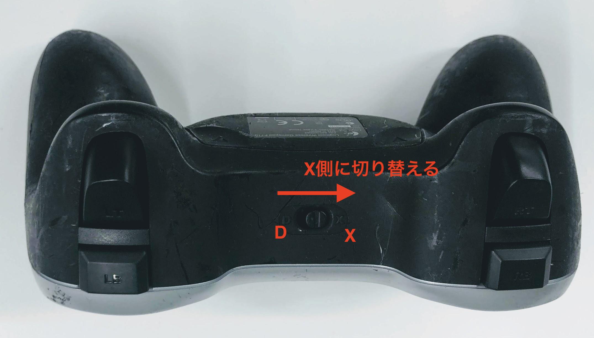
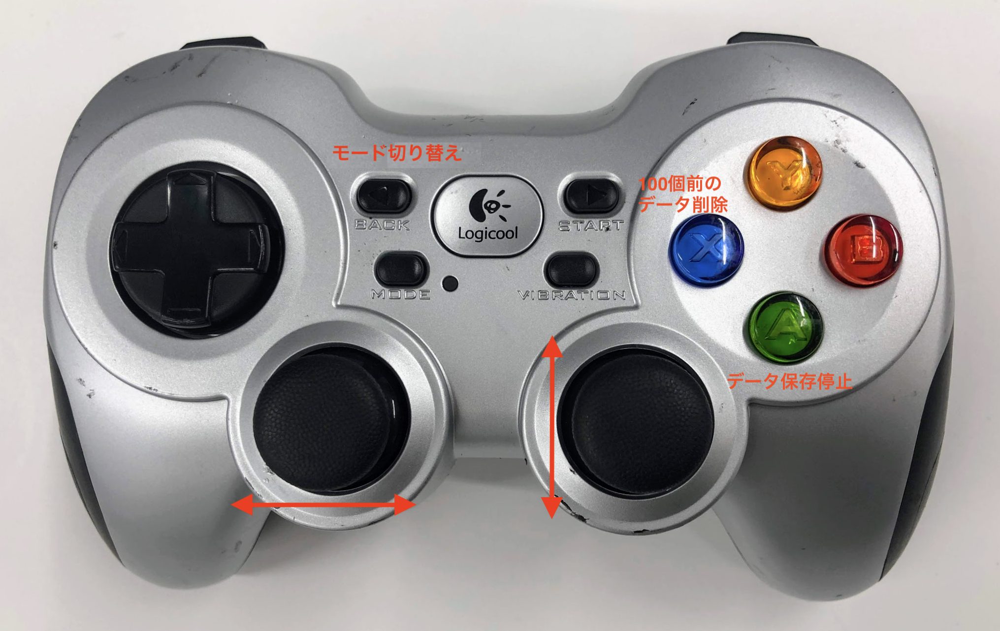
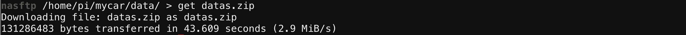

# マニュアル走行と教師データの作成


<hr>

## Joystickの接続

JoystickをDonkeyCarに接続します。Joystickの裏側の蓋を外すと、USBドングルが入っているので、DonkeyCarのRaspberry Pi3のUSBに差し込みます。






!!!warning "Joystickは省電力モードにすぐ入ります"
	Joystickを操作していない時間が長いと、Joystickは省電力モードにはいります。復活させるには、`start`を押し、`vibration`ボタンで電源のOn/Offを確認します。他のボタンにはコマンドが割り振られているために押さないようにしてください。

<hr>

## DonkeyCarの起動

Joystickは、すぐ省電力モードにはいり、Offになります。① StartボタンをおしてJoystickの電源がOnになっている事を確認します。② Vibrationボタンを押してバイブレーションすれば、電源はOnの状態です。


`~/mycar`フォルダに移動します。


```
cd ~/mycar
```

DonkeyCarを起動します。`--js`をつけると、Joystickが有効になります。

```
python manage.py drive --js
```

早速、DonkeyCarのテスト走行を行いましょう!!
走行の終了は、++"CTRL"+"c"++で、終了します。

<hr>

## データの保存

データは、前進・行進している間、自動保存されます。保存先は、`~/mycar/dara`になります。フォルダが生成されるタイミングは、`python manage.py drive --js`を実行したタイミングで、毎回作成されます。

```
cd ~/mycar/data
```

lsコマンドで作成されたフォルダを確認します。

```
ls
```

今作成されたフォルダが下記のように表示されます(例)。このフォルダ以下にデータ・セットが保存されています。

```
tub_01_19-01-26
```

DonkeyCarの終了は、++"CTRL"+"c"++で終了します。

!!!warning "フォルダのできるタイミング"
	tubフォルダができるタイミングは、`python manage.py drive --js`を実行したタイミングです。

<hr>

## 教師データの圧縮

ZIPで学習データとして使いたい走行のフォルダを圧縮します。

```
cd ~/mycar/data
```

<hr>

## zipコマンドでフォルダを圧縮

zipコマンドでフォルダを圧縮します。

まず、過去のdatas.zipが存在する場合があるので、削除します。

```
rm datas.zip
```

今作成した走行データの保存されているtubフォルダを指定します。

```
zip -r datas.zip tub_自分のフォルダ名
```

!!!info "学習に必要なデータ・セット数"
	学習に必要なデータセット数は、5000〜2万データ・セットぐらいになります。

<hr>

## データの転送

<a href="https://chrome.google.com/webstore/detail/secure-shell-app/pnhechapfaindjhompbnflcldabbghjo/related?hl=ja" target="sftp_tab">Secure Shell</a>をクリックし、`アプリの起動`を選択し、新しいWindowで、Secure shellを起動します。今度は、下記の通りSFTPを選択し、SFTPでDonkeyCarに接続します。


|ログインID|パスワード|
|:--|:--|
|pi|raspberry|

SFTPで、datas.zipのあるフォルダに移動します。
```
cd ~/mycar/data
```


SFTPで、datas.zipをgetします。
```
get datas.zip
```




これで、datas.zipがPCに転送されます。
