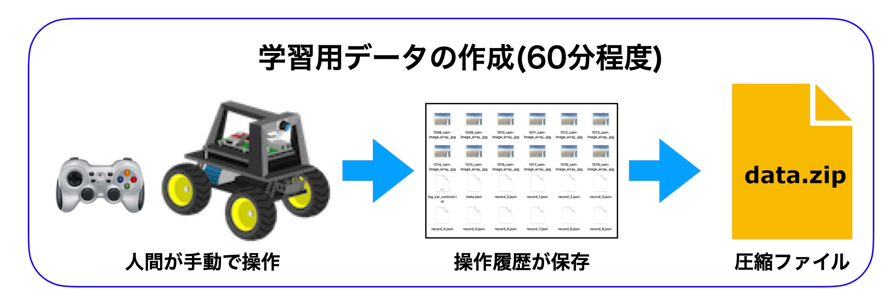
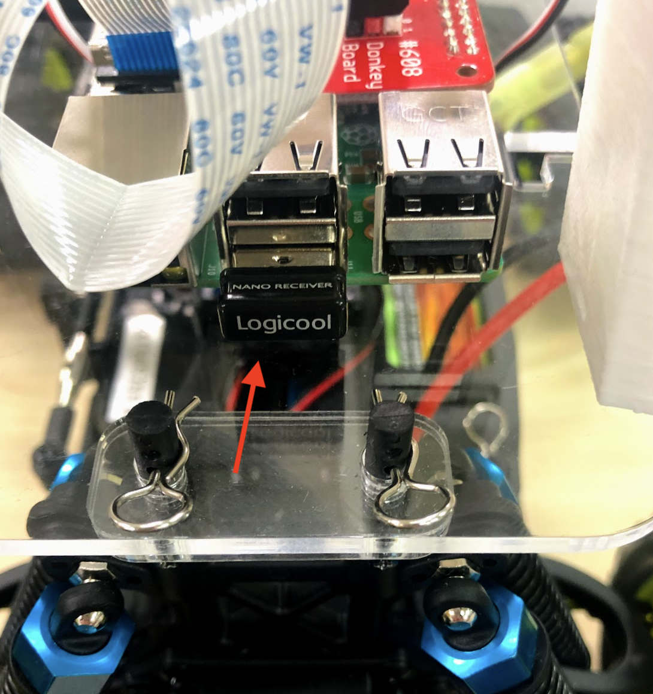
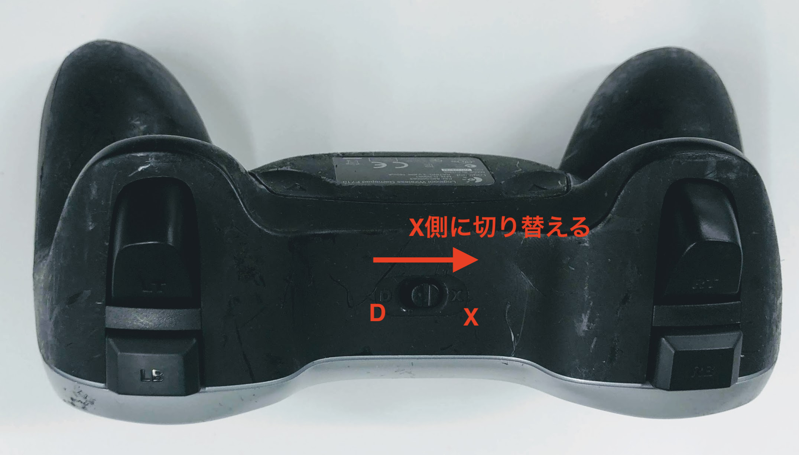
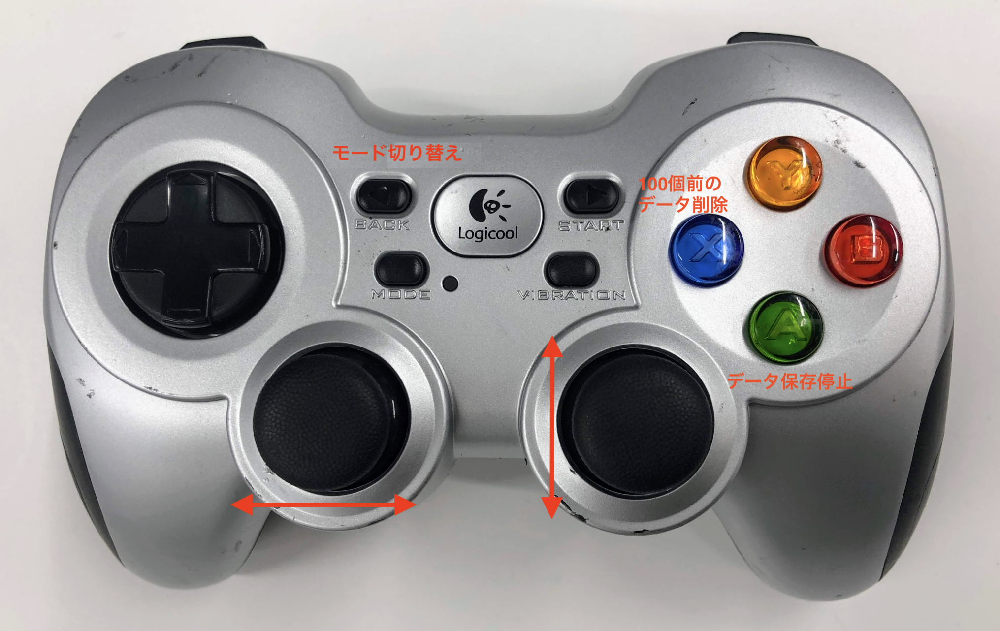

# マニュアル走行と教師データの作成



<hr>

## Joystickの接続

|作業デバイス||
|:--|:--|
|||

JoystickをDonkeyCarに接続します。Joystickの裏側の蓋を外すと、USBドングルが入っているので、DonkeyCarのRaspberry Pi3のUSBに差し込みます。







!!!warning "Joystickは省電力モードにすぐ入ります"
	Joystickを操作していない時間が長いと、Joystickは省電力モードにはいります。復活させるには、`start`を押し、`vibration`ボタンで電源のOn/Offを確認します。他のボタンにはコマンドが割り振られているために押さないようにしてください。

<hr>

## DonkeyCarの起動

|作業デバイス|||
|:--|:--|:--|
||||

Joystickは、すぐ省電力モードにはいり、Offになります。① StartボタンをおしてJoystickの電源がOnになっている事を確認します。② Vibrationボタンを押してバイブレーションすれば、電源はOnの状態です。


`~/mycar`フォルダに移動します。


```console
cd ~/mycar
```

DonkeyCarを起動します。`--js`をつけると、Joystickが有効になります。

```console
python manage.py drive --js
```

早速、DonkeyCarのテスト走行を行いましょう!!
走行の終了は、++"CTRL"+"c"++で、終了します。


## データの保存

|作業デバイス||
|:--|:--|
|||

データは、前進・行進している間、自動保存されます。保存先は、`~/mycar/dara`になります。フォルダが生成されるタイミングは、`python manage.py drive --js`を実行したタイミングで、毎回作成されます。

```console
cd ~/mycar/data
```

lsコマンドで作成されたフォルダを確認します。

```console
ls
```

今作成されたフォルダが下記のように表示されます(例)。このフォルダ以下にデータ・セットが保存されています。

```console
tub_01_19-01-26
```

DonkeyCarの終了は、++"CTRL"+"c"++で終了します。

!!!warning "フォルダのできるタイミング"
	tubフォルダができるタイミングは、`python manage.py drive --js`を実行したタイミングです。

<hr>

## 教師データの圧縮

|作業デバイス||
|:--|:--|
|||

ZIPで学習データとして使いたい走行のフォルダを圧縮します。

```console
cd ~/mycar/
```

<hr>

## zipコマンドでフォルダを圧縮

zipコマンドでフォルダを圧縮します。

まず、過去のdata.zipが存在する場合があるので、削除します。

```console
rm data.zip
```

dataディレクトリをzipファイルにします。

```console
zip -r data/ data.zip
```

!!!info "学習に必要なデータ・セット数"
	学習に必要なデータセット数は、5000〜2万データ・セットぐらいになります。

<hr>

## データの転送

|作業デバイス||
|:--|:--|
|||


|ログインID|パスワード|
|:--|:--|
|pi|raspberry|

SFTPで、data.zipのあるフォルダに移動します。

```console
cd ~/mycar/
```

SFTPで、data.zipをgetします。

```console
get data.zip
```

これで、data.zipがPCに転送されます。

