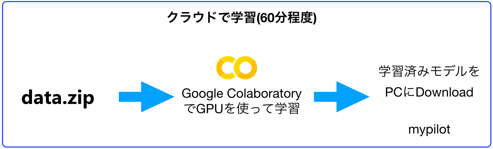

# Colabでの学習(GPU)



!!!warning
	Google Colaboratoryのサンプルは、Chromeが推奨になります。他のブラウザを用いる場合は、ファイルのアップロードに失敗することがあります。

<hr>

## 学習にはGoogle Colaboratoryを用います。

下記リンクからColaboratoryを起動します。

|Notebook|DonkeyCar version|概要|
|:--|:--|
|[GPU_Donkey3_1_5(TensorFlow_1_13_1).ipynb](https://colab.research.google.com/drive/12ZEewu4yEc96lWimnXIg6zPkCwi1r2aR?usp=sharing)|3.1.5|
|[GPU_Donkey3_1_0(TensorFlow_1_13_1).ipynb](https://colab.research.google.com/github/FaBoPlatform/DonkeyColab/blob/master/GPU_GoogleDrive_Donkey3_1_0_Sample(TensorFlow_1_13_1).ipynb#scrollTo=nqB_I9dsxBoA)|3.1.0|


このGoogle Colabのノートブックには、学習するためのスクリプトとコマンドが書いてあります。  
手順に従いColab上でスクリプトを実行すると、DonkeyCarで集めたデータから学習結果を得られます。

<hr>

## 学習済みデータをDonwload

Colabから学習結果をダウンロードします。Colabの下記コードを実行すると'mypilot.h5'が自動ダウンロードされます。(少々時間がかかります。)

```
from google.colab import files

files.download('/content/mycar/models/mypilot.h5')
```
