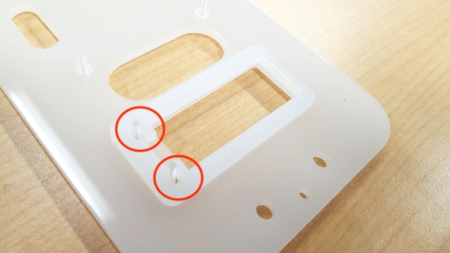
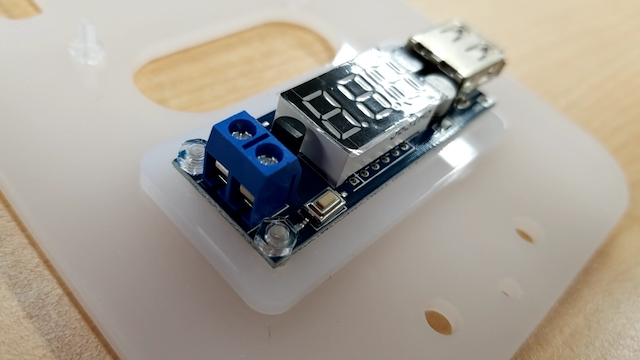
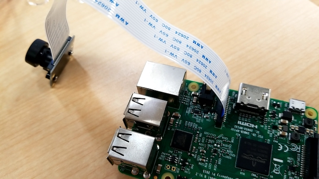
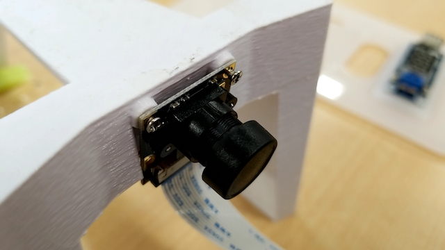
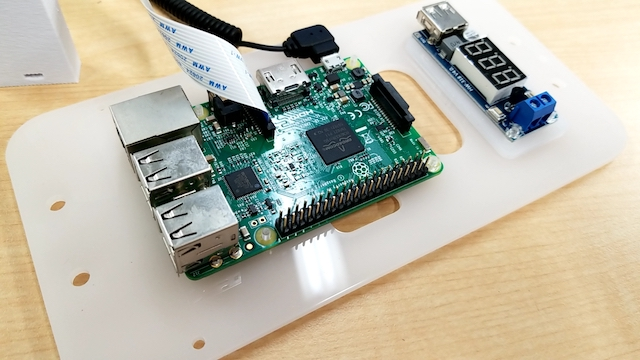
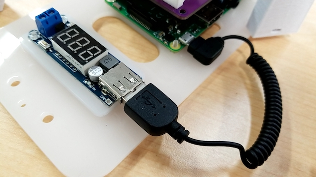
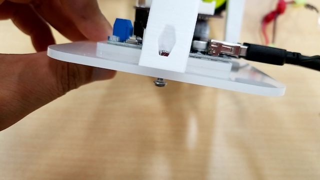
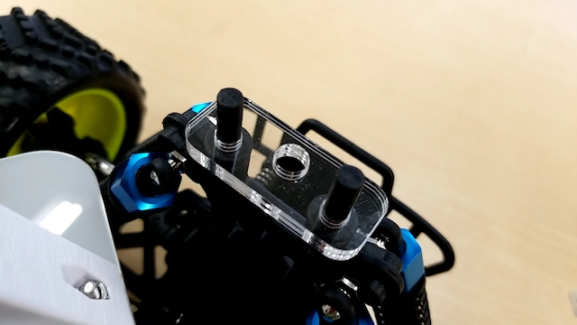
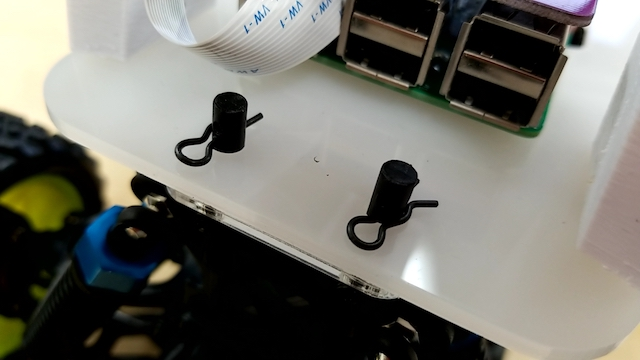
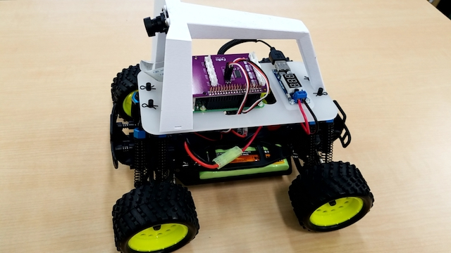

# 組み立て

## Donkey Carのパーツ一覧

|項目|内容|
|:--|:--|
|1|RCカー本体|
|2|Donkey Carアーム|
|3|Donkey Carプレート|
|4|Donkey Board|
|5|降圧型変換器内蔵電圧計|
|6|RaspberryPi3|
|7|PiCamera|
|8|SDカード|
|9|USBケーブル|
|10|バッテリー3又ケーブル|

## Donkey Car組み立て

## ０、下準備

RCカー

　ボディマウントエクステンションを付け直す。

　DonkeyCarプレートを固定できる高さを確保する（４箇所）。 

RaspberryPi

　SDカードをセットする。

## １、DonkeyCarプレートにRaspberryPiを固定するネジを取り付ける。

　使用ネジM2.8-10mmネジ＋ナット　x４

　裏からネジを立てるように固定する。
 
## ２、降圧型変換器内蔵電圧計を取り付ける。

　使用ネジM2.8-10mmネジ＋ナット　x2　

　間にスペーサーを入れて固定する（２箇所）。

## ３、RaspberryPiにPiCameraを取り付ける。

　ハーネスの方向に注意する事。

## ４、DonkeyCarアームにPiCameraを取り付ける。

　ネジが小さいので無くさないように注意する事。

## ５、RaspberryPiに電源供給用USBケーブルを取り付ける。

## ６、DonkeyCarプレートにRaspberryPiを取り付ける。

　方向に注意する事。
 
## ７、手順５で取り付けたUSBと降圧型変換器内蔵電圧計を繋げる。

## 8、DonkeyBoardをRaspberreyPiに取り付ける。

## 9、プレートにアームを固定する。

　使用ネジ　M3-10mm + ナット

　アームの先にナットをはめ込み、下からネジで固定する。(前２箇所　後１箇所）

## １０、サーボケーブルとモーターケーブルをDonkeyBoardに取り付ける。

　差し込むピンの場所と方向に注意する事。（黒＝GND）

## １１、プレートスペーサーを取り付ける。

　前と後ろで形状が違うので注意する事。

## １２、バッテリー３又ケーブルを取り付ける。

　この時RCカー本体の電源がOFFになっている事。

## １３、降圧型変換器内蔵電圧計に３又ケーブルを取り付ける。

　プラスマイナスの向きに注意する事。

## １４、プレートをRCカー本体に固定する。

　４箇所のボディマウントエクステンションに固定ピンを取り付ける。

## １５、完成

