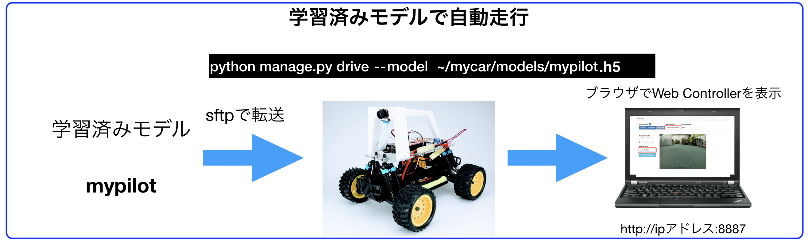

# 自動走行



<hr>

## mypilot.h5をRaspberry Pi3へ移動

SFTPでRaspberry Pi3側の`/home/pi/mycar/models`フォルダにアップロードします。


SFTPで、学習済みモデルをアップするフォルダに移動します。`~/mycar/models/
```
cd ~/mycar/models
```


SFTPで学習済みモデル mypilot.h5をアップロードします。
```
put mypilot.h5
```


<hr>

## 学習済みモデルでDonkeyCarを動かす(Raspberry Pi3)

SSHで、Raspberry Pi側にログインし、mycarフォルダに移動します。

```
cd ~/mycar
```

アップロードしたモデルを指定してDonkeyCarを指導します。

```
python manage.py drive --model ./models/mypilot.h5
```

DonkeyCarに、Webサーバが立ち上がりWebConsoleが起動します。WebConsoleへのアクセスは、`DonkeyCarのIPアドレス:8887`でChromeで接続します。

DonkeyCarのIPアドレスがわからない場合は、ifconfigでwlan0のIPアドレスを調べます。

```
ifconfig -a
```

<hr>

## 学習済みモデルの呼び出し自動走行

Web画面のmode & pilotの部分を、`Local Pilot (d)`に変更するとmypilot.h5を使った自動走行が始まります。


学習済みモデルでの走行を停止するには、Web画面のmodel & pilotから、`User (d)`を選びます。

SSHのRaspberry PiのTerminalで、++"CTRL"+"c"++でコマンドを終了し、DonkeyCarを停止します。

