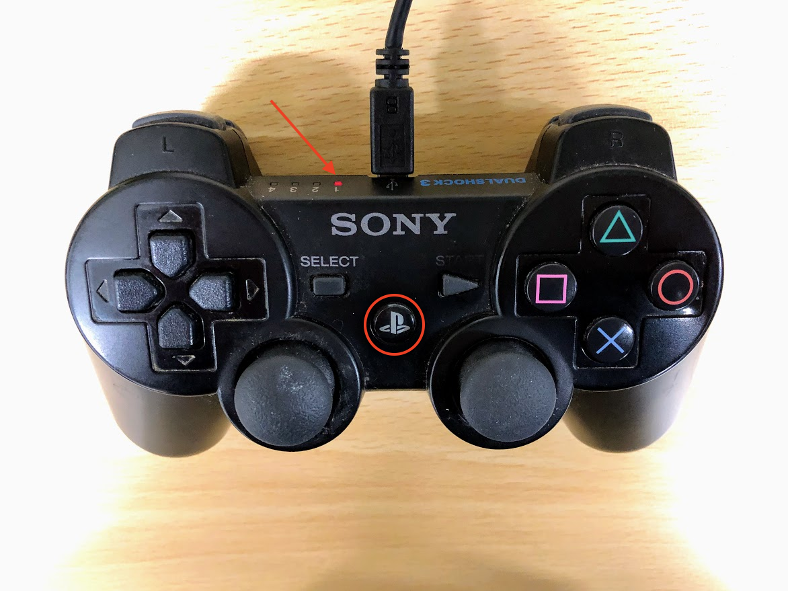

# Joystick(PS3)

Donkey Carでは、SONY純正のPS3 Joystickで操作も可能です。

!!!Warning
	PS3 Joystickは、Thirdparty製は認識しない。

## PS3 Joystickの認識

Bluetooth関連ライブラリを追加
```
sudo apt-get install bluetooth libbluetooth3 libusb-dev
sudo systemctl enable bluetooth.service
sudo usermod -G bluetooth -a pi
```

RespberryPi3をRebootします。
```
reboot
```

Sixpairをインストール
```
wget http://www.pabr.org/sixlinux/sixpair.c
gcc -o sixpair sixpair.c -lusb
```

PS3 JoystickをDonkeyCarにUSBで接続し、PS3ボタンを押します。



Sixpairで認識
```
sudo ./sixpair
Current Bluetooth master: b8:27:eb:4d:b1:73
Setting master bd_addr to b8:27:eb:4d:b1:73
```

Bluetoothデバイスアドレスがでてくれば、成功。PS3 JoystickをDonkeyCarから切り離します。

!!!Warning
    うまくいかない場合は、コントローラの裏にリセットボタンがありますので、リセットします。


bluetoothctlを起動
```
bluetoothctl
[NEW] Controller B8:27:EB:4D:B1:73 donkeypi [default]
[PLAYSTATION(R)3 Controller]#  agent on
Agent registered
```

PS3ボタンを押す
```
[PLAYSTATION(R)3 Controller]#  connect B8:27:EB:4D:B1:73
```
つながるまで繰り返す


```
[PLAYSTATION(R)3 Controller]#  trust B8:27:EB:4D:B1:73
[PLAYSTATION(R)3 Controller]#  default-agent
[PLAYSTATION(R)3 Controller]#  quit
```

認識がうまくいったらRebootします。
```
sudo reboot
```

/dev/input/js*を確認
```
ls /dev/input/js*
/dev/input/js0
```

/dev/input/js0が見えれば成功。


値が取得できるかjstestでチェック
```
jstest /dev/input/js0
```

## 必要なパッケージの拡張

ps3 controllerを追加
```
pip install git+https://github.com/autorope/donkeypart_ps3_controller.git
```

## 調整


### __init__.pyの修正

コントローラの裏にリセットボタン

manage.py に 下記のimport 分を追加
```
cd /home/pi/env/lib/python3.5/site-packages/donkeypart_ps3_controller
vi __init__.py
```

`/home/pi/env/lib/python3.5/site-packages/donkeypart_ps3_controller/__init__.py`
```
from .part import PS3JoystickController
```

### manager.pyの修正

~/mycarに移動して、managae.pyを編集
```
cd ~/mycar
vim manage.py
```

`manage.py`
```
from donkeypart_ps3_controller import PS3JoystickController
```
...
```
if use_joystick or cfg.USE_JOYSTICK_AS_DEFAULT:
        ctr = PS3JoystickController(
            throttle_scale=cfg.JOYSTICK_MAX_THROTTLE,
            steering_scale=cfg.JOYSTICK_STEERING_SCALE,
            #throttle_axis=cfg.JOYSTICK_THROTTLE_AXIS,
            auto_record_on_throttle=cfg.AUTO_RECORD_ON_THROTTLE
        )
    else:
        # This web controller will create a web server that is capable
        # of managing steering, throttle, and modes, and more.
        ctr = LocalWebController(use_chaos=use_chaos)
```