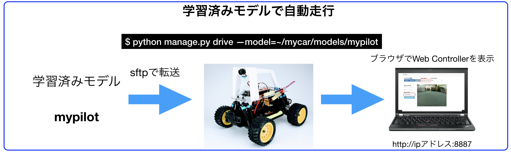

# 自動走行



<hr>

## mypilotをRaspPi3へ移動

<hr>

SFTPでRaspberryPi3側の`/home/pi/mycar/models`フォルダにアップロードします。


<hr>

## 学習済みモデルでDonkeyCarを動かす(RasPi3)

<hr>


RaspberryPi側にログイン。

```
python manage.py drive --model=~/mycar/models/mypilot
...
...
...
You can now go to http://192.168.0.101:8887 to drive your car.
/home/pi/env/lib/python3.5/site-packages/picamera/encoders.py:544: PiCameraResolutionRounded: frame size rounded up from 160x120 to 160x128
  width, height, fwidth, fheight)))
```

起動ログに、Web Consoleの起動しているサーバのアドレスとポートが出てくるので、Web Browserで接続します。

Web画面のmodel & pilotから、local pilotを選ぶ。


