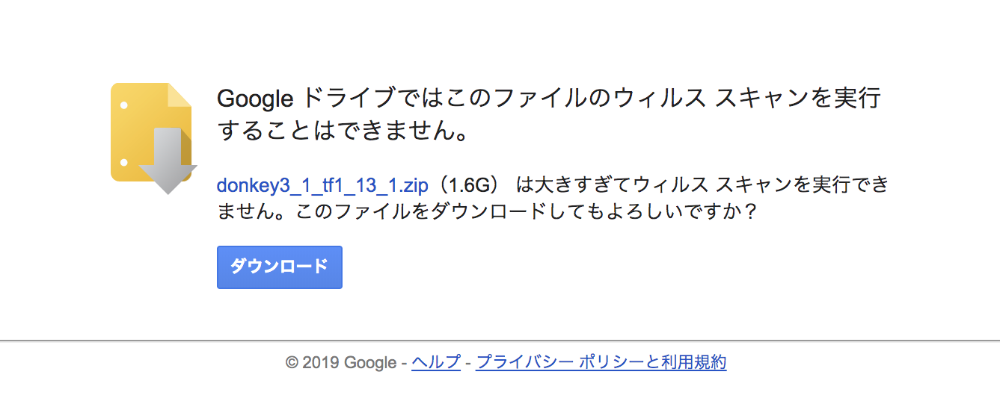

# DonkeyCarのSDカード作成

## DonkeyCarのRaspberry Pi用イメージ

|作業デバイス||
|:--|:--|
|||

DonkeyCarインストール済みのイメージをダウンロードします。

|イメージ|ベースOS|DonkeyCar|
|:--|:--|:--|
|<a href="https://drive.google.com/file/d/1uiUkqMNAAhONLD7ZHmhPery9QN9qlK32/view?usp=sharing"  target="_blank">donkeycar-pi-2021-11-25.zip</a>|Raspberry Pi OS Lite Buster 2019-07-10|v3.1.5|

zipファイルをダウンロードしたら、解凍し、imgをSDカードに焼き込みます。

## SDカードイメージの焼き込み

|作業デバイス||
|:--|:--|
|||

焼き込みには、Etcherを使い焼き込みます。
<a href="https://www.balena.io/etcher/" targte="new">Etcher</a>

ダウンロードしたRaspberry Piのイメージをmicro SDカードに焼き込みます。

!!!warning "注意点"
	必ずデータの入っていないmicro SDカードを使用してください。  

ダウンロードしたイメージとmicro SDカードを選択します。  
`Flash`ボタンを押すことで焼き込みが開始し、完了すれば焼き込み終了です。

OSイメージをSDカードに焼き込み終わったあとに、SDカードを抜いて、再度PCに挿し直すと、PCでSDカードが認識されます。OSXの場合、SDカードは、Bootというデバイスで認識されます。

次にネットワークの設定をおこないます。

