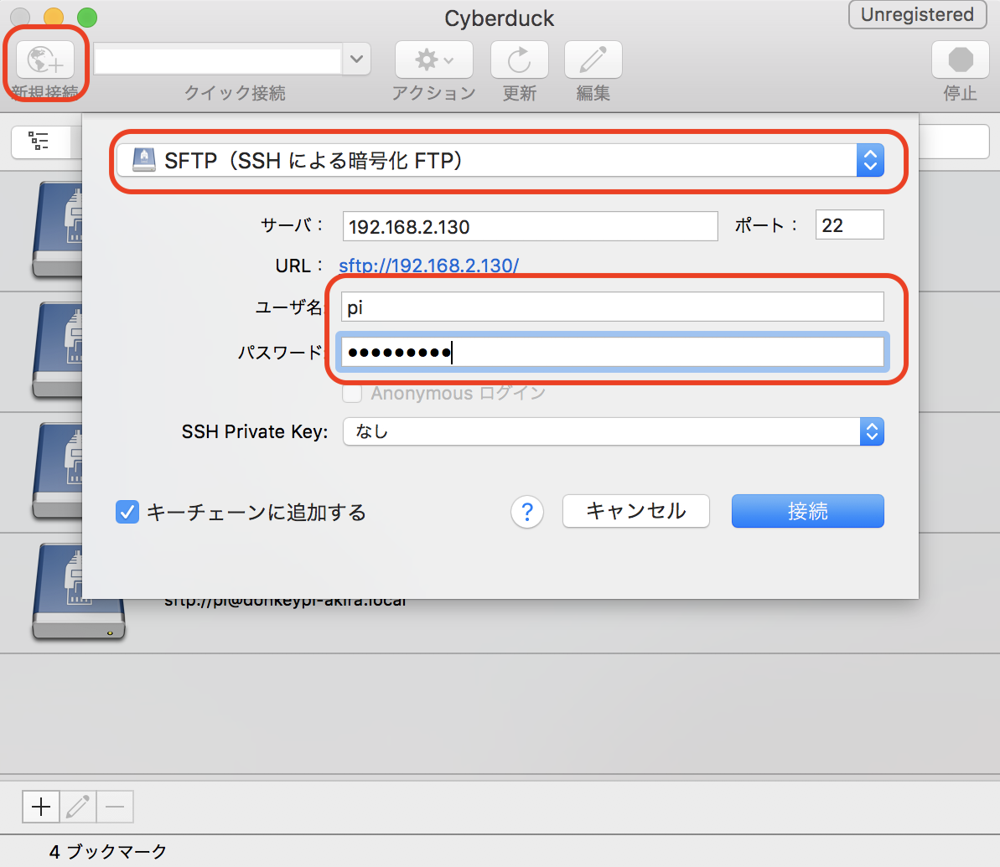
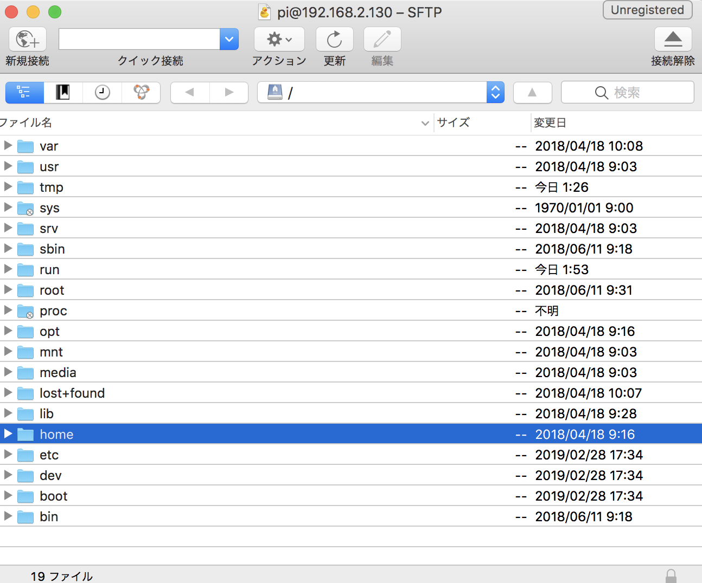
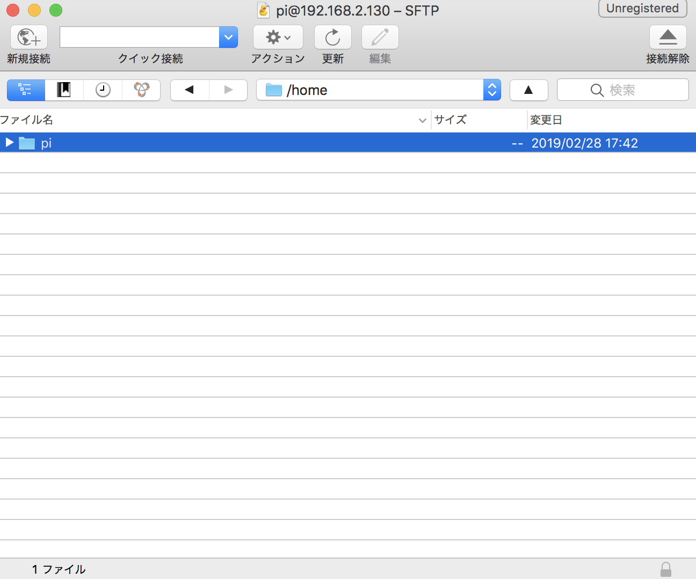
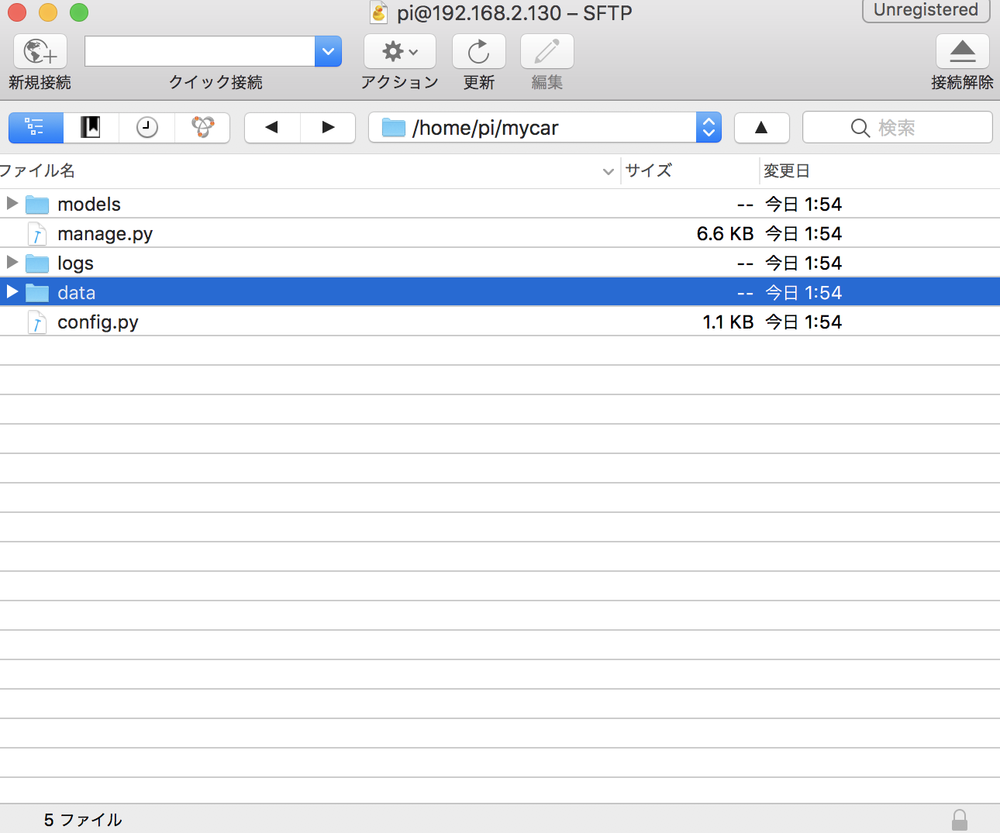

# 教師データの作成


## 教師データの作成

DonkeyCarを起動します。

JoyStick
```
$ cd ~/mycar
$ python manage.py drive --js
```

教師データは、`~/mycar/dara`以下に保存されます。
```
cd ~/mycar/data
ls
tub_01_19-01-26
```

++"CTRL"+"c"++で終了します。

## 教師データの圧縮

データを圧縮し、1つのファイル(ZIP形式)にしてPCに転送します。

RaspberryPi3にZIPをインストールします。
```
sudo apt-get install zip
```

ZIPでフォルダを圧縮します。
```
cd ~/mycar/data
zip -r datas.zip tub_01_19-01-26
```

## データの転送

[Cyberduck](https://cyberduck.io/) をインストールします。









RaspberryPi3からPCに、datas.zipを転送します。


