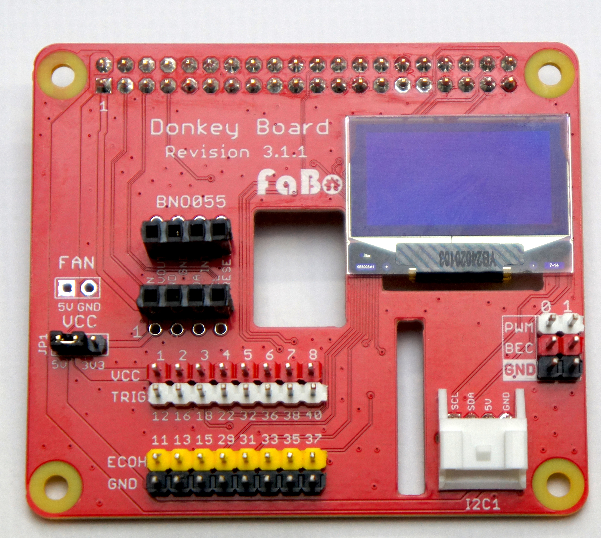
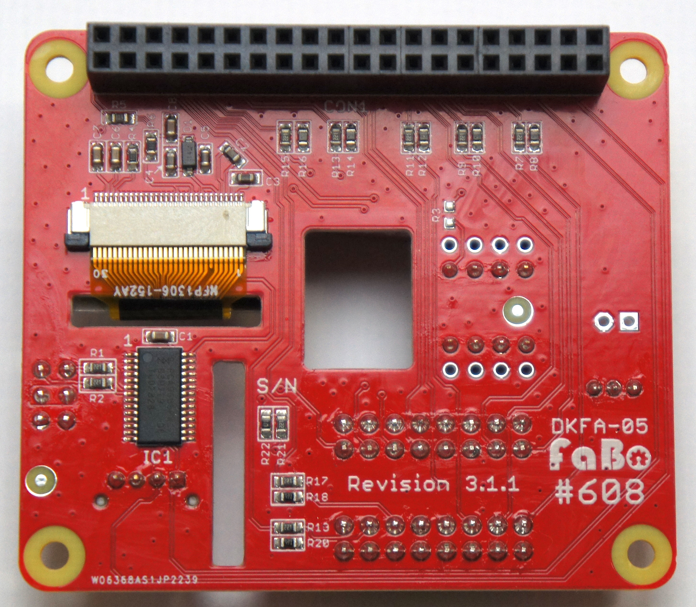
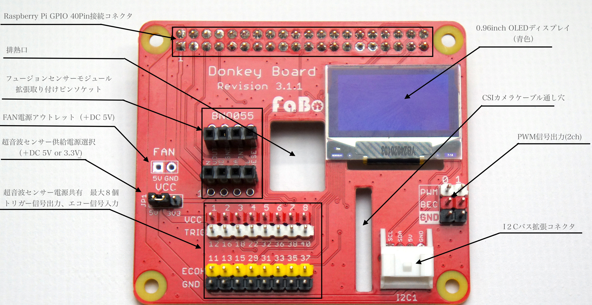
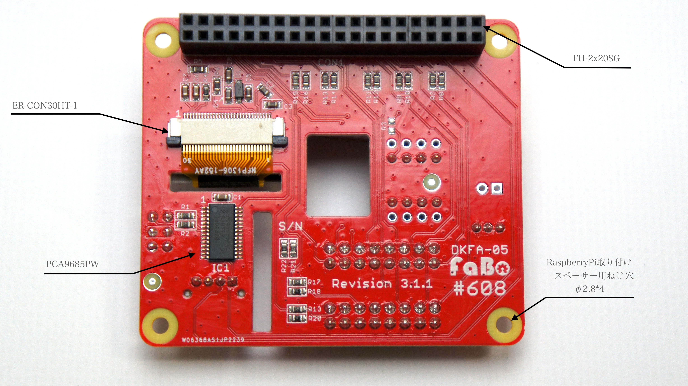
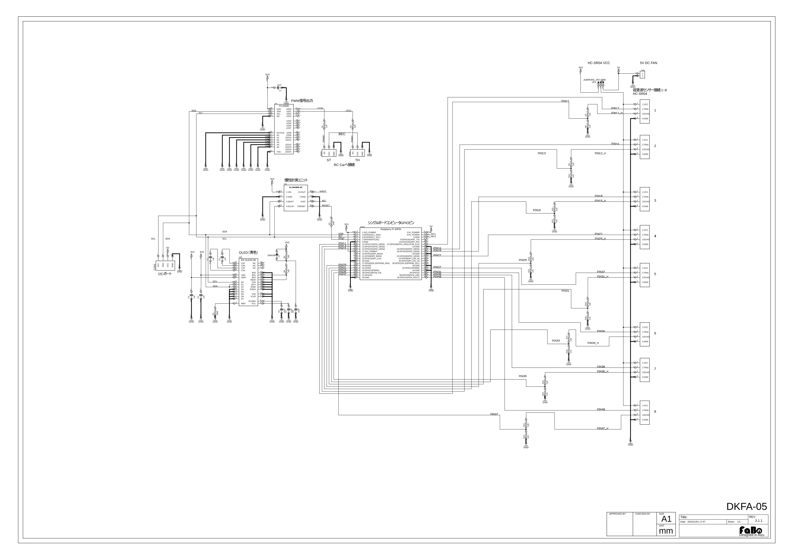
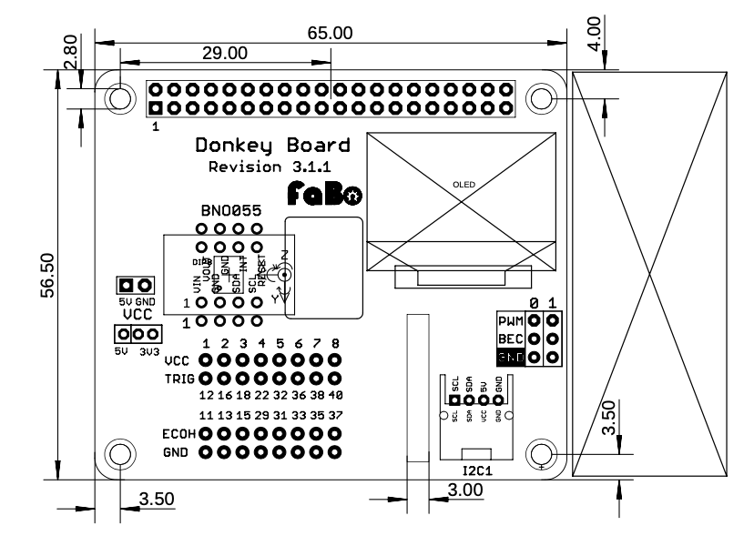
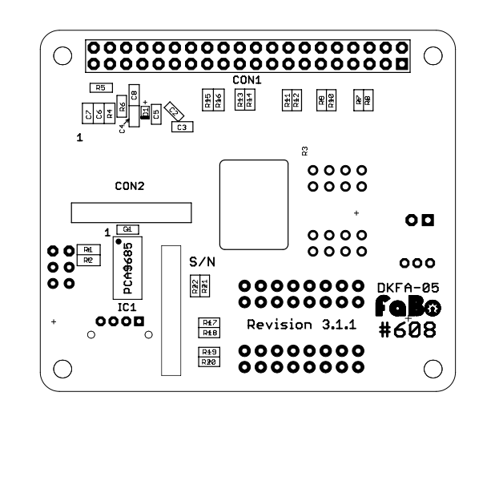

# ラズベリーパイ向けDonkey Board　DKFA-05

### コード番号:DKFA-05

### Revision 3.1.1

## 外観

表

{: width="300px"}

裏

{: width="300px"}

{: width="1100px"}

{: width="1100px"}

## 特徴

Raspberry PiからESCやサーボを制御するための信号に変換し、より安定したPWM信号を出力します。 
最大8個の超音波センサー(HC-SR04)との接続をわかりやすくかつ確実なものとします。 
有機ディスプレイによるRaspberry PiのIPアドレスなどの情報を表示 
I2Cバス拡張コネクタ付き 
フュージョンセンサーモジュール（BNO055）が簡単に拡張できます。（別売） 

## 使用できるRaspberry Pi

|対象ボード||
|:--:|:--:|
|Raspberry Pi 3B＋|対応|
|Raspberry Pi ４|対応予定|
|Raspberry Pi 5|対応予定|

※Raspberry Pi5での使用は別途	ピンソケットが必要となります。

## 回路図

画像をダウンロードしてください。

## 実装図

### 表

### 裏

## DKFA-05　BOM

| Quantity | Reference        | Name                              | Model                                      | Vender                  |
|-----|--------------|-------------------------------------|---------------------------------------------|---------------------------------|
| 4   | C1,6,7,8     | セラミックコンデンサ　10uF 0603 X5R|  |  |
| 4   | C2,3,4,5     | セラミックコンデンサ　1uF  0603 Y5V|  |  |
| 1   | CON1         | 40pin (2×20) ピンソケット| FH-2x20SG | 秋月電子通商|
| 1   | CON3         | JST PA 2mm 4pin コネクタ| S04B-PASK-2 (LF)(SN) | 日本圧着端子製造      |
| 1   | D1           | 小信号汎用ダイオード 100V 2A| 1N4148W | Diodes Incorporated |
| 1   | FAN          | 2.54mm ピッチピンヘッダ 各1列１極 (赤、黒) |   |    |
| 8   | HC1~8        | 2.54mm ピッチピンヘッダ １列8極 (赤、白、黄色、黒) |   |   |
| 1   | IC1          | 16チャンネル, 12ビット PWM Fm+ I2CバスLEDコントローラー| PCA9685PW | NXP |
| 1   | JP1          | 2mm ピッチピンヘッダ3列 １列３極 及び 2mmジャンパーピン１個 |  |秋月電子通商 |
| 3   | PWM0,1       | 2.54mm ピッチピンヘッダ １列２極（白、赤、黒） |  |   |
| 1   | R3           | DNP| |
| 1   | R4           | チップ抵抗　390K 5% 0.1W 0603|  |  |
| 1   | R5           | チップ抵抗　10K 5% 0.1W 0603 |   |  |
| 1   | R6           | チップ抵抗　100 5% 0.1W 0603 |   |  |
| 10  | R1,2,7,9,11,13,15,17,19,21 |チップ抵抗　 220 5% 0.1W 0603|  |  |
| 8   | R8,10,12,14,16,18,20,22    |チップ抵抗　 470 5% 0.1W 0603|   |  |
| 1   | U2           | 30 Pin 0.5mm Pitch Top Contact ZIF Connector,FPC Connector| ER-CON30HT-1 |buydisplay |
| 1   | DISPLAY      | 128x64ドット0.96インチ青色OLEDディスプレイ| Blue 128x64 0.96" OLED Display w/Top Contact Connector FPC, SSD1306 |buydisplay |
| 1   | BNO055      | 分割ロングピンソケット(細ピン用)　１列８極| FH2.54-40U1GF8.5-0.5 | 秋月電子通商|

※予告なく仕様が変更されることがございます。
