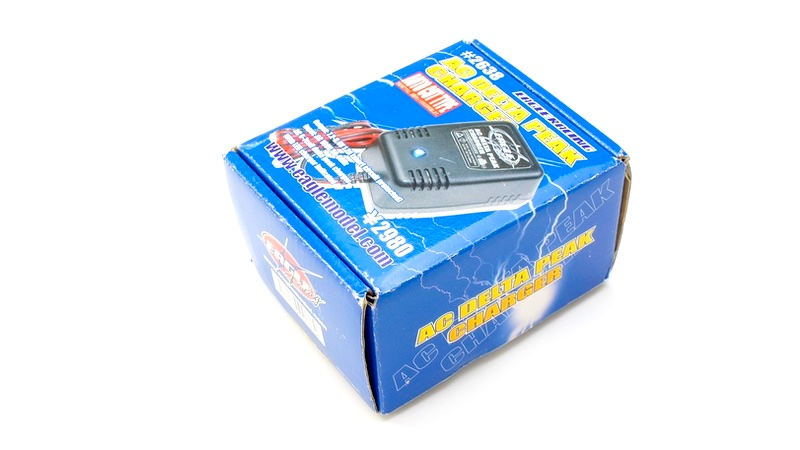

# 充電方法

Donkey Carを充電する前に必ずお読みください。

対象モデル

|コード番号|
|:--:|
|DCK-R2|

## Donkey Carを充電する際に必要となるパーツ

|写真|部品|個数|
|:--|:--|:--:|
| |充電器（PSEマーク付き）  イーグル模型 AC デルタピーク・チャージャー 1.2A充電 #2638 ※ベース車体付属の充電器は使用しないでください。 ※取扱に関しては充電器の説明書をご覧ください。|１台|
||充電用変換コネクタ  ラージコネクターミニコネクタ　 長さ5cm 部品コード:DCK2-004 ※当社ドンキーカー充電には必ずこちらをお使いください。市販のものは、極性が異なる場合がございます。|１本|

※予告なく仕様が変更されることがございます。

[※FaBoお問い合わせ先](https://www.fabo.io/contact/ )

## Donkey Carを充電する際に使用禁止パーツ

下の写真のRCカー本体付属のアダプタ（左右いずれかの写真）は絶対に使用しないでください。本キットでは、充電の際、イーグル模型 AC デルタピーク・チャージャー 1.2A充電 #2638を使用します。

[※FaBoお問い合わせ先](https://www.fabo.io/contact/ )

## Donkey Car RCカーへの充電方法

　Donkey Car(DCK-R2)は、２個のバッテリを搭載しています。ラズパイの給電はモバイルバッテリから、車体へにはニッケル水素電池を使用しています。ここでは、車体への充電方法をご説明します。

ラズパイの緑色のLEDが点灯していないのを確認し、USBケーブルを抜き、ラズパイの電源を切ります。

USBケーブルを抜きますとラズパイの赤色LEDが消灯します。

RCカーの電源は、下の写真が示すところにあります。

電源スイッチをOFF側にスライドさせ、電源OFFにします。

コネクタの爪を押しながら、RCカーのバッテリと本体電源コネクタを切断します。

切断後

充電用変換コネクタをRCカー電源につなぎます。

!!!warning "注意"
	極性が異なる場合がありますので、他社の変換コネクタは使用しないようにしましょう。

!!!warning "注意"
	品質には万全を尽くしていますが、接続前にケーブル赤、黒、極性があっているかご確認ください。

充電器(イーグル模型#2638)を用意します。

!!!caution "警告"
	必ず指定の充電器をご使用ください。

家庭用AC100Vに充電器(イーグル模型#2638)を接続します。接続するとすぐ充電器のコンデンサーの残留がなく充電ができる状態ならば充電器の青色のLEDが1回だけ点滅します。

RCカーのバッテリ（変換コネクタ装着済み）と充電器を接続します。

充電が開始されると、充電器の青色LEDが点灯します。

!!!warning "注意"
	充電器のコンデンサに十分な電荷がある場合は、青色LEDが点灯せず、点滅、消灯し充電が開始されない場合がございます。電源を切り離し、しばらく間隔を置いてご使用ください。（約２０秒間以上）

充電中はLED常時点灯します。

!!!warning "注意"
	充電中は常時監視を行い、異常な発熱やバッテリの膨張等がみられた場合はすぐに充電を中止してください。

通常、約１時間ほどで充電完了します。充電が完了しますと青色LEDがゆっくり点滅します。

充電が完了しましたら、RCカーバッテリと充電用変換コネクタを切断します。

以上、充電は完了となります。

!!!warning "注意"
	連続で充電をご利用される場合は、約２０秒程度間隔を置いてご使用ください。

!!!warning "注意"
	充電完了後は、速やかにRCのバッテリと充電器を切断してください。

!!!warning "注意"
	充電時間は目安です。バッテリ残量がある場合は充電時間が短くなる場合がございます。

!!!caution "警告"
	安全上の注意は、充電器の梱包箱にある記載をご覧ください。

 

## Donkey Carのモバイルバッテリ充電方法

 

モバイルバッテリの入力は最大でDC５V（最大２A）となります。

|写真|部品|個数|
|:--|:--|:--:|
||モバイルバッテリー  INIU BI-B3 10000mAh/37Wh 5V/3A出力 マイクロUSBケーブル付属|１台|

ラズパイの緑色LED（ACT）が点灯していないのを確認し、下の写真が指し示すUSBケーブルをラズパイから取り外します。

モバイルバッテリ側面にある充電用のUSB端子を確認します。

モバイルバッテリ付属のケーブルを使用し、市販のUSB充電器により充電いたします。

モバイルバッテリ付属USBケーブルをモバイルバッテリに接続します。

充電の様子

!!!warning "注意"
	モバイルバッテリ付属のケーブルではない場合、ケーブルの発熱や充電に時間がかかる場合がございます。

!!!warning "注意"
		USB充電器は、本キットに付属しません。

充電が始まると、モバイルバッテリに数値が表示され、数値１桁目が点滅します。

１００％になると充電完了です。９９％から１００％になるまでは時間がかかる場合があります。

!!!warning "注意"
	モバイルバッテリの数値はあくまでも目安です。２０％〜３０％ほど残量があってもラズパイの電源が落ちる場合がございます。
