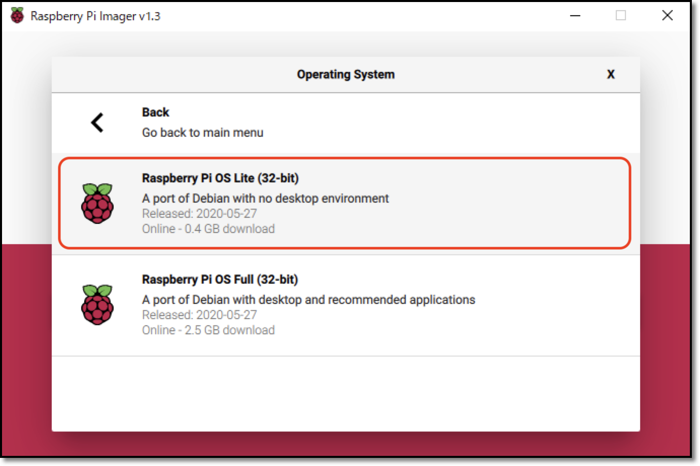
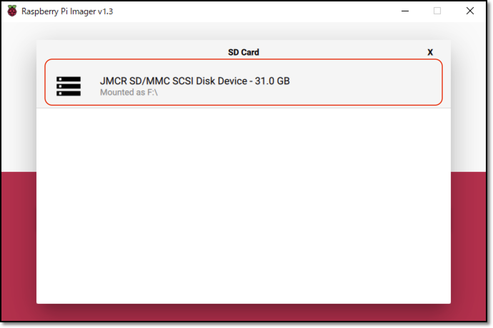
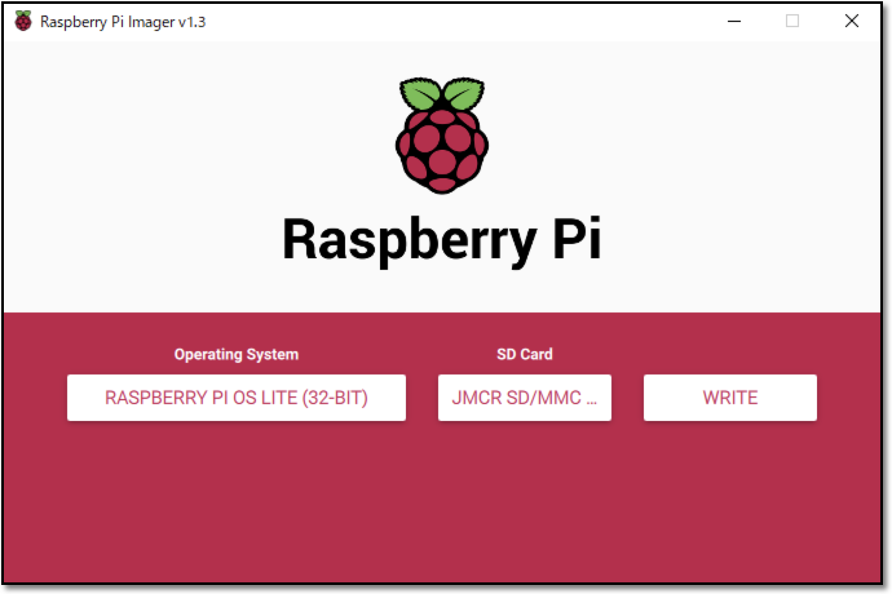

# Imageの焼き込み

!!! Warning "インストール済みイメージを使う場合は、本作業をスキップ"
	DonkeyCarインストール済みイメージを使う場合は、1.車体作成にお進みください。<br>

|項目|概要|
|:-|:-|
|[DonkeyCarインストール済みイメージ](https://drive.google.com/file/d/1cGmHjMB8FfMK6GlUsT7r5ZjFwyFhxgwu)|下記手順で作成したイメージです。RaspberryPi3B+で3時間ほどかかります。|

本章では、上記のイメージを作成するためのインストール手順を解説しています。<br>

## Raspberry Piのイメージ

Raspberry Pi用のイメージは、[Raspberry Pi Imager](https://www.raspberrypi.org/downloads)を使って直接micro SDカードに焼き込みます。

!!! Info "イメージの焼き込みに使えるツールは"
	[Raspberry Pi Imager](https://www.raspberrypi.org/downloads)の他にも、[balenaEtcher](https://www.balena.io/etcher/)やDDコマンドなどでも焼き込み可能です。<br>

使用中のOS(Windows/maxOS/Ubuntuに対応)の[Raspberry Pi Imager](https://www.raspberrypi.org/downloads)をダウンロードし、インストールします。

Raspberry pi Imagerを使ってmicro SDカードにOSイメージを焼きます。OSは`Raspberry Pi OS Lite (32-bit)`を選択します。

<br>
<br>
<br>

## sshの有効化

RaspberryPi OSの焼き込みが終わったら、sshの設定をおこないます。

<br>


OSイメージをmicro SDカードに焼き込み終わったあとに、SDカードを抜いて、再度PCに挿し直すと、PCでSDカードが認識されます。PCでSDカードを認識したら、`boot`パーティション直下に空ファイルのsshファイルをコピーします。

{{ download_link('https://faboplatform.github.io/DonkeyDocs/0.SDカードイメージを最初から作成する方法/ssh', 'ssh') }}をダウンロードし、SDカードにコピーします。`ssh`ファイルの中身はただの空ファイルですが、`ssh`という名前のファイルがSDカードに存在すると、sshでのアクセスが可能になる設定になります。

この方法での結果、raspi-configでsshを有効化すること同じ結果になります。<br>

!!! Info "RasberryPiにキーボードやマウスが装着されていない時に有効"
	上記方法では、PCでsshの設定ができますので、RaspberryPiにキーボードやマウスが装着されていない時でも、sshでの接続を可能な設定に変更する事が可能です。

## WiFiの設定

Wifiの設定も、SDカードに`wpa_supplicant.conf`という名前のファイルをコピーする事で反映させる事が可能です。

{{ download_link('https://faboplatform.github.io/DonkeyDocs/0.SDカードイメージを最初から作成する方法/wpa_supplicant.conf', 'wpa_supplicant.conf') }}をダウンロードします。ファイルを編集してSSIDとパスワードを接続先のWiFiルータの値に書き直します。

wpa_supplicant.conf
```
country=JP
ctrl_interface=DIR=/var/run/wpa_supplicant GROUP=netdev
update_config=1

network={
    ssid="your network name"
    psk="your password"
    scan_ssid=1
}
```

<br>

SDカードの`boot`パーティション直下にコピーしてください。<br>

sshとwpa_supplicant.confの2ファイルをSDカードの`boot`にコピーする事で、Wifiに接続しsshで接続可能になります。
